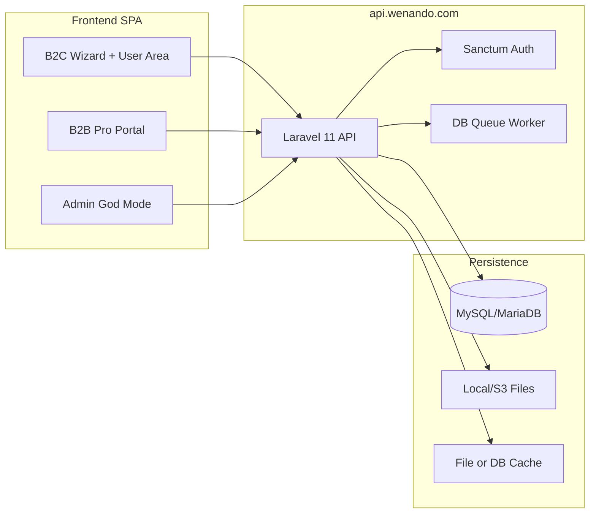

# Wenando Backend — Architecture & Security

> **Scope:** Laravel API at `api.wenando.com` serving the React SPA (`wenando.com`).  
> **Constraints:** Hostinger Cloud (SSH deploy), MySQL/MariaDB, **no Redis**, `QUEUE_CONNECTION=database`, cache via **file** or **database**.

This document is derived from the current React frontend (`src/`), which uses **mock services and localStorage** — no production HTTP client exists yet. API shapes below reflect intended contracts implied by UI flows and mock payloads.

---

## 1. System overview



| Layer | Responsibility |
|-------|----------------|
| **API** | REST JSON, domain validation, matching engine orchestration, wallet ledger |
| **Auth** | Laravel Sanctum (SPA cookie session + optional PAT for automation) |
| **Jobs** | Lead routing, email OTP, trust scoring, notifications |
| **Storage** | Partner documents (visura, ID), sector config JSON |

---

## 2. Laravel Sanctum

### 2.1 Stateful SPA (recommended for web app)

Use when frontend and API share a **parent domain** (e.g. `wenando.com` + `api.wenando.com`):

| Setting | Value |
|---------|--------|
| `SANCTUM_STATEFUL_DOMAINS` | `wenando.com,www.wenando.com,localhost:5173` (dev) |
| `SESSION_DOMAIN` | `.wenando.com` |
| `SESSION_SECURE_COOKIE` | `true` (production) |
| `SESSION_SAME_SITE` | `lax` |

**Flow (mirrors `authService.js`):**

1. `POST /api/v1/auth/otp/request` — email + captcha payload → sends 6-digit OTP (10 min TTL).
2. `POST /api/v1/auth/otp/verify` — email + code → creates session, returns user profile.
3. Subsequent requests: `Authorization` not required; **CSRF cookie** + session cookie via `axios`/`fetch` with `credentials: 'include'`.

**Session payload (frontend today):**

```json
{
  "email": "user@example.com",
  "type": "consumer|b2b|superadmin",
  "name": "Mario Rossi",
  "onboarding_status": "in_progress|pending_review|approved|null"
}
```

Map `type` → `users.user_type` + Spatie roles (`consumer`, `partner_staff`, `super_admin`).

### 2.2 API tokens (optional)

Use **personal access tokens** (`personal_access_tokens`) for:

- Server-to-server integrations
- Mobile apps (future)
- Admin automation scripts

Never expose PATs in the browser SPA. Scope tokens narrowly (`leads:read`, `wallet:write`, etc.).

### 2.3 Portal separation

Frontend enforces **email portal routing** (`validateEmailForPortal`):

| Portal | Allowed `user_type` | Redirect |
|--------|---------------------|----------|
| Consumer `/accedi` | `consumer` | `/user` |
| Partner `/pro/accedi` | `b2b` | `/pro/dashboard` or onboarding |
| Admin `/admin` | `superadmin` | `/admin` (must be enforced server-side) |

Reject cross-portal login with **403** + localized message (same copy as frontend).

---

## 3. CORS (strict)

Configure in `config/cors.php` — **deny by default**, allow only:

| Environment | `allowed_origins` |
|-------------|-------------------|
| Production | `https://wenando.com`, `https://www.wenando.com` |
| Staging | `https://staging.wenando.com` |
| Local | `http://localhost:5173`, `http://127.0.0.1:5173` |

| Option | Value |
|--------|--------|
| `supports_credentials` | `true` (Sanctum SPA) |
| `allowed_methods` | `GET, POST, PUT, PATCH, DELETE, OPTIONS` |
| `allowed_headers` | `Content-Type, X-XSRF-TOKEN, Accept, Authorization` |
| `max_age` | `86400` |

Do **not** use `allowed_origins_patterns` with wildcards in production.

---

## 4. Global rate limiting

Apply layered limits (Redis-free — use Laravel `RateLimiter` with **cache driver** `file` or `database`):

| Limiter key | Scope | Limit | Notes |
|-------------|-------|-------|-------|
| `api` | All authenticated API | 120/min per user | Default throttle |
| `auth-otp-request` | `POST .../otp/request` | **3 per 15 min** per email + IP | Matches frontend `MAX_SEND_ATTEMPTS` |
| `auth-otp-verify` | `POST .../otp/verify` | 10/min per email | Brute-force protection |
| `wizard-submit` | `POST .../leads` (anonymous) | 5/hour per IP | Abuse on public wizard |
| `b2b-unlock` | `POST .../leads/{id}/unlock` | 30/min per company | Wallet operations |
| `admin` | God Mode routes | 300/min per superadmin | Higher ceiling |

Return **429** with standardized JSON (see §5). Include `Retry-After` header when applicable.

---

## 5. Centralized error handling

### 5.1 Response envelope

**Success:**

```json
{
  "success": true,
  "data": { },
  "meta": { "request_id": "01J..." }
}
```

**Error:**

```json
{
  "success": false,
  "error": {
    "code": "OTP_EXPIRED",
    "message": "Codice scaduto. Richiedine uno nuovo.",
    "details": { "field": "code" }
  },
  "trace_id": "01JABCDEF..."
}
```

| Field | Rule |
|-------|------|
| `code` | Stable machine string (`VALIDATION_FAILED`, `INSUFFICIENT_CREDITS`, …) |
| `message` | User-safe Italian copy (can mirror frontend strings) |
| `details` | Optional validation errors `{ "email": ["..."] }` |
| `trace_id` | UUID v7 / ULID — log correlation only |
| **Never in production** | Stack traces, SQL, internal paths |

Implement via custom `Handler` + `App\Exceptions\BusinessException` with `render()` returning the envelope. Map:

- `ValidationException` → 422, `VALIDATION_FAILED`
- `AuthenticationException` → 401
- `AuthorizationException` → 403
- `ModelNotFoundException` → 404
- Unhandled → 500, generic message, full trace logged server-side

### 5.2 HTTP status conventions

| Status | Usage |
|--------|--------|
| 200/201 | Success |
| 204 | Delete success (no body) |
| 401 | Unauthenticated |
| 403 | Wrong portal / insufficient role |
| 404 | Resource not found |
| 422 | Validation |
| 429 | Rate limit |
| 500 | Unexpected server error |

---

## 6. Error logging strategy

| Concern | Approach |
|---------|----------|
| **Channel** | `stack` → daily files on Hostinger (`storage/logs/laravel.log`) |
| **Structure** | JSON lines with `trace_id`, `user_id`, `route`, `ip`, `duration_ms` |
| **Levels** | `error` for 5xx + unexpected exceptions; `warning` for business failures (failed payment); `info` for auth events |
| **PII** | Mask email/phone in logs (`m***@domain.com`); never log OTP codes |
| **Retention** | Rotate daily, 14–30 days on shared hosting |
| **External APM** | Optional later (Sentry) — pass `trace_id` as breadcrumb |
| **Queue failures** | `failed_jobs` table + alert on threshold |

Log every 5xx with full exception + `trace_id`; return only `trace_id` to client.

---

## 7. Hostinger Cloud deployment

### 7.1 Topology

```
Internet → Hostinger (Nginx/Apache) → public/index.php (Laravel)
                ├── MySQL/MariaDB (managed or same VPS)
                ├── storage/ (logs, cache, uploads)
                └── cron: php artisan schedule:run
                └── supervisor/systemd OR cron: queue:work database
```

### 7.2 Environment (`.env` production)

```env
APP_URL=https://api.wenando.com
FRONTEND_URL=https://wenando.com

DB_CONNECTION=mysql
QUEUE_CONNECTION=database
CACHE_STORE=database
SESSION_DRIVER=database
FILESYSTEM_DISK=local

SANCTUM_STATEFUL_DOMAINS=wenando.com,www.wenando.com
SESSION_DOMAIN=.wenando.com
```

Use **database** cache/session on Hostinger if file permissions are restrictive; **file** cache is acceptable for read-heavy config.

### 7.3 Deploy workflow (SSH)

1. `git pull` on server (or rsync artifact).
2. `composer install --no-dev --optimize-autoloader`
3. `php artisan migrate --force`
4. `php artisan config:cache && route:cache && view:cache`
5. `php artisan storage:link`
6. Restart queue worker.

### 7.4 Queue worker (no Redis)

```bash
php artisan queue:work database --sleep=3 --tries=3 --max-time=3600
```

Run via **Supervisor** (preferred) or cron every minute:

```cron
* * * * * cd /path/to/api && php artisan schedule:run >> /dev/null 2>&1
* * * * * cd /path/to/api && php artisan queue:work database --stop-when-empty >> /dev/null 2>&1
```

Jobs: `SendOtpEmail`, `ProcessLeadMatching`, `ScoreTrustTest`, `NotifyPartnerNewLead`, `ProcessWalletTransaction`.

### 7.5 File uploads

Partner documents (`visura`, `identity_doc`) → `storage/app/partners/{company_id}/` with virus scan hook (future). Serve via signed temporary URLs, never public direct paths.

---

## 8. Security — injection & XSS

### 8.1 SQL injection

- **Eloquent / Query Builder only** for dynamic queries.
- Parameter binding for raw queries (avoid except migrations).
- **FormRequest** validation on every mutating endpoint (see §8.3).

### 8.2 XSS

- API returns **JSON only** — no HTML fragments from user input.
- Sanitize rich text in trust test answers on output encoding (Blade not used for API).
- Store wizard/partner text as UTF-8; escape on frontend rendering (React default).

### 8.3 FormRequests (mandatory)

| Domain | Example rules |
|--------|----------------|
| Auth OTP | `email` → `required|email|max:255`; captcha fields per `HumanVerification` |
| Wizard lead | `autonomy` → `in:autosufficiente,parziale,non-autosufficiente`; `budget_min/max` → integer; `phone` → regex E.164 |
| B2B onboarding | `vat` → IT VAT format; `sdi` → `size:7`; files → `mimes:pdf,jpg,png|max:10240` |
| Wallet | `amount` → `numeric|min:1|max:10000` |
| Admin | `partner_id` → `exists:companies,id`; role middleware `super_admin` |

Use `$request->validated()` exclusively in controllers — never trust `$request->all()` for persistence.

### 8.4 Additional controls

| Control | Implementation |
|---------|----------------|
| **CSRF** | Sanctum SPA middleware on stateful routes |
| **Mass assignment** | `$fillable` / DTOs per model |
| **IDOR** | Policies: company staff only access own `company_id` leads/wallet |
| **Captcha** | Server-side verify hCaptcha/reCAPTCHA token; honeypot `company_website` must be empty |
| **OTP** | Hash codes at rest (bcrypt), single-use, TTL 10 min, resend cooldown 60s |
| **Admin** | Dedicated `super_admin` role; IP allowlist optional in settings JSON |
| **HTTPS** | Force TLS; HSTS at reverse proxy |

---

## 9. Frontend integration checklist

When replacing mocks:

1. Point `VITE_API_BASE_URL=https://api.wenando.com/api/v1`.
2. Configure Sanctum CSRF preflight (`GET /sanctum/csrf-cookie`).
3. Replace `authService.js` localStorage with API calls; keep response shape compatible with `AuthContext`.
4. Replace `B2BContext` state with API + optimistic UI where needed.
5. Persist wizard submission → `POST /leads` before navigating to `/results`.
6. Gate `/admin` routes with `super_admin` middleware (currently **unprotected** in SPA).

---

## 10. Assumptions (frontend gaps)

| Topic | Assumption |
|-------|------------|
| Admin auth | Super Admin uses same OTP flow with `user_type=superadmin` + role |
| Sector catalog | `sectors` table seeded; `sector` slugs match onboarding (`rsa`, `adi`, …) |
| Matching engine | Async job computes `match_score`; results page reads `lead_matches` |
| Payments | Wallet recharge creates `transactions` pending → completed via payment provider webhook (not in UI yet) |
| Advisor booking | Separate `advisor_bookings` table or generic `appointments` with `type=advisor` |

See `2_DATABASE_SCHEMA.md` and `3_API_ROUTES_ROADMAP.md` for data model and endpoint catalog.
