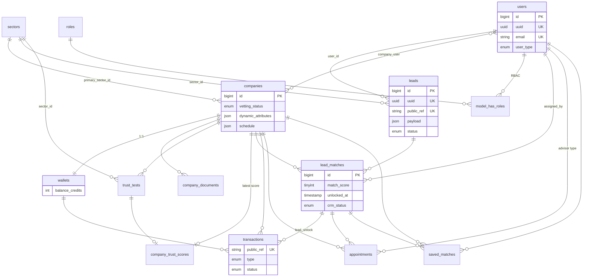

# Wenando — Database Schema Design

> **Engine:** MySQL 8+ / MariaDB 10.6+ · **Charset:** `utf8mb4_unicode_ci`  
> **DDL:** `../database_master.sql`  
> **Pattern:** Core relational tables + **JSON** columns (`payload`, `dynamic_attributes`, `wizard_schema`) for multi-sector scalability.

Derived from frontend entities in `src/data/*`, `src/services/*`, `src/context/*`.

---

## 1. Design principles

### 1.1 Hybrid relational + JSON

| Store in columns | Store in JSON |
|------------------|---------------|
| FKs, status enums, money, dates, indexes | Wizard answers, sector-specific ops fields, trust Q&A, schedules |
| Email, VAT, legal name | AI match metadata, admin notes, feature flags |

**Why:** Senior Care uses `autonomy`, `budget`, RSA capacity; **Home Renovation** (future) might use `project_type`, `sqm`, `timeline` — same `leads.payload` and `sectors.wizard_schema` without migrations per vertical.

### 1.2 Multi-tenancy boundary

- **B2C user** → `users` + `leads`
- **B2B partner** → `companies` + `company_user` pivot + `wallets`
- **Platform** → `sectors`, `roles`, admin tables

All partner-scoped rows include `company_id` for policy checks.

### 1.3 Soft deletes

Apply to: `users`, `companies`, `leads`, `trust_tests` (audit trail). Do not soft-delete ledger rows (`transactions`) — use status `void` instead.

---

## 2. Entity map (frontend → tables)

| Frontend concept | Table(s) | Source |
|------------------|----------|--------|
| Consumer session | `users` (`user_type=consumer`) | `authService.js` |
| Partner session | `users` + `company_user` | `b2bOnboardingService.js` |
| Super Admin | `users` + `model_has_roles` | `/admin` routes |
| B2B registration | `companies` + `users` | `Register.jsx` |
| Onboarding legal/ops/trust | `companies.*`, `company_documents`, `trust_tests` | `Onboarding.jsx`, steps |
| Onboarding status | `companies.vetting_status` | `in_progress`, `pending_review`, `approved` |
| Wizard intake | `leads.payload` | `wizardConfig.js`, `Wizard.jsx` |
| User searches history | `leads` (per submission) | `mockUserSearches.js` |
| B2C match cards | `lead_matches` + `companies` | `mockMatches.js` |
| Marketplace leads | `lead_matches` + `leads` | `mockB2B.js` |
| CRM clients | `crm_deals` (or `lead_matches.crm_status`) | `B2BContext.jsx` |
| Appointments | `appointments` | `mockAppointments` |
| Wallet / unlock cost | `wallets`, `transactions` | `UNLOCK_COST=15` |
| Invoices (B2B UI) | `transactions` + `invoices` view | `mockInvoices` |
| Admin partner cards | `companies` | `mockPartnerRegistrations` |
| Admin lead router | `leads` + `lead_matches` | `mockAdminLeads` |
| Platform transactions | `transactions` | `mockAdmin.transactions` |
| Notifications | `notifications` | `mockNotifications` |
| Saved matches | `saved_matches` | `savedMatches.js` |
| OTP (transient) | `otp_codes` or cache | `authService.js` |
| Roles | Spatie-like 5 tables | planned |

---

## 3. Core tables

### 3.1 `users`

| Column | Type | Notes |
|--------|------|-------|
| `id` | BIGINT PK | |
| `email` | VARCHAR(255) UNIQUE | Normalized lowercase |
| `name` | VARCHAR(255) | Display name |
| `phone` | VARCHAR(32) NULL | From wizard contact |
| `user_type` | ENUM | `consumer`, `b2b`, `superadmin` |
| `email_verified_at` | TIMESTAMP NULL | Set on OTP verify |
| `password` | VARCHAR NULL | Nullable — passwordless OTP primary |
| `remember_token` | VARCHAR NULL | Sanctum/session |
| `last_login_at` | TIMESTAMP NULL | |
| `timestamps`, `deleted_at` | | |

**Indexes:** `email`, `user_type`, `deleted_at`

### 3.2 Roles & permissions (Spatie-like)

| Table | Purpose |
|-------|---------|
| `roles` | `consumer`, `partner_owner`, `partner_staff`, `super_admin` |
| `permissions` | `leads.view`, `leads.unlock`, `wallet.recharge`, `partners.approve`, … |
| `role_has_permissions` | M:N |
| `model_has_roles` | `model_type=User`, `model_id`, `role_id`, optional `company_id` |
| `model_has_permissions` | Direct grants |

Frontend does not implement RBAC yet; B2B assumes single partner account per company initially.

### 3.3 `sectors`

| Column | Type | Notes |
|--------|------|-------|
| `id` | BIGINT PK | |
| `slug` | VARCHAR UNIQUE | `senior-care`, `home-renovation`, … |
| `name` | VARCHAR | Display: "Senior Care" |
| `is_active` | BOOLEAN | |
| `wizard_schema` | JSON | Step definitions (like `wizardConfig.js`) |
| `operations_schema` | JSON | Dynamic fields (like `OPERATIONS_FORM_CONFIG`) |
| `trust_schema` | JSON | Questions (like `TRUST_QUESTIONS`) |
| `matching_rules` | JSON | Weights, filters |
| `timestamps` | | |

**Seed:** `senior-care` with current wizard; stub `home-renovation` for future.

**Scale beyond Senior Care:** New sector = INSERT + JSON schemas; `leads.sector_id` FK; `companies.primary_sector_id` + `company_sectors` M:N if multi-sector partners.

### 3.4 `companies` (B2B partners)

| Column | Type | Notes |
|--------|------|-------|
| `id` | BIGINT PK | |
| `sector_id` | FK → sectors | Primary vertical |
| `organization_name` | VARCHAR | Nome struttura |
| `legal_name` | VARCHAR | Ragione sociale |
| `vat_number` | VARCHAR(16) | Partita IVA |
| `sdi_code` | VARCHAR(7) | Codice SDI |
| `city` | VARCHAR NULL | |
| `vetting_status` | ENUM | `draft`, `in_progress`, `pending_review`, `approved`, `rejected`, `suspended` |
| `tier` | ENUM NULL | `starter`, `growth`, `enterprise` (admin portfolio) |
| `dynamic_attributes` | JSON | Ops form: capacity, night_staff, … |
| `schedule` | JSON | Mon–sun open/slots |
| `approved_at` | TIMESTAMP NULL | |
| `timestamps`, `deleted_at` | | |

**Indexes:** `sector_id`, `vetting_status`, `vat_number`, `(sector_id, vetting_status)`

### 3.5 `company_user` (pivot)

| Column | Notes |
|--------|-------|
| `company_id`, `user_id` | UNIQUE together |
| `role` | `owner`, `staff` |

### 3.6 `company_documents`

| Column | Notes |
|--------|-------|
| `company_id` | FK |
| `type` | `visura`, `identity` |
| `file_path` | Storage path |
| `original_name` | |
| `verified_at` | NULL until admin review |

### 3.7 `trust_tests` & `company_trust_scores`

**`trust_tests`** — one row per onboarding submission / resubmission:

| Column | Notes |
|--------|-------|
| `company_id` | FK |
| `sector_id` | FK |
| `answers` | JSON — keys: `emergency`, `fall`, `family`, `quality` |
| `status` | `draft`, `submitted`, `scored`, `failed` |
| `submitted_at` | |

**`company_trust_scores`** — computed snapshot:

| Column | Notes |
|--------|-------|
| `company_id` | FK UNIQUE (latest) or versioned |
| `trust_test_id` | FK |
| `score` | DECIMAL(5,2) 0–100 |
| `breakdown` | JSON per-question scores |
| `scored_at` | |

Frontend shows trust Q&A in onboarding; numeric score appears in admin/partner views indirectly via match quality.

### 3.8 `leads`

| Column | Type | Notes |
|--------|------|-------|
| `id` | BIGINT PK | Public ref `LD-####` optional |
| `uuid` | CHAR(36) UNIQUE | External API id |
| `sector_id` | FK | Default senior-care |
| `user_id` | FK NULL | Set when consumer authenticated or linked |
| `status` | ENUM | `draft`, `processing`, `routed`, `assigned`, `closed`, `cancelled` |
| `admin_status` | VARCHAR NULL | Admin UI: `In routing`, `Assegnato`, … |
| `payload` | JSON | **Wizard answers** (see §4.1) |
| `contact_name` | VARCHAR | Denormalized from payload |
| `contact_phone` | VARCHAR | |
| `contact_email` | VARCHAR NULL | |
| `location_label` | VARCHAR | e.g. "Milano" |
| `budget_min`, `budget_max` | INT NULL | EUR/month |
| `need_summary` | TEXT NULL | Human-readable esigenza |
| `timestamps`, `deleted_at` | | |

**Indexes:** `sector_id`, `user_id`, `status`, `created_at`, `(sector_id, status)`

### 3.9 `lead_matches`

Links leads to companies with scoring and marketplace unlock state.

| Column | Notes |
|--------|-------|
| `lead_id`, `company_id` | UNIQUE together |
| `match_score` | TINYINT 0–100 |
| `rank` | INT NULL | Display order on results page |
| `is_visible_to_consumer` | BOOL | B2C results |
| `is_in_marketplace` | BOOL | B2B marketplace |
| `unlocked_at` | TIMESTAMP NULL | Partner paid unlock |
| `unlock_cost_credits` | INT | Default 15 |
| `crm_status` | ENUM NULL | `nuovo`, `contattato`, `visita_fissata`, `perso`, `chiuso` |
| `assigned_by` | FK users NULL | Admin override |
| `metadata` | JSON | AI match label, notes |

**Indexes:** `lead_id`, `company_id`, `unlocked_at`, `(company_id, is_in_marketplace)`

### 3.10 `wallets`

| Column | Notes |
|--------|-------|
| `company_id` | FK UNIQUE |
| `balance_credits` | INT | Integer credits (€1 = 1 credit UI today) |
| `currency` | CHAR(3) DEFAULT `EUR` |
| `total_spent_credits` | INT | Denormalized stats |

### 3.11 `transactions`

Immutable ledger for wallet, subscriptions, lead purchases.

| Column | Notes |
|--------|-------|
| `uuid` | Public `TX-####` |
| `company_id` | FK |
| `wallet_id` | FK |
| `type` | `recharge`, `lead_unlock`, `subscription`, `lead_bundle`, `commission`, `refund` |
| `amount_cents` | INT signed |
| `credits_delta` | INT | Wallet impact |
| `status` | `pending`, `completed`, `failed`, `void` |
| `payment_method` | `card`, `sepa`, `transfer`, `wallet` |
| `reference` | VARCHAR | Invoice id |
| `description` | VARCHAR |
| `metadata` | JSON |
| `lead_match_id` | FK NULL | For unlock rows |
| `timestamps` | |

**Indexes:** `company_id`, `status`, `created_at`, `type`

### 3.12 `appointments`

| Column | Notes |
|--------|-------|
| `company_id` | FK |
| `lead_match_id` | FK NULL |
| `client_name` | VARCHAR |
| `scheduled_date` | DATE |
| `scheduled_time` | TIME |
| `note` | TEXT |
| `type` | `visit`, `advisor` |

### 3.13 `notifications`

Laravel-style polymorphic or dedicated:

| Column | Notes |
|--------|-------|
| `notifiable_type`, `notifiable_id` | User or Company |
| `type` | `match`, `credit`, `visit`, … |
| `title`, `message` | |
| `data` | JSON |
| `read_at` | |

### 3.14 `saved_matches`

Consumer bookmarks:

| `user_id`, `company_id` or `lead_match_id` | UNIQUE |

### 3.15 Infrastructure tables

| Table | Purpose |
|-------|---------|
| `personal_access_tokens` | Sanctum PAT |
| `sessions` | DB session driver |
| `cache` / `cache_locks` | Database cache driver |
| `jobs` / `job_batches` / `failed_jobs` | Queue |
| `otp_codes` | Email OTP (optional; can use cache instead) |
| `password_reset_tokens` | Future |

---

## 4. JSON column contracts

### 4.1 `leads.payload` (Senior Care — from wizard)

```json
{
  "autonomy": "autosufficiente|parziale|non-autosufficiente",
  "location": { "label": "Milano", "value": "milano" },
  "budget": { "min": 1500, "max": 2500 },
  "contact": { "nome": "Mario", "telefono": "+39 333 123 4567" }
}
```

Denormalize key fields to columns for filtering/indexing.

### 4.2 `companies.dynamic_attributes`

```json
{
  "sector": "rsa",
  "capacity": "24",
  "nonSelfSufficient": true,
  "nightStaff": true,
  "notes": "..."
}
```

Keys driven by `sectors.operations_schema`.

### 4.3 `companies.schedule`

```json
{
  "mon": { "open": true, "slots": "09:00-12:00, 15:00-18:00" },
  "sun": { "open": false, "slots": "" }
}
```

### 4.4 `trust_tests.answers`

```json
{
  "emergency": "…",
  "fall": "…",
  "family": "…",
  "quality": "…"
}
```

### 4.5 Future sector example (`home-renovation`)

`sectors.wizard_schema` might define steps `property_type`, `sqm`, `budget_range`; `leads.payload` stores answers without schema migration.

---

## 5. Relationships (ER diagram — full)



---

## 6. Indexing strategy

| Query pattern | Index | Rationale |
|---------------|-------|-----------|
| Partner marketplace by score | `lead_matches(company_id, is_in_marketplace, match_score)` | [VERIFICATO] Marketplace sorted by `matchScore`; filter `unlocked` |
| Admin lead queue | `leads(status, created_at)` | Lead Router table by stato + date |
| Consumer search history | `leads(user_id, created_at)` | `/user/ricerche` list |
| Pending partner approvals | `companies(vetting_status, created_at)` | ManagePartners Pending filter |
| Wallet history | `transactions(company_id, created_at)` | Fatturazione page |
| OTP lookup | `otp_codes(email, expires_at)` | Verify + cleanup expired |
| CRM pipeline filter | `lead_matches(company_id, crm_status)` | SmartCRM `?stato=` |
| Public ref lookup | `leads(public_ref)`, `transactions(public_ref)` | Admin/B2B display IDs |
| Unlocked leads only | `lead_matches(company_id, unlocked_at)` | CRM clients derived from unlocks |

### Recommended additional indexes (see 10_SQL_REVIEW)

| Index | Reason |
|-------|--------|
| `leads(location_label)` prefix | Geo filtering [ASSUNZIONE] future |
| `lead_matches(lead_id, is_visible_to_consumer)` | B2C results page |
| `companies(city)` | Admin partner cards by città |
| `notifications(notifiable_type, notifiable_id, read_at)` | Unread count badge |

---

## 6.1 Query patterns (implementazione)

### Marketplace leads (B2B)

```sql
-- Preview: PII columns NULL or masked in API layer
SELECT lm.id, lm.match_score, lm.unlock_cost_credits, lm.unlocked_at,
       l.location_label, l.budget_min, l.budget_max, l.need_summary
FROM lead_matches lm
JOIN leads l ON l.id = lm.lead_id
WHERE lm.company_id = :company_id
  AND lm.is_in_marketplace = 1
  AND l.status IN ('routed', 'assigned')
ORDER BY lm.match_score DESC
LIMIT 50;
```

### CRM clients (unlocked only)

```sql
SELECT lm.id, lm.crm_status, lm.unlocked_at,
       l.contact_name, l.contact_phone, l.contact_email, l.location_label
FROM lead_matches lm
JOIN leads l ON l.id = lm.lead_id
WHERE lm.company_id = :company_id
  AND lm.unlocked_at IS NOT NULL
  AND (:crm_status IS NULL OR lm.crm_status = :crm_status);
```

### Admin lead router

```sql
SELECT l.public_ref, l.contact_name, l.need_summary, l.admin_status,
       l.created_at, l.admin_notes
FROM leads l
WHERE l.deleted_at IS NULL
ORDER BY l.created_at DESC
LIMIT :per_page OFFSET :offset;
```

---

## 7. Sector scalability playbook

1. **Add sector row** with `wizard_schema`, `operations_schema`, `trust_schema`, `matching_rules` JSON.
2. **Configure companies** with `sector_id` (+ optional `company_sectors` for multi-vertical partners).
3. **Leads** reference `sector_id`; wizard POST validates against `sectors.wizard_schema` (JSON Schema or Laravel custom rule).
4. **Matching job** reads `sectors.matching_rules` — no code deploy for weight tweaks.
5. **Admin Lead Router** filters by `sector_id`; AI match string stored in `lead_matches.metadata`.

Senior Care field names in frontend (`autonomy`, `rsa`, etc.) remain in payload; other sectors use different keys in the same column.

---

## 8. Status enumerations (canonical)

| Domain | Values |
|--------|--------|
| `users.user_type` | `consumer`, `b2b`, `superadmin` |
| `companies.vetting_status` | `draft`, `in_progress`, `pending_review`, `approved`, `rejected`, `suspended` |
| `leads.status` | `draft`, `processing`, `routed`, `assigned`, `closed`, `cancelled` |
| `lead_matches.crm_status` | `nuovo`, `contattato`, `visita_fissata`, `perso`, `chiuso` |
| `transactions.status` | `pending`, `completed`, `failed`, `void` |
| `transactions.type` | `recharge`, `lead_unlock`, `subscription`, `lead_bundle`, `commission`, `refund` |

Map admin UI Italian labels in API transformers, not DB enums, if localization flexibility is needed.

---

## 9. Assumptions

| Item | Assumption |
|------|------------|
| Credits | 1 credit = €1 for UI parity with mock wallet |
| Lead ID format | `LD-####` generated in API layer from `id` or `uuid` |
| CRM | `crm_status` on `lead_matches` (not separate `crm_deals` table) to reduce joins |
| Consumer email on wizard | Optional until `/accedi`; phone required in wizard |
| Multi-company users | Rare; `company_user` supports one primary company initially |
