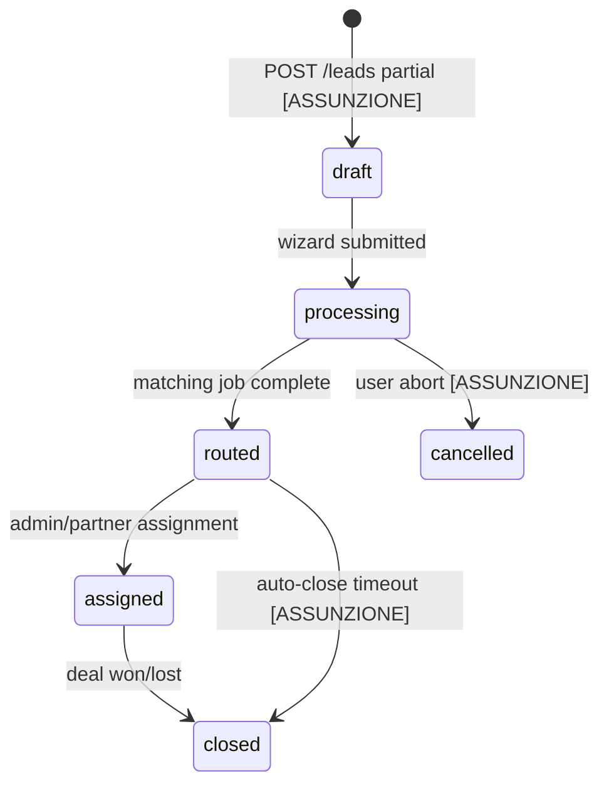
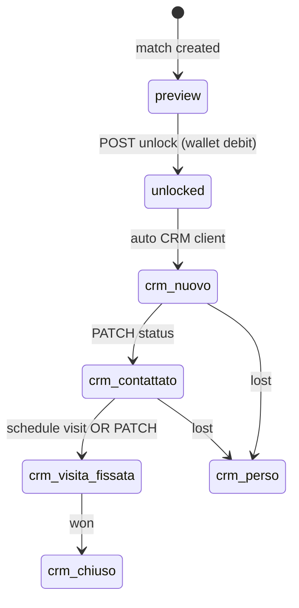
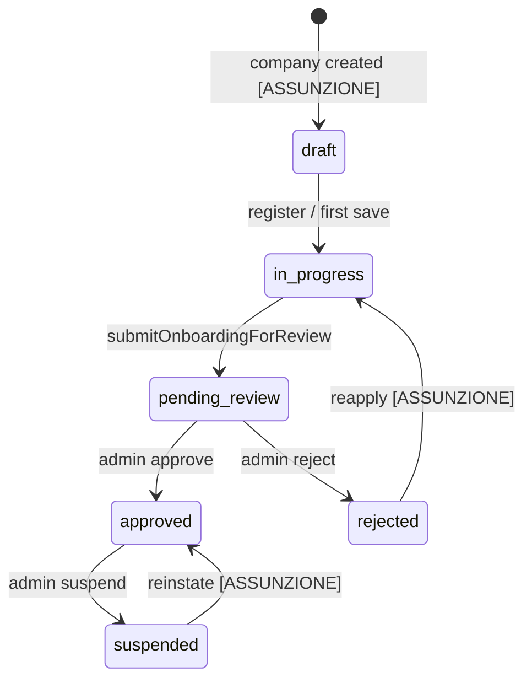
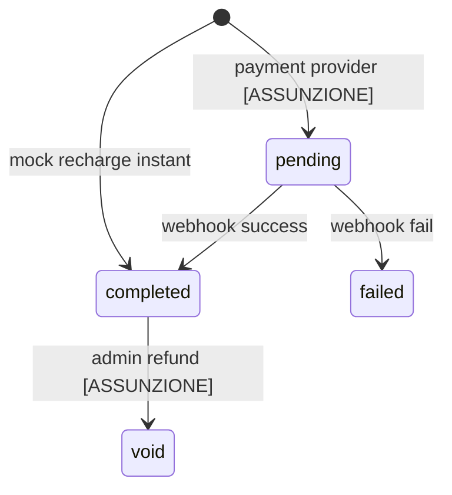

# Wenando — Domain Model & Entities

> Catalogo entità derivato da analisi sistematica del frontend React (`src/`).  
> **Legenda:** [VERIFICATO] = trovato nel codice · [ASSUNZIONE] = inferito per coerenza backend

---

## 1. Panoramica ownership

| Dominio | Entità principali | Owner API | Ruoli |
|---------|-------------------|-----------|-------|
| **B2C** | Lead, SavedMatch, AdvisorBooking, UserSearch | Consumer / Public | `consumer` |
| **B2B** | Company, Wallet, LeadMatch (marketplace/CRM), Appointment, Invoice | Partner company | `partner_owner`, `partner_staff` |
| **Admin** | Partner vetting, Lead routing, Platform metrics, Transactions | Platform | `super_admin` |
| **Shared** | Sector, User, Notification, Transaction ledger | Platform config | varies |

---

## 2. Catalogo entità

### 2.1 User

| Attributo | Tipo | Source | Note |
|-----------|------|--------|------|
| `id` | BIGINT | DB | Internal |
| `uuid` | UUID | DB | API external id |
| `email` | string | [VERIFICATO] `authService` | Lowercase normalized |
| `name` | string | [VERIFICATO] session | Display name |
| `phone` | string? | [VERIFICATO] wizard contact | Denormalized from latest lead [ASSUNZIONE] |
| `user_type` | enum | [VERIFICATO] | `consumer`, `b2b`, `superadmin` |
| `email_verified_at` | timestamp | [ASSUNZIONE] | Set on OTP verify |
| `onboarding_status` | enum? | [VERIFICATO] B2B session | `in_progress`, `pending_review`, `approved` — B2B only |

**Relazioni:** `hasMany` Lead · `belongsToMany` Company (via `company_user`) · `hasMany` SavedMatch

**Mock users [VERIFICATO]:**
- `user@example.com` → consumer
- `partner@care.it` → b2b (pre-approved onboarding)

---

### 2.2 Sector

| Attributo | Tipo | Source |
|-----------|------|--------|
| `slug` | string | `senior-care`, `home-renovation` |
| `wizard_schema` | JSON | mirrors `wizardConfig.js` |
| `operations_schema` | JSON | mirrors `OPERATIONS_FORM_CONFIG` |
| `trust_schema` | JSON | mirrors `TRUST_QUESTIONS` |
| `matching_rules` | JSON | weights, min score marketplace |

**Relazioni:** `hasMany` Company, Lead, TrustTest

---

### 2.3 Lead (B2C intake)

| Attributo | Tipo | Source |
|-----------|------|--------|
| `uuid` | UUID | API |
| `public_ref` | string | `LD-####` [VERIFICATO] mockAdmin |
| `sector_id` | FK | default senior-care |
| `user_id` | FK? | linked after `/accedi` [ASSUNZIONE] |
| `status` | enum | see §3.1 |
| `admin_status` | string | Italian UI labels [VERIFICATO] mockAdmin |
| `payload` | JSON | wizard answers — see schema |
| `contact_name` | string | `payload.contact.nome` |
| `contact_phone` | string | `payload.contact.telefono` |
| `location_label` | string | `payload.location.label` |
| `budget_min`, `budget_max` | int | EUR/month |
| `need_summary` | text | Generated from payload [ASSUNZIONE] |

**Payload Senior Care — field-by-field [VERIFICATO]:**

| Step | Field | Type | Validation (frontend) |
|------|-------|------|----------------------|
| 1 autonomy | `autonomy` | enum | `autosufficiente`, `parziale`, `non-autosufficiente` |
| 2 location | `location.label` | string | min 2 chars query; mock 4 cities |
| 2 location | `location.value` | string | slug e.g. `milano-mi` |
| 3 budget | `budget.min` | int | 500–4900, step 100, default 1500 |
| 3 budget | `budget.max` | int | 600–5000, default 2500, min gap 100 |
| 4 contact | `contact.nome` | string | required trim |
| 4 contact | `contact.telefono` | string | required trim, tel input |

**Diagnosis mapping [VERIFICATO] `autonomyInfo.getDiagnosis`:**

| autonomy | recommendation | primary | secondary |
|----------|----------------|---------|-----------|
| autosufficiente | Servizi di Compagnia e Supporto Leggero | Assistenza Domiciliare | RSA |
| parziale | Assistenza Domiciliare | Assistenza Domiciliare | RSA |
| non-autosufficiente | RSA o Assistenza H24 | RSA | Assistenza Domiciliare |

---

### 2.4 Company (B2B Partner)

| Attributo | Tipo | Source |
|-----------|------|--------|
| `organization_name` | string | [VERIFICATO] Register — Nome Struttura |
| `legal_name` | string | [VERIFICATO] Register — Ragione Sociale |
| `vat_number` | string | [VERIFICATO] StepLegal |
| `sdi_code` | string | [VERIFICATO] StepLegal |
| `vetting_status` | enum | see §3.3 |
| `tier` | enum | [VERIFICATO] admin portfolio | `starter`, `growth`, `enterprise` |
| `dynamic_attributes` | JSON | StepOperations |
| `schedule` | JSON | StepOperations weekly |
| `city` | string | [ASSUNZIONE] from registration geo |

**Registration fields [VERIFICATO] `Register.jsx`:**
- email (required, email regex)
- organizationName (required)
- legalName (required)

---

### 2.5 CompanyDocument

| Attributo | Tipo | Source |
|-----------|------|--------|
| `type` | enum | `visura`, `identity` |
| `file_path` | string | storage |
| `original_name` | string | [VERIFICATO] FileDropZone filename only in mock |
| `verified_at` | timestamp? | admin review |

**Upload constraints [VERIFICATO] StepLegal:**
- Visura: PDF only, max 10 MB
- Identity: PDF or image

---

### 2.6 TrustTest / CompanyTrustScore

| Attributo | Tipo | Source |
|-----------|------|--------|
| `answers.emergency` | text | [VERIFICATO] TRUST_QUESTIONS |
| `answers.fall` | text | required non-empty to proceed |
| `answers.family` | text | |
| `answers.quality` | text | type text (not textarea) |
| `status` | enum | `draft`, `submitted`, `scored`, `failed` |
| `score` | decimal 0–100 | [ASSUNZIONE] computed async |
| `breakdown` | JSON | per-question scores |

---

### 2.7 LeadMatch

| Attributo | Tipo | Source |
|-----------|------|--------|
| `public_ref` | string | `ML-####` [VERIFICATO] mockB2B |
| `match_score` | 0–100 | [VERIFICATO] |
| `unlocked_at` | timestamp? | null = preview mode |
| `unlock_cost_credits` | int | default 15 [VERIFICATO] |
| `crm_status` | enum | see §3.4 |
| `is_visible_to_consumer` | bool | B2C results cards |
| `is_in_marketplace` | bool | B2B marketplace |
| `metadata` | JSON | AI match label, admin override |

**Preview vs unlocked [VERIFICATO] LeadMarketplace:**
- Locked: name/phone/email blurred (`ObfuscatedField`)
- Unlocked: full PII + CRM entry created

---

### 2.8 Wallet

| Attributo | Tipo | Source |
|-----------|------|--------|
| `balance_credits` | int | [VERIFICATO] INITIAL=150 |
| `total_spent_credits` | int | [VERIFICATO] mock 705 |
| `currency` | EUR | |

**Rules [VERIFICATO] B2BContext:**
- Unlock deducts `unlock_cost` (15)
- Insufficient balance → toast error + recharge modal
- Recharge: any amount > 0 instant [mock]

---

### 2.9 Transaction

| Attributo | Tipo | Source |
|-----------|------|--------|
| `public_ref` | string | `TX-####` [VERIFICATO] mockAdmin |
| `type` | enum | recharge, lead_unlock, subscription, … |
| `amount_cents` | int | |
| `credits_delta` | int | signed |
| `status` | enum | pending, completed, failed, void |
| `payment_method` | enum | card, sepa, transfer, wallet |
| `reference` | string | `INV-####` |

**B2B invoice UI [VERIFICATO] mockInvoices:** description, amount, status (`Pagata`, `In attesa`)

**Admin transaction UI [VERIFICATO]:** stato `Completata`, `In attesa`, `Fallita`

---

### 2.10 Appointment

| Attributo | Tipo | Source |
|-----------|------|--------|
| `public_ref` | string | `APT-###` [VERIFICATO] |
| `client_id` | string | CRM client ref |
| `scheduled_date` | date | ISO `YYYY-MM-DD` |
| `scheduled_time` | time | `HH:MM` |
| `note` | text | |
| `type` | enum | `visit` (B2B), `advisor` (B2C booking) |

**Advisor booking [VERIFICATO] BookingSheet:** name, date (next 5 days), time slots `09:00`, `10:30`, `14:00`, `16:30`

---

### 2.11 Notification

| Attributo | Tipo | Source |
|-----------|------|--------|
| `type` | enum | `match`, `credit`, `visit` [VERIFICATO] |
| `title`, `message` | string | |
| `read` | bool | |

---

### 2.12 SavedMatch

| Attributo | Tipo | Source |
|-----------|------|--------|
| `user_id` | FK | |
| `company_id` or `lead_match_id` | FK | [VERIFICATO] toggle by match id string |

---

### 2.13 UserSearch (view model)

Not a separate table — projection of `leads` for consumer UI [VERIFICATO] mockUserSearches:

| Field | Example |
|-------|---------|
| `id` | `search-1` |
| `title` | "Ricerca per la Mamma" [ASSUNZIONE] user-editable future |
| `location` | from payload |
| `date` | formatted IT |
| `status` | `completed`, `processing` |
| `matchCount` | 3 |
| `answers` | full wizard payload |

---

## 3. State machines

### 3.1 Lead.status (canonical DB)

**Admin UI overlay [VERIFICATO] `admin_status` (Italian, not 1:1 with DB):**

| admin_status | Maps to lead.status [ASSUNZIONE] |
|--------------|----------------------------------|
| In routing | processing / routed |
| Assegnato | assigned |
| In attesa | processing |
| Chiuso | closed |

**Dashboard lead statuses [VERIFICATO] mockLeads:** `Hot Match`, `Warm Lead`, `New`, `Contacted` — partner-facing labels [ASSUNZIONE] not stored on Lead directly.

---

### 3.2 LeadMatch (marketplace + CRM)

---

### 3.3 Company / Onboarding (vetting)

**Frontend gates [VERIFICATO]:**
- `B2BProtectedRoute`: requires `approved` for `/pro/dashboard|marketplace|crm|…`
- `getB2BRedirectPath`: approved → dashboard; pending_review → onboarding; else onboarding
- `partner@care.it` hardcoded approved in mock

**Onboarding step validation [VERIFICATO] `canProceed`:**

| Step | Requirements |
|------|--------------|
| 0 Legal | vat + sdi + visura + identityDoc |
| 1 Operations | dynamic.sector + ≥1 schedule day open with slots |
| 2 Trust | all 4 TRUST_QUESTIONS answered (trim non-empty) |
| 3 Review | always true |

---

### 3.4 Wallet / Transaction

**Unlock atomicity [ASSUNZIONE]:** DB transaction: check balance → debit wallet → set unlocked_at → insert transaction → set crm_status=nuovo.

---

## 4. Public ID format rules

| Prefix | Entity | Format | Example | Generation |
|--------|--------|--------|---------|------------|
| `LD-` | Lead | `LD-{4+ digits}` | LD-2048 | Zero-pad `id` or sequential |
| `ML-` | LeadMatch (marketplace) | `ML-{4+ digits}` | ML-2048 | Separate sequence [ASSUNZIONE] |
| `TX-` | Transaction | `TX-{4+ digits}` | TX-8842 | Sequential global |
| `CRM-` | CRM client (UI) | `CRM-{digits}` | CRM-102 | UI alias for unlocked lead_match [VERIFICATO] |
| `INV-` | Invoice ref | `INV-{year}-{seq}` | INV-2026-042 | |
| `PR-` | Partner registration | `PR-{3 digits}` | PR-001 | Admin UI |
| `APT-` | Appointment | `APT-{3 digits}` | APT-001 | |
| `ACT-` | Activity feed | `ACT-{digits}` | ACT-001 | Ephemeral UI |
| `NOT-` | Notification | `NOT-{3 digits}` | NOT-001 | |

**API rule:** External APIs use `uuid` for leads; public_ref for display/export only.

---

## 5. Ruoli e permessi impliciti [ASSUNZIONE]

| Permission | Consumer | Partner | Super Admin |
|------------|----------|---------|-------------|
| Submit wizard | ✓ | — | — |
| View own searches | ✓ | — | — |
| Register partner | — | ✓ (public) | — |
| Onboarding save | — | ✓ (owner) | read |
| Marketplace unlock | — | ✓ | — |
| CRM update | — | ✓ | — |
| Approve partner | — | — | ✓ |
| Route lead | — | — | ✓ |
| Impersonate | — | — | ✓ |
| View all transactions | — | own | ✓ |

Frontend RBAC not implemented — single B2B user per company assumed [VERIFICATO].

---

## 6. Cross-reference schemas

- JSON Schema: [`schemas/wizard_senior_care_payload.json`](./schemas/wizard_senior_care_payload.json)
- JSON Schema: [`schemas/company_onboarding_payload.json`](./schemas/company_onboarding_payload.json)
- CRM transitions: [`schemas/lead_match_crm_status.json`](./schemas/lead_match_crm_status.json)
