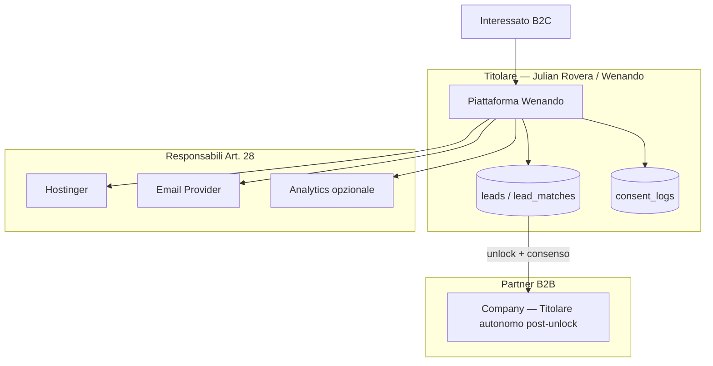
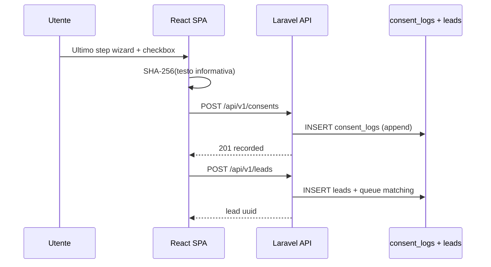
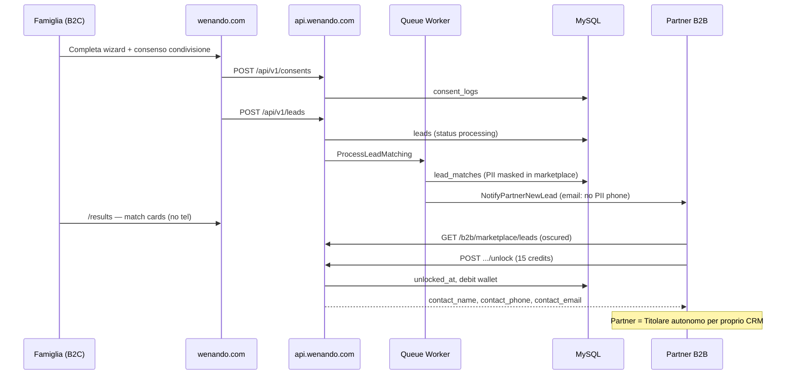

# Wenando — Piano di Conformità Legale & Architettura Privacy

> **Scope:** Strategia GDPR, cookie, retention e implementazione tecnica per la piattaforma Wenando (Trust Engine B2C/B2B — settore Senior Care).  
> **Step:** 1 di 4 del workflow compliance (solo questo documento; policy legali e codice in Step 2–4).  
> **Allineamento:** `1_ARCHITECTURE_&_SECURITY.md`, `2_DATABASE_SCHEMA.md`, `3_API_ROUTES_ROADMAP.md`

---

## Dati del Titolare

| Campo | Valore |
|-------|--------|
| **Titolare / Data Controller** | Julian Rovera |
| **Denominazione commerciale** | Wenando |
| **P.IVA** | IT13227980011 |
| **Email di contatto privacy** | hola@wenando.com |
| **Sito** | `https://wenando.com` |
| **API** | `https://api.wenando.com/api/v1` |

---

## 1. Executive Summary

Wenando è un **Trust Engine** che mette in contatto famiglie (B2C) e strutture/partner qualificati (B2B) nel settore dell’assistenza agli anziani. Il trattamento coinvolge dati personali e, in molti casi, **indizi relativi alla salute e all’autonomia** (wizard: `autonomy`, esigenze di cura, budget, localizzazione, contatti).

L’approccio adottato è **Privacy by Design e by Default** (Art. 25 GDPR):

- **Minimizzazione:** PII del lead oscurate nel marketplace B2B fino a `unlock` (cfr. ADR-008); condivisione partner limitata ai campi necessari.
- **Trasparenza:** consenso esplicito e versionato prima di `POST /leads` e prima di cookie non essenziali.
- **Accountability:** log immutabili dei consensi (`consent_logs`), registro trattamenti (Art. 30), retention automatizzata.
- **Sicurezza:** Sanctum, CORS restrittivo, rate limiting, mascheramento PII nei log (cfr. doc architettura §6).

Questo documento definisce **ruoli GDPR, basi giuridiche, flussi dati, specifiche Laravel/React** e una **roadmap** sincronizzata con gli Step 2–4 del workflow compliance. Non sostituisce parere legale professionale.

---

## 2. Ruoli GDPR e Responsabilità

### 2.1 Titolare del trattamento (Data Controller)

| Ruolo | Soggetto | Ambito |
|-------|----------|--------|
| **Titolare** | **Julian Rovera** (Wenando) | Piattaforma, wizard B2C, area utente, matching, marketplace, wallet, admin God Mode, log consensi, email transazionali |

Il titolare determina finalità e mezzi del trattamento su `users`, `leads`, `lead_matches`, `transactions`, `consent_logs`, ecc.

### 2.2 Responsabili del trattamento (Data Processors — Art. 28)

| Fornitore | Finalità | Dati trattati | Requisito |
|-----------|----------|---------------|-----------|
| **Hostinger Cloud** | Hosting API + DB MySQL/MariaDB | Tutti i dati in DB e file `storage/` | DPA Hostinger; server in UE o SCC se extra-UE |
| **Provider email** (es. SMTP Hostinger / SendGrid / Mailgun) | OTP, notifiche partner | Email, metadati invio | DPA + elenco sub-responsabili |
| **Analytics** (fase 2, opzionale) | Statistiche uso sito | IP anonimizzato, pageviews — **solo con consenso** | DPA; preferenza **Plausible** (UE) o self-hosted |
| **Captcha** (hCaptcha / reCAPTCHA) | Anti-abuso auth/wizard | IP, token challenge | DPA; informativa cookie/privacy |
| **Payment provider** (futuro) | Ricarica wallet | Dati pagamento | PCI-DSS lato provider; Wenando non memorizza PAN |

Wenando mantiene un **registro dei responsabili** aggiornato (Step 5 roadmap).

### 2.3 Partner B2B — modello giuridico per il trasferimento lead

I partner (`companies`) non sono responsabili del trattamento di Wenando sul wizard B2C, salvo diverso accordo. Per il **trasferimento del lead** dopo matching/unlock si applica il seguente modello:

| Scenario | Modello GDPR | Quando |
|----------|--------------|--------|
| **A — Partner riceve lead come destinatario autonomo** | **Trasferimento titolare → titolare** (Art. 26 o informativa + consenso dell’interessato) | Partner svolge **proprio** trattamento commerciale/assistenziale sul contatto; Wenando non determina finalità post-unlock |
| **B — Partner agisce su istruzioni di Wenando** | **Responsabile del trattamento** (Art. 28) | Partner usa dati **solo** per finalità definite da Wenando (es. solo notifica struttura designata, no marketing proprio) |

**Modello raccomandato per Wenando (Senior Care):** **Scenario A** — ogni partner approvato (`vetting_status = approved`) è **Titolare autonomo** per le proprie attività di contatto/assistenza dopo unlock, mentre Wenando resta titolare della piattaforma, del matching e del trattamento pre-trasferimento.

**Consenso dell’interessato (B2C):** al passo finale del wizard, checkbox separata del tipo:

> «Acconsento che Wenando condivida i miei dati con strutture partner selezionate per essere ricontattato/a in merito alla mia richiesta.»

Versione testo + hash registrati in `consent_logs` con `consent_type = lead_sharing` (testo checkbox wizard dedicato; cfr. [TERMS_B2C.md](./legal/TERMS_B2C.md) Art. 8.5). Il consenso Art. 9 e l’accettazione dell’informativa sono registrati con `consent_type = privacy_policy` (Art. 8.3 TERMS_B2C); l’accettazione contrattuale con `terms_b2c`.

**Joint controllership (Art. 26):** da valutare solo se un partner co-definisce il wizard o il profilo utente con Wenando (es. white-label). Non è il caso del marketplace standard.

### 2.4 Diagramma ruoli (sintesi)



---

## 3. Base Giuridica del Trattamento (Art. 6 GDPR)

| Categoria dati | Tabella / origine | Finalità | Base giuridica | Note |
|----------------|-------------------|----------|----------------|------|
| Email, nome utente, telefono profilo | `users` | Account, OTP, area utente | **Contratto** (b. — servizio richiesto) / **Consenso** per marketing | OTP = esecuzione misure pre-contrattuali |
| Risposte wizard (autonomia, budget, località, contatto) | `leads.payload`, colonne denormalizzate | Matching, diagnosi risultati, routing | **Consenso** (a.) esplicito al submit | Dati potenzialmente **categoria particolare** (salute) — vedi §9 DPIA |
| `contact_name`, `contact_phone`, `contact_email` | `leads` | Contatto partner, CRM | **Consenso** + esecuzione servizio | Telefono obbligatorio in wizard (schema) |
| Match score, metadata AI | `lead_matches` | Ranking, marketplace | **Consenso** / **Interesse legittimo** (f. — miglioramento servizio) con LIA documentata | Preferire consenso per profilazione sensibile |
| PII post-unlock | `lead_matches.unlocked_at` | CRM partner | **Consenso** B2C + **contratto B2B** partner-Wenando | Partner titolare autonomo post-trasferimento |
| Wallet, transazioni | `wallets`, `transactions` | Fatturazione, crediti | **Contratto** (b.) + **obbligo legale** (c. — 10 anni fiscali) | Ledger immutabile |
| Documenti partner (visura, ID) | `company_documents` | Vetting, antifrode | **Contratto** + **Interesse legittimo** (sicurezza piattaforma) | Conservazione limitata |
| Trust test answers | `trust_tests.answers` | Trust score partner | **Contratto** B2B | Non dati sanitari consumer |
| Log consensi | `consent_logs` | Prova accountability | **Obbligo legale** (c. — dimostrazione consenso) | 5 anni retention |
| OTP | `otp_codes` | Autenticazione | **Contratto** | TTL 10 min, hash at rest |
| Session / CSRF | `sessions`, cookie | Sicurezza | **Interesse legittimo** / necessità tecnica | Cookie strettamente necessari |
| Analytics (se attivi) | Plausible / self-hosted | Statistiche aggregate | **Consenso** (a.) | Solo dopo opt-in banner |
| Log applicativi (mascherati) | `storage/logs` | Sicurezza, debug | **Interesse legittimo** (f.) | No OTP, email mascherata |
| Marketing email B2C/B2B | futuro | Newsletter | **Consenso** (a.) — opt-in separato | Non attivo in go-live v1 |

**Art. 9 (categorie particolari):** il campo `autonomy` e il contesto Senior Care possono rivelare **stato di salute**. Base: **consenso esplicito** Art. 9(2)(a) tramite checkbox `privacy_policy` nel wizard (testo Art. 8.3 TERMS_B2C), oltre a informativa chiara.

---

## 4. Consent Logging — Implementazione Tecnica

### 4.1 Tabella `consent_logs`

Nuova tabella (non presente in `2_DATABASE_SCHEMA.md` — da aggiungere in Step 2).

| Colonna | Tipo | Nullable | Note |
|---------|------|----------|------|
| `id` | BIGINT UNSIGNED PK AI | No | |
| `user_id` | BIGINT FK → `users.id` | **Sì** | NULL per wizard pre-registrazione |
| `session_id` | VARCHAR(64) | Sì | ID sessione Laravel o UUID client per anonimi |
| `consent_type` | ENUM | No | `privacy_policy`, `terms_b2c`, `lead_sharing`, `terms_b2b`, `marketing`, `analytics_cookies` |
| `policy_version` | VARCHAR(20) | No | Semver es. `1.0.0` — allineato a footer legal docs |
| `ip_address` | VARCHAR(45) | Sì | IPv4/IPv6; considerare hashing dopo 90 gg [ASSUNZIONE] |
| `user_agent` | VARCHAR(512) | Sì | Troncato se > 512 |
| `consent_given` | BOOLEAN | No | `true` = accettato; `false` = rifiuto esplicito |
| `consent_text_hash` | CHAR(64) | No | SHA-256 del testo mostrato all’utente |
| `created_at` | TIMESTAMP | No | Solo `created_at` — **nessun** `updated_at` |

**Indici:** `(user_id, consent_type, created_at)`, `(session_id, consent_type)`, `(consent_type, policy_version)`.

**Vincoli applicativi:**

- **Append-only:** nessun `UPDATE`/`DELETE` su righe esistenti (eccetto job di **anonimizzazione** post-retention: azzerare `ip_address`, `user_agent`, `session_id` mantenendo hash e metadati consenso).

Enum `consent_type` allineato alle policy legali v1.0.0 in `backend/docs/legal/` (pubblicate in `public/legal/`).

### 4.2 Modello Eloquent `ConsentLog`

```php
// App\Models\ConsentLog
class ConsentLog extends Model
{
    public $timestamps = false; // solo created_at gestito manualmente o const UPDATED_AT = null

    protected $fillable = [
        'user_id', 'session_id', 'consent_type', 'policy_version',
        'ip_address', 'user_agent', 'consent_given', 'consent_text_hash',
    ];

    protected $casts = [
        'consent_given' => 'boolean',
        'created_at' => 'datetime',
    ];

    public function user(): BelongsTo
    {
        return $this->belongsTo(User::class);
    }
}
```

**Relazioni inverse:** `User::hasMany(ConsentLog::class)`.

**Policy:** nessun endpoint pubblico di modifica; creazione solo via `ConsentLogService`.

### 4.3 API (prefisso `/api/v1` — allineato a roadmap)

| Method | Path | Auth | Scopo |
|--------|------|------|-------|
| **POST** | `/api/v1/consents` | Opzionale (sessione o anonimo con `session_id`) | Registra uno o più consensi |
| **GET** | `/api/v1/consents/me` | Sì (Sanctum) | Ultimo stato per tipo + storico paginato |

**POST `/api/v1/consents` — request:**

```json
{
  "consents": [
    {
      "consent_type": "privacy_policy",
      "policy_version": "1.0.0",
      "consent_given": true,
      "consent_text_hash": "a3f2…sha256…",
      "session_id": "optional-client-uuid"
    },
    {
      "consent_type": "analytics_cookies",
      "policy_version": "1.0.0",
      "consent_given": false,
      "consent_text_hash": "…"
    }
  ]
}
```

**Response:** `201` con `{ "recorded": [ { "id", "consent_type", "created_at" } ] }`.

**GET `/api/v1/consents/me` — response:**

```json
{
  "latest_by_type": {
    "privacy_policy": { "consent_given": true, "policy_version": "1.0.0", "created_at": "…" },
    "analytics_cookies": { "consent_given": false, "policy_version": "1.0.0", "created_at": "…" }
  },
  "history": { "data": [], "meta": {} }
}
```

**Rate limit:** stesso bucket `api` o dedicato `consent-write` 30/min per IP.

**Validazione FormRequest:**

- `consent_type` → `in:privacy_policy,terms_b2c,lead_sharing,terms_b2b,marketing,analytics_cookies`
- `policy_version` → `regex:/^\d+\.\d+\.\d+$/`
- `consent_text_hash` → `required|string|size:64`
- `consent_given` → `required|boolean`

Il frontend calcola `consent_text_hash` su testo legal snapshot (o riceve hash da pagina statica versionata).

### 4.4 Punti di integrazione frontend

| Punto UI | Consensi registrati | Sync |
|----------|---------------------|------|
| **Wizard — ultimo step** | `privacy_policy`, `terms_b2c`, `lead_sharing`, checkbox marketing opzionale | `POST /consents` **prima** di `POST /leads` |
| **Cookie banner** (prima visita) | `analytics_cookies` | `localStorage` + `POST /consents` |
| **Registrazione B2B** `/pro/register` | `terms_b2b` (fase 2), `privacy_policy` | On submit registrazione |
| **Area utente — preferenze** | `marketing`, `analytics_cookies` | Revoca = `consent_given: false` nuova riga append |

### 4.5 Flusso wizard + consenso



---

## 5. Data Retention & Anonymization

### 5.1 Tabella periodi di conservazione

| Dataset | Condizione | Periodo | Azione |
|---------|------------|---------|--------|
| **Lead B2C** (`leads`) | Nessun login / `user_id` NULL e inattivo | **730 giorni** (24 mesi) dall’ultima attività | Anonimizzazione (configurabile `LEAD_ANONYMIZE_DAYS`) |
| **Lead B2C** con account | Utente attivo o cancellazione account | Fino a richiesta erasure o 730 gg inattività post-chiusura | Anonimizzazione + unlink `user_id` |
| **`lead_matches`** | Lead anonimizzato | Stesso job | Mantieni `match_score`, azzera riferimenti PII via join lead |
| **`consent_logs`** | — | **5 anni** dalla raccolta | Anonimizzazione IP/UA/session; conservare hash e boolean |
| **`transactions`** / fatturazione B2B | Obblighi fiscali IT | **10 anni** | Nessuna cancellazione; solo status `void` per correzioni |
| **`otp_codes`** | — | **10 minuti** TTL + purge giornaliero | Delete hard |
| **`sessions`** | — | Scadenza sessione + purge | Delete |
| **Log Laravel** | — | **30 giorni** (hosting) | Rotazione file (già in architettura) |
| **`company_documents`** | Partner `rejected` / churn | **24 mesi** poi delete file | Hard delete file + row |
| **Backup DB** | — | **90 giorni** rolling [ASSUNZIONE] | Policy Hostinger |

### 5.2 Comando schedulato `leads:anonymize-stale`

```php
// app/Console/Commands/AnonymizeStaleLeads.php
// Signature: leads:anonymize-stale {--dry-run}
```

**Regola selezione:**

```sql
SELECT id FROM leads
WHERE deleted_at IS NULL
  AND status IN ('closed', 'cancelled', 'routed', 'assigned')
  AND updated_at < NOW() - INTERVAL :days DAY
  AND (contact_email NOT LIKE 'anon_%' OR contact_email IS NULL); -- già anonimizzati esclusi
```

Per lead **senza account** senza attività su `lead_matches.unlocked_at` e senza aggiornamento CRM: usa `created_at` se `updated_at` non riflette attività partner.

**Schedule (`app/Console/Kernel.php` o `routes/console.php` Laravel 11):**

```php
Schedule::command('leads:anonymize-stale')->dailyAt('03:00')->timezone('Europe/Rome');
```

Allineato a cron Hostinger: `php artisan schedule:run` ogni minuto (cfr. architettura §7.4).

### 5.3 Logica di anonimizzazione

| Campo `leads` | Prima | Dopo |
|---------------|-------|------|
| `contact_name` | Mario Rossi | `NULL` |
| `contact_phone` | +39 333… | `NULL` (o hash HMAC con pepper in colonna `contact_phone_hash` se serve anti-duplicato) |
| `contact_email` | mario@… | `anon_{sha256_prefix}@anonymized.wenando.local` |
| `location_label` | Milano, Zona X | `Milano` (solo città) o `NULL` |
| `payload` JSON | PII in `contact`, `nome` | Strip chiavi PII; mantieni `autonomy`, `budget` aggregati per statistiche |
| `need_summary` | Testo libero | `NULL` o testo generico «Richiesta anonimizzata» |
| `user_id` | FK | `NULL` se account cancellato |

**`users` (diritto all’oblio):** soft-delete (`deleted_at`) poi job `users:anonymize` su email/nome/phone con stesso schema hash.

### 5.4 Soft-delete vs hard anonymization

| Strategia | Uso |
|-----------|-----|
| **Soft-delete** (`deleted_at` su `leads`, `users`) | Richiesta utente «cancella account» — nasconde da UI, mantiene FK per integrità `transactions` / audit |
| **Hard anonymization** | Retention scaduta o erasure confermata — **sovrascrive** PII, non rimuove la riga (statistiche, ledger) |
| **Hard delete** | Solo dati non soggetti a obbligo di legge (`otp_codes`, sessioni, file documenti scaduti) |

**Mai** hard-delete righe `transactions` o `consent_logs` (solo anonimizzazione campi identificativi in `consent_logs`).

---

## 6. Cookie Strategy

### 6.1 Classificazione

| Cookie / storage | Tipo | Finalità | Consenso |
|------------------|------|----------|----------|
| `laravel_session` / `XSRF-TOKEN` | Strettamente necessario | Sessione Sanctum, CSRF | No |
| `wenando_cookie_consent` (localStorage) | Preferenza | Memorizza scelta banner | No (preferenza, non tracking) |
| Analytics (es. Plausible) | Funzionale/statistica | Metriche aggregate | **Sì** — opt-in |
| Marketing / ads | — | — | **Nessuno in v1** |

**Raccomandazione:** [Plausible Analytics](https://plausible.io) (UE, no cookie di profilazione di default) o **Plausible self-hosted** su subdomain `analytics.wenando.com` per controllo totale.

### 6.2 Cookie banner — UX

- Posizione: **barra inferiore fissa**, non modale bloccante.
- Tre azioni **pari peso visivo** (stesso stile bottone, nessun dark pattern):
  - **Accetta tutti** — abilita analytics + log `analytics_cookies: true`
  - **Rifiuta non essenziali** — solo necessari + log `analytics_cookies: false`
  - **Personalizza** — pannello con toggle singolo (analytics); marketing disabilitato/grigio in v1
- Link: «Cookie Policy» e «Privacy Policy» (Step 2).
- Lingua: italiano primario.

### 6.3 Sync client-server

```javascript
// Chiave localStorage (sostituisce eventuale mock)
const STORAGE_KEY = 'wenando_cookie_consent';

// Valore esempio (allineato a COOKIE_POLICY.md e `src/constants/cookieConsent.js`)
{
  "version": "1.0.0",
  "necessary": true,
  "analytics": false,
  "timestamp": "2026-06-03T10:00:00.000Z"
}
```

Alla scelta: `POST /api/v1/consents` con `consent_type: analytics_cookies` + hash testo policy cookie.

### 6.4 Piano componente React `CookieBanner`

| File | Responsabilità |
|------|----------------|
| `src/components/legal/CookieBanner.jsx` | UI banner + drawer Personalizza |
| `src/hooks/useCookieConsent.js` | Read/write `localStorage`, chiama API |
| `src/lib/consentHash.js` | `sha256(text)` Web Crypto API |
| `src/App.jsx` | Monta banner se `!consent` in storage |

**Comportamento:**

1. Mount → leggi `wenando_cookie_consent`.
2. Se assente → mostra banner.
3. On action → aggiorna storage → `POST /consents` → nascondi banner.
4. Se analytics `true` → carica script Plausible dinamicamente (`defer`).

Non caricare script analytics prima del consenso (Privacy by Default).

---

## 7. Data Flow — Trasferimento Dati ai Partner B2B

### 7.1 Sequence diagram (end-to-end)



### 7.2 Base giuridica condivisione

- **Pre-marketplace:** trattamento da Wenando (matching, scoring) — consenso wizard + informativa.
- **Post-unlock:** trasferimento a partner — consenso esplicito + contratto B2B Wenando-partner; partner tratta come titolare autonomo per contatto commerciale.

### 7.3 DPA e accordi partner

Ogni `company` con `vetting_status = approved` deve aver firmato:

1. **Contratto di piattaforma / T&C B2B** con clausole privacy.
2. **Allegato Art. 28** solo se il partner è **responsabile** (Scenario B).
3. **Lettera di incarico** per titolare autonomo (Scenario A): obblighi di legge applicabile, divieto uso per finalità diverse, sicurezza, cancellazione su richiesta Wenando/utente.

### 7.4 Principio di minimizzazione — campi condivisi

| Fase | Campi visibili al partner |
|------|---------------------------|
| Marketplace (pre-unlock) | `location_label` (città), `budget_min/max`, `need_summary`, `match_score` — **no** `contact_phone`, `contact_name`, email |
| Post-unlock | `contact_name`, `contact_phone`, `contact_email`, `location_label`, `need_summary`, `payload` subset rilevante (es. `autonomy`) |

Non esporre `user_id` interno; usare `public_ref` / `ML-####` come in ADR-007.

### 7.5 Obblighi partner

- Trattare dati solo per rispondere alla richiesta Senior Care.
- Non cedere a terzi senza base giuridica propria.
- Implementare misure di sicurezza adeguate (Art. 32).
- Assistere Wenando per **DSAR** entro 30 giorni se ricevute via piattaforma.
- Notificare **data breach** a Wenando entro 24h.

---

## 8. Diritti degli Interessati (Art. 15–22 GDPR)

**Canale richieste:** hola@wenando.com — oggetto «Diritti privacy».  
**SLA risposta:** **30 giorni** (proroga +60 se complessità, comunicata entro 30 gg).

| Diritto | Art. | Implementazione tecnica | Endpoint / processo |
|---------|------|-------------------------|---------------------|
| **Accesso** | 15 | Export JSON/PDF dati utente + lead collegati + consensi | `GET /api/v1/user/privacy/export` (Step 4) |
| **Rettifica** | 16 | Aggiornamento profilo e lead attivi | `PATCH /api/v1/user/profile`; admin/support per `leads` errati |
| **Cancellazione / Oblio** | 17 | Soft-delete user + `leads:anonymize` + revoca marketing | `POST /api/v1/user/privacy/erase-request` → coda verifica identità |
| **Limitazione** | 18 | Flag `processing_restricted_at` su `users` / `leads` [ASSUNZIONE] | Blocco matching e unlock fino a revoca |
| **Portabilità** | 20 | JSON machine-readable | Stesso export accesso, subset dati forniti dall’utente |
| **Opposizione** | 21 | Opt-out marketing / analytics | Nuova riga `consent_logs` con `consent_given: false` |
| **Revoca consenso** | 7(3) | Come opposizione per finalità basate su consenso | Non retroattivo; stop trattamento futuro |

### 8.1 Dettaglio implementativo (Step 4)

**Export (`PrivacyExportService`):**

- `users`: email, name, phone, created_at
- `leads`: where `user_id` = X OR `contact_email` = user.email
- `consent_logs`: storico
- `saved_matches`, `advisor_bookings` se presenti

**Erase cascade:**

1. Verifica OTP o sessione autenticata.
2. `users.deleted_at` = now.
3. Job `AnonymizeUserLeads` per tutti i `leads.user_id`.
4. Notifica partner con lead sbloccati: «richiesta cancellazione — cessare trattamento» [processo manuale v1].
5. Risposta email entro SLA.

**Eccezioni Art. 17(3):** conservare `transactions` e `consent_logs` (obbligo legale / prova consenso) con anonimizzazione identificativi dove possibile.

---

## 9. DPIA (Valutazione d’Impatto — Art. 35)

### 9.1 Necessità DPIA

**Raccomandata** (non sempre obbligatoria in assenza di decisione automatizzata con effetti giuridici significativi), perché:

- Trattamento sistematico di dati relativi a **bisogni assistenziali / autonomia** (possibile Art. 9).
- **Profilazione** implicita (matching score, diagnosi «RSA vs ADI»).
- Interessati potenzialmente **vulnerabili** (anziani o familiari).

### 9.2 Rischi principali e mitigazioni

| Rischio | Impatto | Mitigazione |
|---------|---------|-------------|
| Accesso non autorizzato a PII lead | Alto | Sanctum, policy `company_id`, blur marketplace, audit unlock |
| Trasferimento eccessivo a partner | Alto | Minimizzazione pre/post unlock; consenso granulare |
| Profilazione salute senza base Art. 9 | Alto | Consenso esplicito Art. 9; testo chiaro wizard |
| Data breach partner | Medio-Alto | DPA, vetting `trust_tests`, sospensione `vetting_status` |
| Re-identificazione da payload JSON | Medio | Anonimizzazione strip `payload.contact` |
| Admin God Mode non protetto | Alto | Middleware `super_admin` + audit log (cfr. threat model) |

**Output Step 3:** documento DPIA formale firmato dal titolare, revisione annuale o su cambio matching/AI.

---

## 10. Registro delle Attività di Trattamento (Art. 30)

| ID | Attività | Finalità | Categorie interessati | Categorie dati | Destinatari | Trasferimenti extra-UE | Termine | Misure |
|----|----------|----------|----------------------|----------------|-------------|------------------------|---------|--------|
| R1 | Wizard B2C | Matching assistenziale | Famiglie, caregiver | Identità, contatto, salute (autonomia), geo | Partner post-consenso | Solo se processor extra-UE con SCC | 24 mesi inattività → anon | Cifratura TLS, consenso, rate limit |
| R2 | Account consumer OTP | Autenticazione area utente | Consumatori | Email, nome, telefono | Email provider | Come sopra | Vita account + 24 mesi | OTP hash, session DB |
| R3 | Marketplace B2B | Monetizzazione lead | Partner | Lead PII post-unlock | Partner titolare | — | 10 anni transazioni; lead 24 mesi | Unlock a pagamento, audit |
| R4 | Onboarding B2B | Vetting partner | Rappresentanti legali | P.IVA, documenti, trust Q&A | Admin Wenando | — | Durata contratto + 10 anni fiscale | Upload MIME whitelist |
| R5 | Wallet / fatturazione | Crediti piattaforma | Partner | Pagamenti, transazioni | Payment provider [futuro] | Provider certificati | 10 anni | Ledger immutabile |
| R6 | Log consensi | Accountability | Tutti visitatori | IP, UA, hash consenso | Nessuno | — | 5 anni | Append-only |
| R7 | Analytics web | Miglioramento sito | Visitatori | IP anonimizzato, pagine | Plausible / self-hosted | UE preferito | 26 mesi [provider] | Opt-in only |
| R8 | Admin God Mode | Gestione piattaforma | Utenti/partner | Tutti sopra | Solo personale autorizzato | — | Log 30 gg | RBAC super_admin |
| R9 | Notifiche email | Servizio, alert lead | B2C, B2B | Email, metadati | SMTP provider | — | Transazionale: minimo necessario | Template senza PII in alert marketplace |

---

## 11. Roadmap Implementazione

Allineata al workflow compliance multi-step:

| Fase | Step workflow | Deliverable | Dipendenze doc |
|------|---------------|-------------|----------------|
| **Phase 1** | Step 2 — Legal docs | [Privacy Policy](./legal/PRIVACY_POLICY.md), [Cookie Policy](./legal/COOKIE_POLICY.md), [T&C B2C](./legal/TERMS_B2C.md), [T&C B2B](./legal/TERMS_B2B_PARTNERS.md), informativa Art. 13 | Testi con version semver → `policy_version`; mirror in `public/legal/` |
| **Phase 2** | Step 2 — Backend | Migration `consent_logs`, model, `POST/GET consents`, validazione `POST /leads` richiede consenso verificato | `2_DATABASE_SCHEMA.md` update |
| **Phase 3** | Step 3 — Frontend | `CookieBanner`, checkbox wizard, pagine `/privacy`, `/cookies`, `/terms` | Hash testi statici in `public/legal/` |
| **Phase 4** | Step 3–4 | `leads:anonymize-stale`, DSAR export/erase endpoints, email workflow hola@ | Kernel schedule Hostinger |
| **Phase 5** | Step 4 — Partner | Template DPA/contratto, checklist vetting, audit annuale partner attivi | Admin approve partner |

### 11.1 Priorità incrociata con API roadmap

| Priorità API esistente | Aggiunta compliance |
|------------------------|---------------------|
| P0 Auth + `POST /leads` | **Bloccare** `POST /leads` senza `consent_logs` validi per `privacy_policy` (include Art. 9), `terms_b2c` e, per marketplace, `lead_sharing` |
| P1 B2B onboarding | Consensi `terms_b2b` + accettazione DPA |
| P2 Marketplace unlock | Log audit `transactions` + unlock (già previsto) |
| P3 Admin | Export DSAR admin-assisted |

---

## 12. Checklist Pre-Go-Live

### 12.1 Documentazione legale (Step 2)

- [ ] Privacy Policy v1.0.0 pubblicata (`/privacy`) con titolare **Julian Rovera**, P.IVA **IT13227980011**, email **hola@wenando.com**
- [ ] Cookie Policy con elenco cookie/storage
- [ ] T&C B2C e B2B con clausola limitazione responsabilità matching
- [ ] Informativa Art. 9 per dati salute/autonomia nel wizard

### 12.2 Backend (Step 2–3)

- [ ] Tabella `consent_logs` migrata e testata
- [ ] `POST /api/v1/consents` e `GET /api/v1/consents/me` in produzione
- [ ] `POST /api/v1/leads` rifiuta submit senza consensi `privacy_policy`, `terms_b2c` e `lead_sharing` (versione corrente)
- [ ] PII marketplace mascherata fino a `unlocked_at` (verifica Policy/Transformer)
- [ ] Rate limit `wizard-submit` attivo
- [ ] `leads:anonymize-stale` schedulato e testato `--dry-run`
- [ ] Mascheramento PII nei log Laravel

### 12.3 Frontend (Step 3)

- [ ] `CookieBanner` con Accetta tutti / Rifiuta non essenziali / Personalizza pari peso
- [ ] `wenando_cookie_consent` + sync API
- [ ] Wizard: checkbox non pre-selezionate, hash testo, ordine consensi → submit lead
- [ ] Analytics script **non** caricato prima del consenso
- [ ] Link footer a policy su tutte le pagine

### 12.4 Organizzativo

- [ ] Registro Art. 30 compilato (§10)
- [ ] Elenco responsabili (Hostinger, email, captcha) con DPA
- [ ] Processo DSAR hola@wenando.com (30 giorni)
- [ ] DPIA redatta e archiviata (§9)
- [ ] Template accordo partner (Phase 5) pronto prima di scalare partner

### 12.5 Sicurezza (da architettura)

- [ ] CORS produzione solo `wenando.com`
- [ ] Admin API protetta `super_admin`
- [ ] HTTPS + `SESSION_SECURE_COOKIE=true`
- [ ] Backup e ripristino testati

---

## Riferimenti incrociati

| Documento | Contenuto rilevante |
|-----------|---------------------|
| `1_ARCHITECTURE_&_SECURITY.md` | Sanctum, CORS, rate limit, PII log, threat model |
| `2_DATABASE_SCHEMA.md` | `leads`, `lead_matches`, `users`, soft-delete |
| `3_API_ROUTES_ROADMAP.md` | `POST /leads`, auth, marketplace unlock |
| `legal/PRIVACY_POLICY.md` | Informativa Art. 13/14, basi giuridiche, retention, diritti — v1.0.0 |
| `legal/COOKIE_POLICY.md` | Cookie, localStorage, banner, Plausible — v1.0.0 |
| `legal/TERMS_B2C.md` | Consensi wizard (`privacy_policy`, `terms_b2c`, `lead_sharing`), limitazioni servizio — v1.0.0 |
| `legal/TERMS_B2B_PARTNERS.md` | Marketplace, unlock 15 crediti, Scenario A, dispute D1–D4 — v1.0.0 |

**URL pubblici SPA (allineati ai documenti legali):** `/privacy`, `/cookies`, `/terms`, `/terms-partners`.  
**Mirror deploy:** `backend/docs/legal/` → `public/legal/` (identici byte-per-byte).

**Prossimo step workflow:** Step 2 — redazione policy legali (IT) e migration `consent_logs`.
