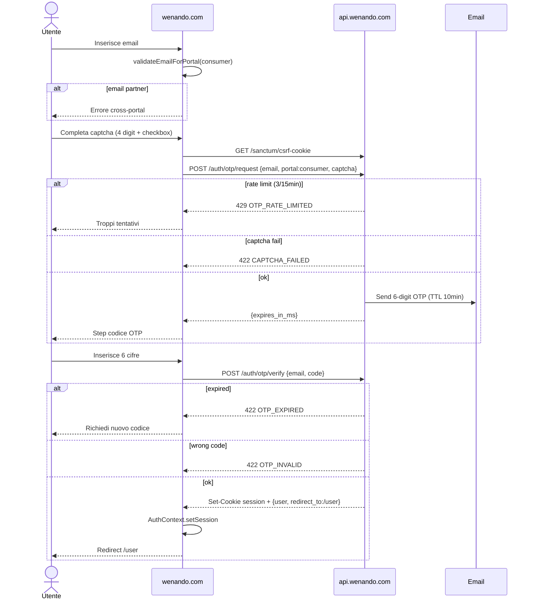
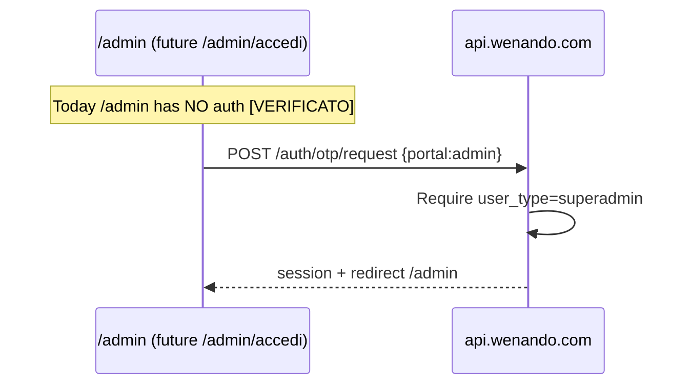
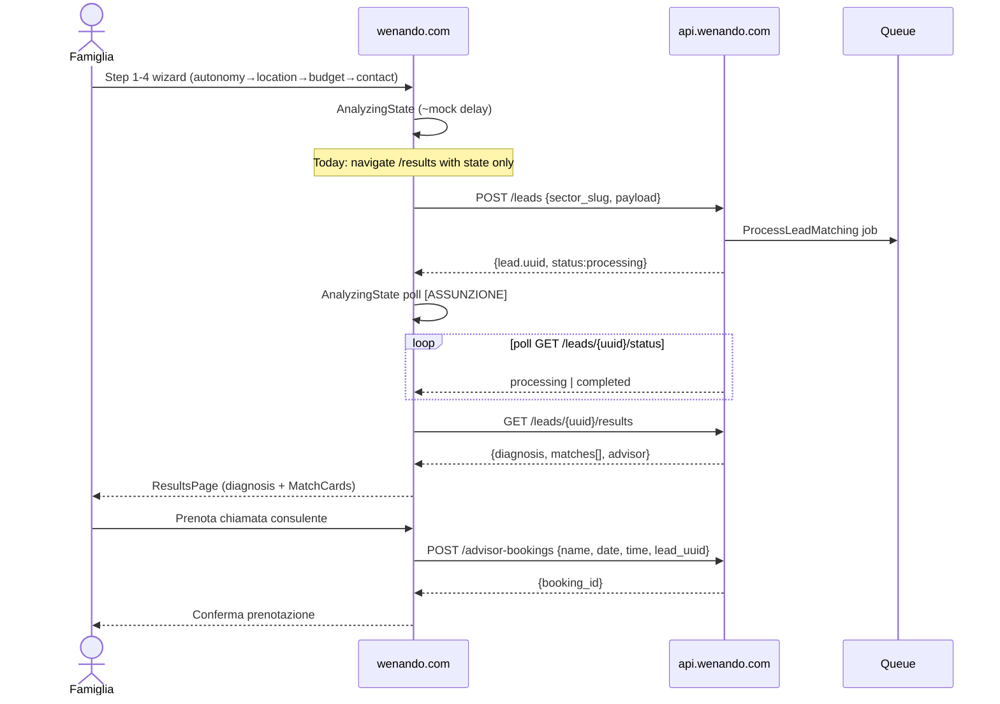
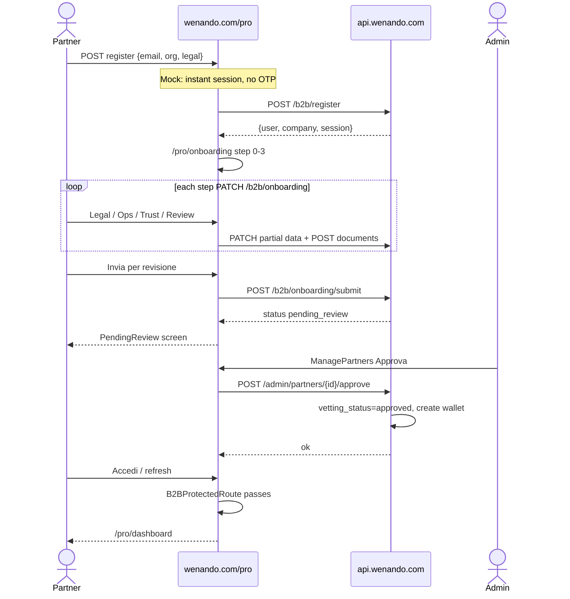
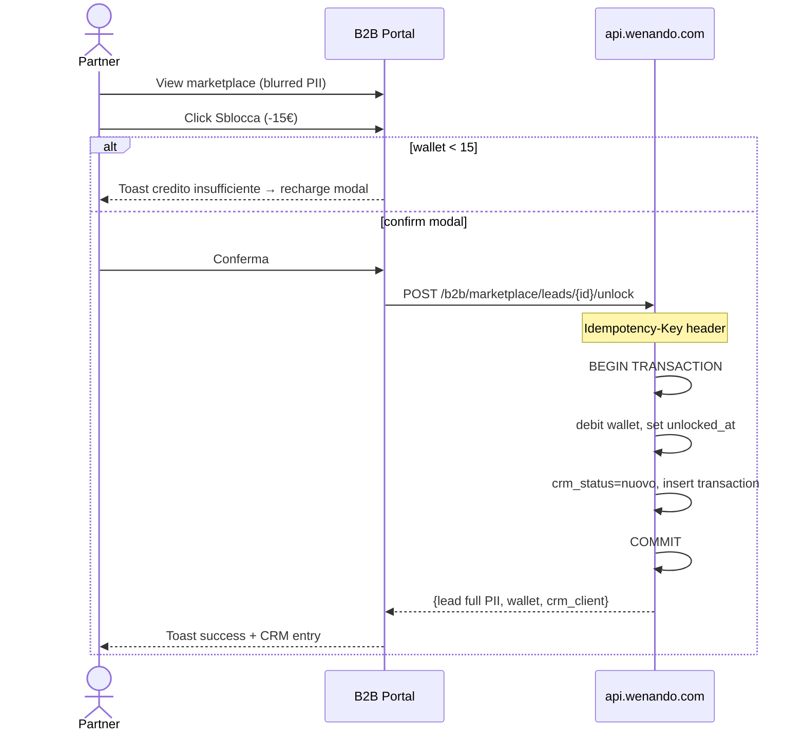
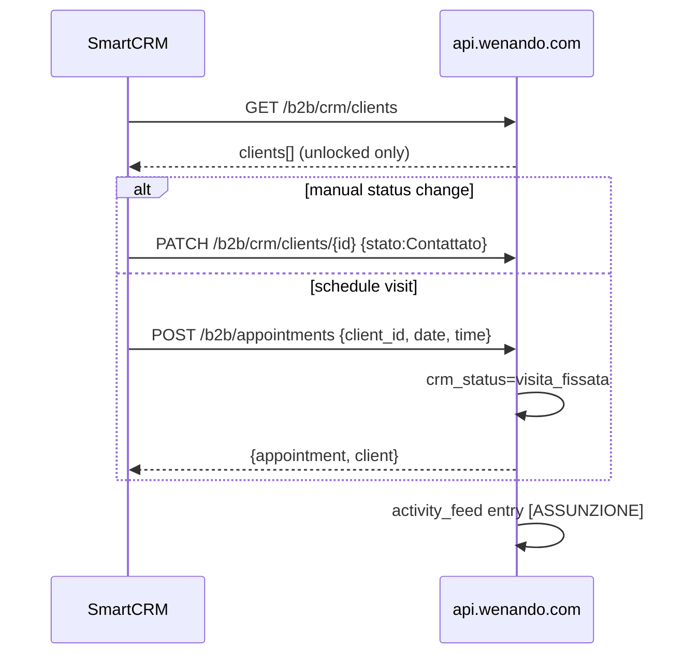
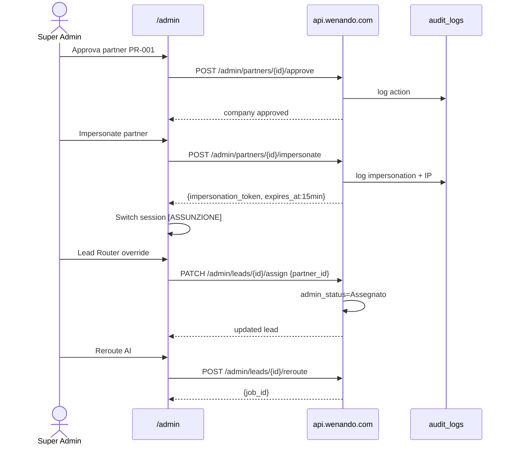
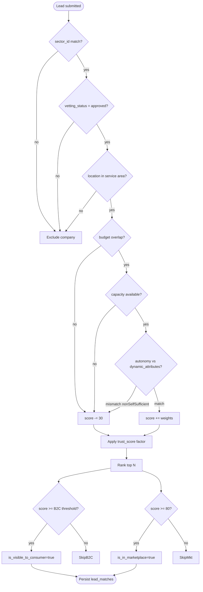
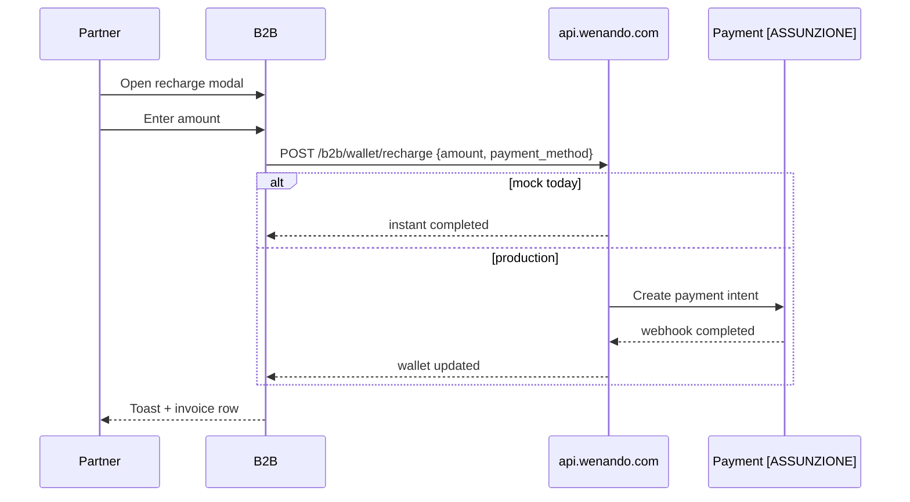

# Wenando — User Flows & Sequence Diagrams

> Flussi derivati dal frontend React. Error/retry paths inclusi dove [VERIFICATO] nel mock.

---

## 1. OTP Auth — Consumer (`/accedi`)

[VERIFICATO] `Accedi.jsx`, `authService.js`, `HumanVerification.jsx`

**Resend cooldown [VERIFICATO]:** 60s between sends — UI timer via `getResendCooldown`.

---

## 2. OTP Auth — B2B Partner (`/pro/accedi`)

Same flow as §1 with `portal: partner` and redirect:
- `approved` → `/pro/dashboard` [VERIFICATO] `getB2BRedirectPath`
- `pending_review` / `in_progress` → `/pro/onboarding`

---

## 3. OTP Auth — Admin [ASSUNZIONE]

---

## 4. B2C Wizard → Results → Advisor

[VERIFICATO] `Wizard.jsx`, `ResultsPage.jsx`, `BookingSheet.jsx`

**Guard [VERIFICATO]:** ResultsPage redirects to `/wizard` if `!answers.autonomy`.

**Post-login link [VERIFICATO]:** Header links to `/user/ricerche` (searches may be empty until API persists).

---

## 5. B2B Register → Onboarding → Vetting → Approved

[VERIFICATO] `Register.jsx`, `Onboarding.jsx`, `ManagePartners.jsx`

**Reject path [VERIFICATO UI]:** Partner card removed from list — maps to `rejected` + notification [ASSUNZIONE].

---

## 6. Marketplace Unlock (15 credits)

[VERIFICATO] `B2BContext.unlockLead`, `LeadMarketplace.jsx`

---

## 7. CRM Pipeline Transitions

[VERIFICATO] `SmartCRM.jsx`, `B2BContext.updateCRMStatus`, `scheduleVisit`

**CRM statuses [VERIFICATO]:** Nuovo → Contattato → Visita Fissata → Chiuso | Perso

---

## 8. Admin — Approve / Reject / Suspend / Impersonate / Route Lead

---

## 9. Matching algorithm — Decision tree

Logic today is **mock**; target behavior inferred from UI + data shapes.

**Weights [ASSUNZIONE] from `sectors.matching_rules` JSON:**

| Factor | Weight | Source hint |
|--------|--------|-------------|
| Budget overlap | 25% | wizard budget vs company pricing [ASSUNZIONE] |
| Geo proximity | 20% | location_label vs company.city |
| Autonomy fit | 25% | non-autosufficient → requires nonSelfSufficient |
| Trust score | 15% | company_trust_scores.score |
| Capacity | 10% | dynamic.capacity |
| Night staff | 5% | non-autosufficient + nightStaff bonus |

**min_match_score_marketplace:** 80 [VERIFICATO] seed in database_master.sql

---

## 10. Error & retry paths

| Flow | Error | User message [VERIFICATO] | Retry |
|------|-------|---------------------------|-------|
| OTP request | Rate limit | Troppi tentativi. Riprova tra N min | Wait window |
| OTP verify | Expired | Codice scaduto | New request |
| OTP verify | Invalid | Codice non valido | Re-enter |
| Captcha | Too fast | Attendi un momento | Wait 2s [VERIFICATO] |
| Unlock | Insufficient credits | Credito insufficiente | Recharge |
| Onboarding step | Missing fields | Button disabled | Fill fields |
| Results | No answers | Redirect wizard | Restart wizard |
| Network | 5xx | Generic [ASSUNZIONE] | Exponential backoff |

---

## 11. Wallet recharge flow [VERIFICATO mock]

