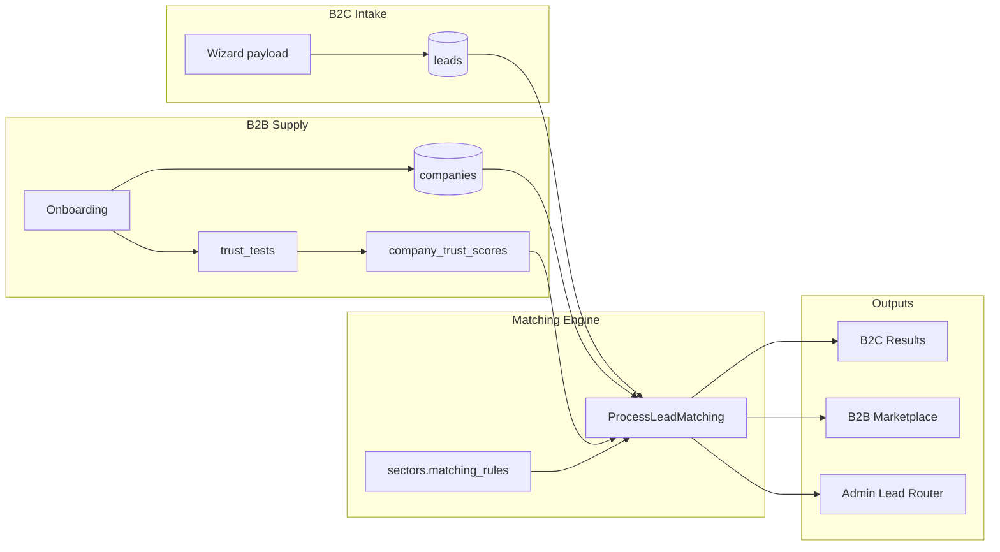

# Wenando — Matching & Trust Engine Logic

> Come `trust_tests`, `company_trust_scores` e l'algoritmo di matching collegano B2C wizard, B2B marketplace e admin Lead Router.

---

## 1. Architettura Trust Engine



---

## 2. Trust Tests & Scoring

### 2.1 Lifecycle

| Phase | trust_tests.status | Trigger |
|-------|-------------------|---------|
| Partner fills onboarding step 2 | `draft` | PATCH trust_answers partial |
| Submit for review | `submitted` | POST /b2b/onboarding/submit |
| Async scoring job | `scored` | ScoreTrustTest job |
| Failed minimum threshold | `failed` | score < min_trust [ASSUNZIONE] |

### 2.2 Questions [VERIFICATO] TRUST_QUESTIONS

| ID | Title | Scoring hint [ASSUNZIONE] |
|----|-------|---------------------------|
| `emergency` | Emergenza medica notturna | Check escalation, timing, documentation keywords |
| `fall` | Caduta ospite | 3-step protocol completeness |
| `family` | Comunicazione familiari | SLA, channels, H24 |
| `quality` | Standard qualità | Named metrics (NPS, audit) |

### 2.3 company_trust_scores

| Field | Usage |
|-------|-------|
| `score` | 0–100 composite |
| `breakdown` | `{ "emergency": 85, "fall": 90, ... }` |
| `trust_test_id` | Source submission |

**Minimum threshold [ASSUNZIONE]:** score < 60 → partner approved but deprioritized in matching; < 40 → admin review flag.

Scoring implementation options (pick one at implement time):
1. **Rule-based** keyword + length heuristics (MVP)
2. **LLM-assisted** async with human review queue [ASSUNZIONE]
3. **Manual** admin score on approve [fallback]

---

## 3. Lead matching algorithm

### 3.1 Trigger

`POST /leads` → queue `ProcessLeadMatching` with `lead_id`.

Poll: `GET /leads/{uuid}/status` until `status != processing`.

### 3.2 Candidate pool

```sql
SELECT c.*, cts.score AS trust_score
FROM companies c
LEFT JOIN company_trust_scores cts ON cts.company_id = c.id
WHERE c.sector_id = :lead_sector_id
  AND c.vetting_status = 'approved'
  AND c.deleted_at IS NULL;
```

Further filter in PHP using `dynamic_attributes`, `schedule`, geo [ASSUNZIONE].

### 3.3 Score factors & weights

Default from `sectors.matching_rules` seed:

```json
{
  "default_unlock_cost": 15,
  "min_match_score_marketplace": 80,
  "weights": {
    "budget_overlap": 0.25,
    "geo_match": 0.20,
    "autonomy_fit": 0.25,
    "trust_score": 0.15,
    "capacity": 0.10,
    "operational_bonus": 0.05
  },
  "b2c_visible_min_score": 70,
  "max_b2c_results": 3,
  "max_marketplace_per_lead": 50
}
```

### 3.4 Factor calculations

#### budget_overlap (0–100)

```
lead_range = [budget_min, budget_max]
overlap = intersection with company acceptable range [ASSUNZIONE pricing table or capacity proxy]
score = (overlap_width / lead_range_width) * 100
```

[VERIFICATO] Wizard budget 500–5000 EUR/month; mock leads show formatted `2.400€/mese`.

#### geo_match (0–100)

```
if location.value city matches company.city → 100
if same province [ASSUNZIONE] → 80
if same region → 50
else → 0 (exclude)
```

[VERIFICATO] Mock locations: Milano (MI), Roma (RM), etc.

#### autonomy_fit (0–100)

| lead.autonomy | company.dynamic_attributes | Score |
|---------------|---------------------------|-------|
| non-autosufficiente | nonSelfSufficient=true, nightStaff=true | 100 |
| non-autosufficiente | nonSelfSufficient=false | 20 |
| parziale | any accepting | 85 |
| autosufficiente | adi/centro sector | 90 |
| autosufficiente | rsa only | 60 |

Map wizard `autonomy` enum to care need level [VERIFICATO] autonomyInfo.

#### trust_score factor

```
factor = company_trust_scores.score  // 0-100 directly
```

#### capacity factor

```
if dynamic.capacity >= 1 → min(100, capacity * 5) [ASSUNZIONE linear cap]
```

#### operational_bonus

```
+5 if nightStaff and lead needs h24 [ASSUNZIONE keyword in need_summary]
+5 if schedule has open slots matching visit preferences [ASSUNZIONE]
```

### 3.5 Composite match_score

```
match_score = round(sum(weight_i * factor_i / 100 * 100))
```

Store in `lead_matches.match_score` (TINYINT 0–100).

### 3.6 Output flags

| Condition | Flags |
|-----------|-------|
| `match_score >= b2c_visible_min_score` | `is_visible_to_consumer=true`, set `rank` 1–3 |
| `match_score >= min_match_score_marketplace` (80) | `is_in_marketplace=true` |
| Top match | `metadata.ai_match_label` = "{company} ({score}%)" [VERIFICATO] admin UI |

### 3.7 Diagnosis (B2C results page)

[VERIFICATO] Not matching-based — purely rules on `autonomy` via `getDiagnosis()`:

Results API returns static educational content + ranked company cards separately.

---

## 4. Preview vs unlock — data visibility

### 4.1 Marketplace card [VERIFICATO] LeadMarketplace

| Field | Locked | Unlocked |
|-------|--------|----------|
| match_score | ✓ | ✓ |
| budget | ✓ | ✓ |
| location | ✓ | ✓ |
| need / esigenza | ✓ | ✓ |
| lead id (ML-) | ✓ | ✓ |
| name | blurred | ✓ |
| phone | blurred | ✓ |
| email | blurred | ✓ |
| unlock_cost | ✓ | N/A (already unlocked) |

API implementation: use separate DTOs `MarketplaceLeadPreview` vs `MarketplaceLeadUnlocked`.

### 4.2 B2C results [VERIFICATO] mockMatches

Consumer sees company name, location, compatibility — **no consumer PII of other users**. Partner branding only.

### 4.3 Admin Lead Router [VERIFICATO] mockAdminLeads

Full PII always visible to super_admin: email, telefono, note, partner_assegnato.

---

## 5. Admin override & reroute

[VERIFICATO] LeadRouter `handleAssignPartner`:
- Sets `partnerAssegnato`
- Sets `stato` → `Assegnato`
- Updates `aiMatch` → `"{partner} (override)"`

API should:
1. Create/update `lead_matches` row with `assigned_by=admin_id`
2. Set `leads.admin_status = 'Assegnato'`
3. Log audit event

`POST /admin/leads/{id}/reroute` re-runs ProcessLeadMatching excluding manual lock [ASSUNZIONE flag `metadata.manual_lock`].

---

## 6. Sector-agnostic matching via JSON

New sector (e.g. home-renovation) defines in `sectors.matching_rules`:

```json
{
  "payload_fields": {
    "project_type": { "weight": 0.3, "match": "dynamic.project_types[]" },
    "sqm": { "weight": 0.2, "range": true },
    "budget": { "weight": 0.25, "range": true }
  }
}
```

Matching engine reads rules generically — no deploy for weight tweaks.

---

## 7. Idempotency & concurrency

- One `lead_matches` row per (lead_id, company_id) UNIQUE
- Unlock uses row-level lock on wallet + lead_match
- Matching job idempotent: delete/recreate matches for lead if `status=processing` [ASSUNZIONE] or upsert

---

## 8. Open questions

| # | Question |
|---|----------|
| 1 | Trust scoring: automated vs manual MVP? |
| 2 | Geo: integrate real comune DB or third-party API? |
| 3 | Should B2C results hide companies below trust threshold entirely? |
| 4 | Multi-sector companies: match against `company_sectors` M:N? |
| 5 | Lead exclusivity: can multiple partners unlock same lead? [VERIFICATO mock: yes] |
