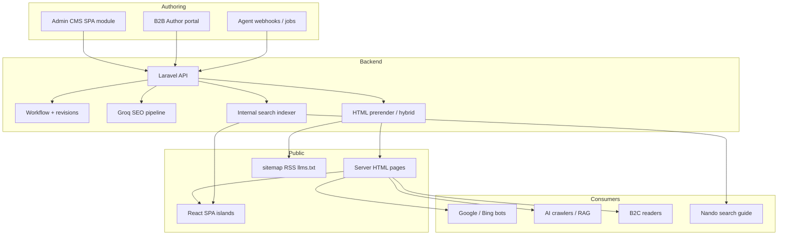
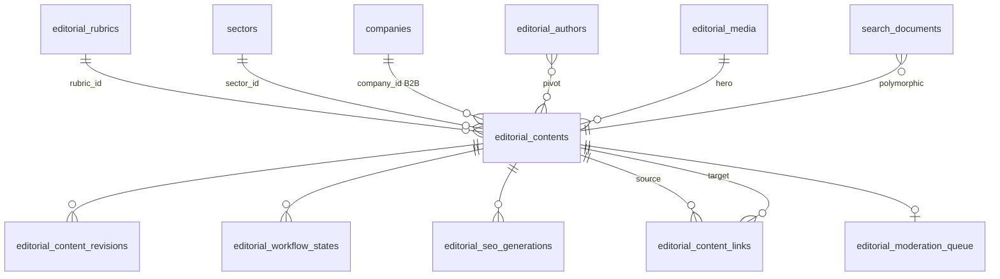
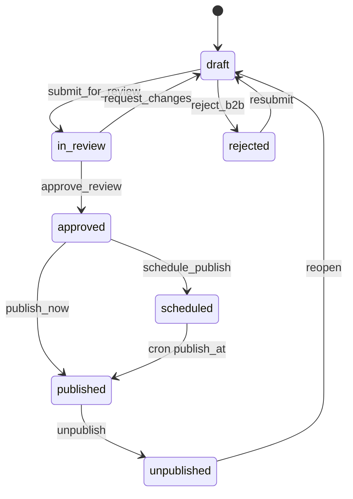
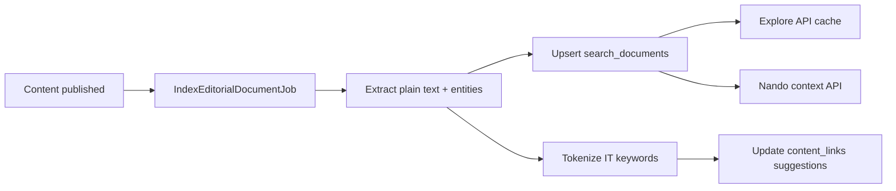
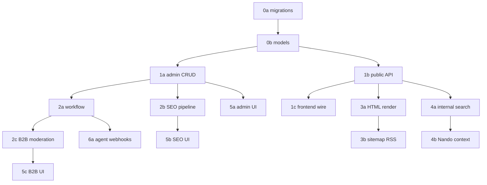

# Wenando Editorial CMS — Enterprise Architecture

> **Status:** Planning spec (no implementation yet)  
> **Scope:** Newspaper/magazine-grade CMS for elder-care editorial + B2B structure-authored content  
> **Stack:** Laravel 13 API (`api.wenando.com`) · React/Vite SPA (`wenando.com`) · Groq (`NandoGroqService`) · Hostinger  
> **Related:** [`GUIDED_SEARCH_SYSTEM.md`](./GUIDED_SEARCH_SYSTEM.md) · [`backend/docs/2_DATABASE_SCHEMA.md`](../backend/docs/2_DATABASE_SCHEMA.md) · [`backend/docs/3_API_ROUTES_ROADMAP.md`](../backend/docs/3_API_ROUTES_ROADMAP.md)

---

## 1. Executive summary & goals

### 1.1 Problem today

Wenando’s consumer experience surfaces editorial content in search/explore flows, but **all blog data is mock**:

| Current artifact | Role |
|------------------|------|
| `src/constants/searchResultsData.js` → `MOCK_BLOG_RESULTS` | Static cards (article, story, interview) |
| `src/components/search-results/EditorialInsightsSection.jsx` | UI grouping by rubrica |
| `ExplorePage.jsx` | Renders mocks on `/esplora` results |

Public URLs point to `#`. SEO is weak: SPA serves a single `index.html` meta shell. Crawlers and generative engines cannot reliably index long-form YMYL content.

### 1.2 Vision

Build an **enterprise editorial CMS** where:

1. **Wenando editorial team** (50–60 people) writes, previews, publishes newspaper-grade content with workflow, audit, and revision history.
2. **Approved B2B structures** (`companies`) author their own stories/articles under moderation — never unverified medical claims.
3. **Auto-SEO + human override** generates title variants, meta descriptions, keywords, and structured data via Groq — always requiring human approval before publish.
4. **GEO (Generative Engine Optimization)** makes content citation-friendly for ChatGPT, Perplexity, Google AI Overviews — not only traditional Google SERP.
5. **Internal search engine** indexes editorial + structure profiles, ranks by intent/sector/geo, feeds `/esplora`, Nando Groq context, and future agent pipelines.
6. **HTML-first public pages** (hybrid render) deliver crawlable articles with sitemap, RSS, JSON-LD, canonical URLs, hreflang-ready markup — styled coherently with homepage (`#FDFBF7`, coral `#E07A5F`, violet accents, post-it editorial cards).

### 1.3 Success criteria (north star)

| Dimension | Goal |
|-----------|------|
| **SEO** | Indexed long-form pages; rich results (Article, FAQPage, Event); sitemap coverage ≥ 95% published URLs |
| **GEO** | Verifiable excerpts cited by AI search; `llms.txt` + structured entity graph |
| **Discovery** | Internal search returns relevant editorial within 200 ms p95; Nando uses editorial corpus as grounded context |
| **Trust (YMYL)** | 100% published health content has human reviewer sign-off; structure-authored disclaimers visible |
| **Ops** | 50+ concurrent editors without merge conflicts; full audit trail on publish/unpublish |

### 1.4 Architectural stance



**Key decision:** SPA-only fails for SEO/GEO. Recommend **Laravel hybrid rendering**: server-generated HTML document + optional React hydration islands for interactive TOC, related cards, and explore handoff.

---

## 2. Content model

### 2.1 Content types (tipi di contenuto)

| Type slug | Italian label | Purpose | Typical length |
|-----------|---------------|---------|----------------|
| `article` | **Articolo** | Guides, explainers, anti-truffe, costi | 800–4000 words |
| `story` | **Storia** | Family narratives (verified/consented) | 600–2500 words |
| `interview` | **Intervista** | Q&A with experts, operators, advisors | 1000–3500 words |
| `event` | **Evento** | Open days, webinars, info sessions | 200–800 words + datetime/location |

Each type shares the **block editor** body; type-specific fields attach via `content_type` + JSON `type_payload`.

### 2.2 Rubriche (editorial sections)

Rubriche are taxonomy nodes — not just tags. Examples aligned with current mocks:

| Slug | Label | Notes |
|------|-------|-------|
| `anti-truffe` | Anti-truffe | High trust priority; mandatory legal review |
| `guide` | Guide | How-to, checklists |
| `costi` | Costi | Pricing transparency |
| `diritti` | Diritti | Legal/rights explainers |
| `storie` | Storie di famiglie | Consumer stories |
| `esperti` | Esperti | Interviews |
| `eventi` | Eventi | Calendar rubric |

Hierarchy: `editorial_rubrics.parent_id` supports nested rubrics (e.g. `guide/rsa`).

### 2.3 Authorship model

| Author type | `author_type` | Display |
|-------------|---------------|---------|
| Wenando staff | `wenando` | Byline + role + optional photo |
| Structure (B2B) | `company` | Structure name + “Contenuto della struttura” badge + disclaimer |
| Guest expert | `guest` | Name, credentials, Wenando verified badge |
| Agent draft | `agent` | Hidden until human assigns real byline |

### 2.4 Block editor JSON schema

Content body stored in `editorial_contents.body_blocks` (JSON array). Versioned per revision.

**Block types:**

| Block `type` | Purpose |
|--------------|---------|
| `heading` | H2–H4 with anchor slug for TOC |
| `paragraph` | Rich text (limited HTML subset) |
| `image` | Hero/inline with alt, caption, credit |
| `quote` | Pull quote |
| `callout` | Info/warning/tip boxes (YMYL warnings) |
| `faq` | Question/answer pairs → FAQPage JSON-LD |
| `cta` | Wenando CTAs (wizard, esplora, structure profile) |
| `embed` | YouTube, maps (allowlist) |
| `structure_card` | Link to approved `company` profile |
| `related_links` | Internal editorial graph edges |
| `section_break` | Visual divider + optional label |
| `event_details` | Date, time, location, registration URL (event type) |
| `interview_qa` | Structured Q/A for interview type |

**JSON Schema (simplified):**

```json
{
  "$schema": "https://json-schema.org/draft/2020-12/schema",
  "type": "array",
  "items": {
    "oneOf": [
      {
        "type": "object",
        "required": ["id", "type", "data"],
        "properties": {
          "id": { "type": "string", "format": "uuid" },
          "type": { "const": "heading" },
          "data": {
            "type": "object",
            "required": ["level", "text", "anchor"],
            "properties": {
              "level": { "enum": [2, 3, 4] },
              "text": { "type": "string", "maxLength": 200 },
              "anchor": { "type": "string", "pattern": "^[a-z0-9-]+$" }
            }
          }
        }
      },
      {
        "type": "object",
        "required": ["id", "type", "data"],
        "properties": {
          "id": { "const": "paragraph" },
          "type": { "const": "paragraph" },
          "data": {
            "type": "object",
            "required": ["html"],
            "properties": {
              "html": { "type": "string", "maxLength": 20000 }
            }
          }
        }
      },
      {
        "type": "object",
        "properties": {
          "type": { "const": "faq" },
          "data": {
            "type": "object",
            "required": ["items"],
            "properties": {
              "items": {
                "type": "array",
                "items": {
                  "type": "object",
                  "required": ["question", "answer"],
                  "properties": {
                    "question": { "type": "string", "maxLength": 300 },
                    "answer": { "type": "string", "maxLength": 2000 }
                  }
                }
              }
            }
          }
        }
      },
      {
        "type": "object",
        "properties": {
          "type": { "const": "cta" },
          "data": {
            "type": "object",
            "required": ["variant", "label", "href"],
            "properties": {
              "variant": { "enum": ["primary", "secondary", "soft"] },
              "label": { "type": "string", "maxLength": 80 },
              "href": { "type": "string" },
              "tracking_id": { "type": "string" }
            }
          }
        }
      }
    ]
  }
}
```

**Example article body (truncated):**

```json
[
  {
    "id": "b1a2c3d4-e5f6-7890-abcd-ef1234567890",
    "type": "heading",
    "data": { "level": 2, "text": "Come riconoscere un'agenzia affidabile", "anchor": "segnali-affidabilita" }
  },
  {
    "id": "b2b3c4d5-e6f7-8901-bcde-f12345678901",
    "type": "paragraph",
    "data": {
      "html": "<p>Prima di firmare un contratto per una badante, verifica sempre che l'agenzia sia iscritta al registro regionale...</p>"
    }
  },
  {
    "id": "b3c4d5e6-f7a8-9012-cdef-123456789012",
    "type": "callout",
    "data": {
      "variant": "warning",
      "title": "Attenzione",
      "html": "<p>Wenando non garantisce l'idoneità di singole agenzie. Questo articolo ha scopo informativo.</p>"
    }
  },
  {
    "id": "b4d5e6f7-a8b9-0123-def0-234567890123",
    "type": "faq",
    "data": {
      "items": [
        {
          "question": "Quanto costa mediamente un'agenzia?",
          "answer": "Le commissioni variano per regione; in media tra il 15% e il 25% della retribuzione mensile..."
        }
      ]
    }
  },
  {
    "id": "b5e6f7a8-b9c0-1234-ef01-345678901234",
    "type": "cta",
    "data": {
      "variant": "primary",
      "label": "Confronta strutture nella tua zona",
      "href": "/wizard",
      "tracking_id": "cta_article_badanti_wizard"
    }
  }
]
```

### 2.5 Derived fields (computed, not hand-edited)

| Field | Source |
|-------|--------|
| `word_count` | Sum of paragraph/interview_qa text |
| `read_minutes` | `ceil(word_count / 200)` — matches `EditorialInsightsSection` |
| `toc` | Extract from `heading` blocks |
| `excerpt` | First 160 chars of lead paragraph or manual override |
| `plain_text` | Strip HTML for search index |

### 2.6 Internal linking graph

`editorial_content_links` stores directed edges:

- `source_content_id` → `target_content_id`
- `link_type`: `related`, `see_also`, `series_next`, `series_prev`, `structure_profile`
- Auto-suggested by indexer; human-approved in CMS.

---

## 3. SEO field matrix

### 3.1 Field inventory

| Field | Storage | Auto (Groq) | Manual override | Char limit | Google guideline |
|-------|---------|-------------|-----------------|------------|------------------|
| `slug` | column | suggest from H1 | ✓ required unique | 80 | Short, descriptive, lowercase-hyphen |
| `title` (H1) | column | — | ✓ | 70 display | One clear topic per page |
| `seo_title` | `seo_pack` | ✓ 3 variants | ✓ pick/ edit | **50–60** ideal, max 70 | Unique per page; brand suffix optional |
| `meta_description` | `seo_pack` | ✓ 3 variants | ✓ pick/ edit | **150–160** ideal, max 320 | Accurate summary; no keyword stuffing |
| `focus_keyword` | `seo_pack` | ✓ | ✓ | 80 | Primary intent phrase |
| `secondary_keywords` | `seo_pack` JSON | ✓ | ✓ | 5–10 terms | Semantic support |
| `og_title` | `seo_pack` | ✓ default = seo_title | ✓ | 70 | Social preview |
| `og_description` | `seo_pack` | ✓ | ✓ | 200 | May differ from meta |
| `og_image` | media FK | fallback hero | ✓ | 1200×630 | Unique per URL |
| `twitter_card` | `seo_pack` | `summary_large_image` | ✓ | — | Match OG image |
| `canonical_url` | column | auto from slug | ✓ | — | Absolute HTTPS URL |
| `robots` | `seo_pack` | `index,follow` | ✓ | — | `noindex` for draft preview |
| `hreflang` | `seo_pack` JSON | — | ✓ future | — | `it-IT` default; `en` stub |
| `schema_type` | column | map from content type | ✓ | — | Article, NewsArticle, Event |
| `breadcrumb_label` | `seo_pack` | ✓ from rubric path | ✓ | 40 | BreadcrumbList |
| `geo_excerpt` | `seo_pack` | ✓ citation block | ✓ | 300–500 | Standalone quotable paragraph |
| `faq_schema` | derived from FAQ blocks | auto | ✓ disable per block | — | Must match visible FAQ |
| `published_at` | column | — | set on publish | — | Freshness signal |
| `modified_at` | column | auto | — | — | `dateModified` in JSON-LD |
| `author_schema` | join authors | — | ✓ | — | Person or Organization |

### 3.2 `seo_pack` JSON structure

```json
{
  "version": 3,
  "generated_at": "2026-06-05T10:00:00Z",
  "generated_by": "groq",
  "approved": false,
  "approved_by_user_id": null,
  "approved_at": null,
  "seo_score": 82,
  "seo_score_breakdown": {
    "title_length": 10,
    "description_length": 9,
    "keyword_in_title": 8,
    "heading_structure": 9,
    "internal_links": 7,
    "faq_present": 10,
    "ymyl_disclaimer": 10,
    "readability": 9,
    "geo_excerpt_quality": 10
  },
  "title_variants": [
    { "id": "t1", "text": "Badante convivente: costi reali e trappole da evitare", "score": 88 },
    { "id": "t2", "text": "Quanto costa una badante convivente in Italia (2026)", "score": 85 },
    { "id": "t3", "text": "Guida ai costi della badante convivente: retta e contributi", "score": 79 }
  ],
  "description_variants": [
    { "id": "d1", "text": "Rete, contributi e costi nascosti della badante convivente spiegati con chiarezza. Checklist anti-truffe e domande da fare.", "score": 90 }
  ],
  "selected_title_id": "t1",
  "selected_description_id": "d1",
  "focus_keyword": "costo badante convivente",
  "secondary_keywords": ["badante convivente", "contributi INPS", "costi assistenza anziani"],
  "geo_excerpt": "Una badante convivente in Italia costa in media tra 1.200€ e 1.800€ al mese, oltre a contributi e spese di agenzia. Wenando spiega retta, INPS e red flags contrattuali.",
  "manual_overrides": {
    "seo_title": null,
    "meta_description": null
  },
  "issues": [
    { "severity": "warning", "code": "THIN_CONTENT", "message": "Word count sotto 800 per articolo guida" }
  ]
}
```

### 3.3 Auto vs manual rules

| Rule | Behavior |
|------|----------|
| Publish gate | Cannot publish unless `seo_pack.approved === true` AND `seo_score >= 70` (configurable) OR admin override with audit reason |
| Regenerate | `POST .../seo-regenerate` creates new version; prior version archived in revisions |
| Manual wins | Any `manual_overrides.*` non-null field bypasses Groq selection |
| Preview | Draft preview uses `robots: noindex,nofollow` always |

### 3.4 Google Search Essentials alignment

- **People-first content:** block editor enforces author, rubric, last-reviewed date for YMYL.
- **Page experience:** HTML pages LCP target < 2.5s; hero images WebP + dimensions.
- **Structured data:** validate via Google Rich Results Test in CI [ASSUNZIONE].
- **Avoid:** clickbait titles, hidden FAQ text, AI-only content without human edit trail.

---

## 4. GEO strategy (Generative Engine Optimization)

GEO optimizes for **citation in AI-generated answers**, not only blue-link ranking.

### 4.1 Principles

| Principle | Implementation |
|-----------|----------------|
| **Verifiable facts** | `geo_excerpt` + FAQ blocks with sourced claims |
| **Entity clarity** | JSON-LD `@graph` with Organization, Person, Place |
| **Chunk-friendly structure** | Headings with anchors; self-contained paragraphs |
| **Canonical authority** | `sameAs` links to Wenando social, Wikipedia refs where applicable |
| **Freshness signals** | Visible `Ultimo aggiornamento` + `dateModified` |
| **Permissive AI crawling** | `llms.txt` + robots allow major AI bots [policy decision] |

### 4.2 Structured data (@graph example)

Public HTML embeds:

```json
{
  "@context": "https://schema.org",
  "@graph": [
    {
      "@type": "Organization",
      "@id": "https://wenando.com/#organization",
      "name": "Wenando",
      "url": "https://wenando.com",
      "logo": "https://wenando.com/logo.png",
      "sameAs": ["https://www.linkedin.com/company/wenando"]
    },
    {
      "@type": "WebSite",
      "@id": "https://wenando.com/#website",
      "url": "https://wenando.com",
      "publisher": { "@id": "https://wenando.com/#organization" }
    },
    {
      "@type": "Article",
      "@id": "https://wenando.com/magazine/articoli/costo-badante-convivente#article",
      "headline": "Quanto costa davvero una badante convivente",
      "description": "...",
      "author": { "@type": "Person", "name": "...", "jobTitle": "..." },
      "publisher": { "@id": "https://wenando.com/#organization" },
      "datePublished": "2026-06-01",
      "dateModified": "2026-06-05",
      "mainEntityOfPage": "https://wenando.com/magazine/articoli/costo-badante-convivente",
      "image": "...",
      "about": [
        { "@type": "Thing", "name": "Assistenza domiciliare" },
        { "@type": "Place", "name": "Italia" }
      ]
    },
    {
      "@type": "BreadcrumbList",
      "itemListElement": [
        { "@type": "ListItem", "position": 1, "name": "Magazine", "item": "https://wenando.com/magazine" },
        { "@type": "ListItem", "position": 2, "name": "Costi", "item": "..." },
        { "@type": "ListItem", "position": 3, "name": "..." }
      ]
    },
    {
      "@type": "FAQPage",
      "mainEntity": [
        {
          "@type": "Question",
          "name": "Quanto costa mediamente un'agenzia?",
          "acceptedAnswer": { "@type": "Answer", "text": "..." }
        }
      ]
    }
  ]
}
```

**Event type** adds `Event` node with `startDate`, `location`, `eventAttendanceMode`.

### 4.3 Citation-friendly excerpts

- **`geo_excerpt`** rendered in `<meta name="description">` AND visible `.geo-summary` box at top (not hidden).
- **`speakable` CSS selector** [ASSUNZIONE] for voice/AI parsers: `[data-speakable="summary"]`.
- **Statistics blocks** include `data-source` attribute linking to primary source URL.

### 4.4 `llms.txt` (site root)

Served at `https://wenando.com/llms.txt`:

```text
# Wenando — Assistenza anziani in Italia
# Last updated: 2026-06-05

> Wenando è una piattaforma italiana di ricerca e orientamento per RSA, badanti e assistenza domiciliare.
> Contenuti editoriali verificati da redazione umana. Non sostituiscono parere medico o legale.

## Contenuti prioritari
- https://wenando.com/magazine/articoli/costo-badante-convivente
- https://wenando.com/magazine/guide/checklist-visita-rsa

## API pubblica (read-only)
- https://api.wenando.com/api/v1/editorial/feed.json

## Contatti redazione
- redazione@wenando.com

## Policy
- Contenuti YMYL: revisione medica-legale per categorie salute/diritti
- Contenuti strutture: badge "Contenuto della struttura" + disclaimer
```

Regenerate nightly via scheduled job from top-ranked + recently updated content.

### 4.5 AI bot robots policy

`robots.txt` (public site):

```text
User-agent: *
Allow: /magazine/

User-agent: GPTBot
Allow: /magazine/

User-agent: ChatGPT-User
Allow: /magazine/

User-agent: Google-Extended
Allow: /magazine/

Sitemap: https://wenando.com/sitemap-index.xml
```

Policy reviewed quarterly; block list configurable in admin settings.

---

## 5. Database schema

> **Engine:** MySQL 8+ · **Charset:** `utf8mb4_unicode_ci`  
> **Pattern:** Relational core + JSON (`body_blocks`, `seo_pack`, `type_payload`) — consistent with [`2_DATABASE_SCHEMA.md`](../backend/docs/2_DATABASE_SCHEMA.md)

### 5.1 New tables overview

| Table | Purpose |
|-------|---------|
| `editorial_rubrics` | Rubriche taxonomy |
| `editorial_contents` | Published content head record |
| `editorial_content_revisions` | Immutable revision history |
| `editorial_content_blocks` | Optional normalized blocks [ASSUNZIONE phase 3] |
| `editorial_content_links` | Internal link graph |
| `editorial_authors` | Byline profiles |
| `editorial_content_author` | M:N content ↔ author |
| `editorial_media` | Images/files with alt, focal point |
| `editorial_workflow_states` | State machine audit |
| `editorial_moderation_queue` | B2B submissions |
| `editorial_audit_logs` | Append-only actions |
| `editorial_seo_generations` | Groq SEO run history |
| `search_documents` | Internal index documents |
| `search_document_terms` | Inverted index terms [ASSUNZIONE] |
| `search_queries_log` | Anonymous search analytics |

### 5.2 `editorial_rubrics`

| Column | Type | Notes |
|--------|------|-------|
| `id` | BIGINT PK | |
| `parent_id` | FK NULL | Nested rubrics |
| `slug` | VARCHAR(80) UNIQUE | e.g. `anti-truffe` |
| `name` | VARCHAR(120) | Display: "Anti-truffe" |
| `description` | TEXT NULL | Hub page copy |
| `sector_id` | FK → sectors NULL | Scope to `senior-care` |
| `sort_order` | INT | Menu ordering |
| `is_active` | BOOLEAN | |
| `hub_seo_pack` | JSON NULL | Rubric landing SEO |
| `timestamps` | | |

**Indexes:** `slug`, `parent_id`, `(sector_id, is_active)`

### 5.3 `editorial_contents`

| Column | Type | Notes |
|--------|------|-------|
| `id` | BIGINT PK | |
| `uuid` | CHAR(36) UNIQUE | Public API id |
| `slug` | VARCHAR(160) UNIQUE | Final URL segment |
| `content_type` | ENUM | `article`, `story`, `interview`, `event` |
| `status` | ENUM | See §7 workflow |
| `title` | VARCHAR(200) | H1 |
| `dek` | VARCHAR(300) NULL | Subtitle / standfirst |
| `excerpt` | TEXT NULL | Card teaser |
| `body_blocks` | JSON | Block editor array |
| `type_payload` | JSON NULL | Event dates, interview guest, story consent |
| `seo_pack` | JSON NULL | See §3.2 |
| `rubric_id` | FK → editorial_rubrics | Primary rubric |
| `sector_id` | FK → sectors | Default `senior-care` |
| `author_type` | ENUM | `wenando`, `company`, `guest`, `agent` |
| `company_id` | FK NULL | B2B author |
| `hero_media_id` | FK → editorial_media NULL | |
| `word_count` | INT | Denormalized |
| `read_minutes` | TINYINT | Denormalized |
| `featured` | BOOLEAN | Homepage / explore boost |
| `published_at` | TIMESTAMP NULL | |
| `unpublished_at` | TIMESTAMP NULL | Soft unpublish |
| `published_by_user_id` | FK NULL | |
| `reviewed_at` | TIMESTAMP NULL | YMYL last medical/legal review |
| `reviewed_by_user_id` | FK NULL | |
| `locale` | CHAR(5) | Default `it-IT` |
| `canonical_path` | VARCHAR(255) | `/magazine/articoli/{slug}` |
| `timestamps`, `deleted_at` | | Soft delete |

**Indexes:**

| Index | Rationale |
|-------|-----------|
| `(status, published_at DESC)` | Public listings |
| `(content_type, status, featured)` | Explore cards by type |
| `(rubric_id, status, published_at)` | Rubric hubs |
| `(company_id, status)` | B2B author dashboard |
| `FULLTEXT(title, excerpt)` | Admin spotlight search [ASSUNZIONE] |

### 5.4 `editorial_content_revisions`

| Column | Notes |
|--------|-------|
| `id` | PK |
| `editorial_content_id` | FK |
| `revision_number` | INT increment |
| `snapshot` | JSON — full content row at save time |
| `body_blocks` | JSON copy |
| `seo_pack` | JSON copy |
| `created_by_user_id` | FK |
| `change_summary` | VARCHAR(500) NULL |
| `created_at` | |

**Unique:** `(editorial_content_id, revision_number)`

### 5.5 `editorial_authors` & pivot

**`editorial_authors`:**

| Column | Notes |
|--------|-------|
| `user_id` | FK NULL — staff linked to account |
| `display_name` | |
| `role_title` | e.g. "Giornalista senior" |
| `bio` | TEXT |
| `avatar_media_id` | FK NULL |
| `credentials` | JSON — licenses, affiliations |
| `is_active` | |

**`editorial_content_author`:** `editorial_content_id`, `editorial_author_id`, `sort_order`, `is_primary`

### 5.6 `editorial_media`

| Column | Notes |
|--------|-------|
| `uuid` | Public CDN id |
| `disk`, `path` | Laravel storage |
| `mime_type` | |
| `width`, `height` | |
| `alt_text` | Required before publish |
| `caption`, `credit` | |
| `focal_point` | JSON `{x,y}` |
| `uploaded_by_user_id` | |

### 5.7 `editorial_workflow_states`

Append-only state transitions:

| Column | Notes |
|--------|-------|
| `editorial_content_id` | FK |
| `from_status`, `to_status` | |
| `actor_user_id` | FK |
| `comment` | TEXT NULL |
| `created_at` | |

### 5.8 `editorial_moderation_queue`

B2B structure submissions:

| Column | Notes |
|--------|-------|
| `editorial_content_id` | FK |
| `company_id` | FK |
| `submitted_by_user_id` | FK |
| `moderation_status` | `pending`, `in_review`, `approved`, `rejected`, `revision_requested` |
| `moderator_user_id` | FK NULL |
| `moderator_notes` | TEXT |
| `submitted_at`, `resolved_at` | |

### 5.9 `editorial_audit_logs`

| Column | Notes |
|--------|-------|
| `auditable_type` | `EditorialContent`, `EditorialRubric`, … |
| `auditable_id` | |
| `action` | `created`, `updated`, `seo_regenerated`, `published`, `unpublished`, `moderated` |
| `actor_user_id` | NULL for system/agent |
| `actor_type` | `user`, `agent`, `system` |
| `payload` | JSON diff summary |
| `ip_address` | VARCHAR NULL |
| `created_at` | Immutable |

### 5.10 `editorial_seo_generations`

| Column | Notes |
|--------|-------|
| `editorial_content_id` | FK |
| `revision_number` | |
| `groq_model` | |
| `prompt_version` | |
| `input_hash` | Dedupe |
| `output_seo_pack` | JSON |
| `latency_ms` | |
| `status` | `success`, `failed` |
| `error_message` | TEXT NULL |
| `created_at` | |

### 5.11 Internal search tables

**`search_documents`:**

| Column | Notes |
|--------|-------|
| `id` | PK |
| `document_type` | `editorial`, `company_profile`, `rubric_hub` |
| `document_id` | Polymorphic source id |
| `url` | Canonical public URL |
| `title`, `excerpt` | |
| `body_plain` | Stripped text for ranking |
| `sector_id` | FK |
| `geo_tags` | JSON — cities, topics |
| `boost_score` | FLOAT — editorial priority |
| `published_at` | |
| `indexed_at` | |
| `embedding` | BLOB NULL — phase 4 vector [ASSUNZIONE] |

**Indexes:** `FULLTEXT(title, excerpt, body_plain)`, `(document_type, sector_id)`, `published_at`

**`search_queries_log`:** `query`, `results_count`, `session_id`, `user_id` NULL, `created_at` — GDPR retention 90 days.

### 5.12 Roles & permissions extensions

New permissions (Spatie-like):

| Permission | Roles |
|------------|-------|
| `editorial.view` | editor, reviewer, admin |
| `editorial.create` | editor, admin |
| `editorial.edit.own` | editor |
| `editorial.edit.any` | admin, chief_editor |
| `editorial.review` | reviewer, admin |
| `editorial.publish` | admin, chief_editor |
| `editorial.moderate.b2b` | reviewer, admin |
| `editorial.seo.approve` | reviewer, admin |
| `editorial.unpublish` | admin |
| `editorial.structure.author` | partner_owner, partner_staff (scoped) |
| `editorial.agent` | system agent user |

New roles: `chief_editor`, `editor`, `reviewer` (platform); B2B uses existing `partner_owner` / `partner_staff` + structure scope.

### 5.13 ER diagram (editorial subset)



### 5.14 Migration outline (Laravel)

| Migration file | Action |
|----------------|--------|
| `2026_06_10_000001_create_editorial_rubrics_table` | Rubrics + seed |
| `2026_06_10_000002_create_editorial_media_table` | Media library |
| `2026_06_10_000003_create_editorial_authors_table` | Authors |
| `2026_06_10_000004_create_editorial_contents_table` | Core content |
| `2026_06_10_000005_create_editorial_content_revisions_table` | Revisions |
| `2026_06_10_000006_create_editorial_content_links_table` | Link graph |
| `2026_06_10_000007_create_editorial_workflow_and_audit_tables` | Workflow + audit |
| `2026_06_10_000008_create_editorial_moderation_queue_table` | B2B moderation |
| `2026_06_10_000009_create_editorial_seo_generations_table` | SEO history |
| `2026_06_10_000010_create_search_documents_table` | Internal search |
| `2026_06_10_000011_seed_editorial_permissions` | RBAC seeds |

---

## 6. API routes

> **Base URL:** `https://api.wenando.com/api/v1`  
> **Auth:** Laravel Sanctum · JSON envelope per architecture doc

### 6.1 Public B2C read (no auth)

| Method | Path | Purpose | Key response |
|--------|------|---------|--------------|
| GET | `/editorial/contents` | Paginated magazine feed | `{ contents: Card[], meta }` — filters: `type`, `rubric`, `featured`, `q` |
| GET | `/editorial/contents/{slug}` | Single content JSON | Full body + seo meta for SPA hydrate |
| GET | `/editorial/rubrics` | Rubric tree | `{ rubrics[] }` |
| GET | `/editorial/rubrics/{slug}` | Rubric hub + contents | `{ rubric, contents[] }` |
| GET | `/editorial/related/{slug}` | Related content graph | `{ related[] }` |
| GET | `/editorial/feed.json` | JSON feed for agents | Top N recent |
| GET | `/editorial/feed.xml` | RSS 2.0 | XML |
| GET | `/search/editorial` | Public internal search | `{ results[], meta }` — `?q=&type=&rubric=` |

**Card DTO** (matches `EditorialInsightsSection` props):

```json
{
  "id": "uuid",
  "type": "article",
  "title": "Come riconoscere un'agenzia per badanti affidabile",
  "description": "Segnali positivi, red flags e domande da fare...",
  "category": "Anti-truffe",
  "readMinutes": 6,
  "url": "https://wenando.com/magazine/articoli/agenzia-badanti-affidabile",
  "image": "https://cdn.wenando.com/...",
  "featured": true,
  "publishedAt": "2026-06-01T08:00:00Z"
}
```

**`GET /editorial/contents/{slug}` full response:**

```json
{
  "content": {
    "uuid": "...",
    "slug": "...",
    "contentType": "article",
    "title": "...",
    "dek": "...",
    "bodyBlocks": [],
    "toc": [{ "anchor": "...", "text": "...", "level": 2 }],
    "authors": [{ "name": "...", "role": "...", "avatarUrl": "..." }],
    "rubric": { "slug": "anti-truffe", "name": "Anti-truffe" },
    "readMinutes": 6,
    "wordCount": 1240,
    "publishedAt": "...",
    "updatedAt": "...",
    "disclaimer": null,
    "structureBadge": null,
    "seo": {
      "title": "...",
      "description": "...",
      "canonicalUrl": "...",
      "ogImage": "...",
      "jsonLd": {}
    },
    "related": []
  }
}
```

### 6.2 Public HTML routes (Laravel web — not JSON API)

Served from `wenando.com` via reverse proxy to Laravel `routes/web.php` OR subdomain `www` hybrid:

| Method | Path | Purpose |
|--------|------|---------|
| GET | `/magazine` | Magazine home HTML |
| GET | `/magazine/{rubric_slug}` | Rubric hub HTML |
| GET | `/magazine/{type_plural}/{slug}` | Article/story/interview/event HTML |
| GET | `/sitemap-index.xml` | Sitemap index |
| GET | `/sitemap-{chunk}.xml` | URL sets (max 50k) |
| GET | `/robots.txt` | Crawler rules |
| GET | `/llms.txt` | GEO manifest |

Type plural map: `articoli`, `storie`, `interviste`, `eventi`.

### 6.3 Admin CRUD (`/admin/editorial/*`)

| Method | Path | Purpose | Auth |
|--------|------|---------|------|
| GET | `/admin/editorial/contents` | List + filters | SuperAdmin, editor roles |
| POST | `/admin/editorial/contents` | Create draft | editor+ |
| GET | `/admin/editorial/contents/{uuid}` | Detail + revisions | editor+ |
| PATCH | `/admin/editorial/contents/{uuid}` | Update fields/blocks | edit scope |
| DELETE | `/admin/editorial/contents/{uuid}` | Soft delete | admin |
| POST | `/admin/editorial/contents/{uuid}/revisions` | Save revision snapshot | editor+ |
| GET | `/admin/editorial/contents/{uuid}/revisions` | List revisions | editor+ |
| POST | `/admin/editorial/contents/{uuid}/revisions/{n}/restore` | Restore | chief_editor+ |
| POST | `/admin/editorial/contents/{uuid}/transition` | Workflow action | role-gated |
| POST | `/admin/editorial/contents/{uuid}/preview-token` | Signed preview URL | editor+ |
| POST | `/admin/editorial/contents/{uuid}/publish` | Publish | publish perm |
| POST | `/admin/editorial/contents/{uuid}/unpublish` | Unpublish | admin |
| POST | `/admin/editorial/contents/{uuid}/seo-regenerate` | Trigger Groq SEO job | editor+ |
| PATCH | `/admin/editorial/contents/{uuid}/seo-pack` | Manual SEO override | reviewer+ |
| POST | `/admin/editorial/contents/{uuid}/seo-pack/approve` | Approve SEO | seo.approve perm |
| GET | `/admin/editorial/rubrics` | CRUD rubrics | admin |
| POST | `/admin/editorial/media` | Upload media | editor+ |
| GET | `/admin/editorial/audit-logs` | Filterable audit | admin |
| GET | `/admin/editorial/moderation` | B2B queue | reviewer+ |
| POST | `/admin/editorial/moderation/{id}/resolve` | Approve/reject/request changes | reviewer+ |

**`POST .../transition` body:**

```json
{
  "action": "submit_for_review",
  "comment": "Pronto per revisione YMYL"
}
```

Actions: `submit_for_review`, `request_changes`, `approve_review`, `schedule_publish`, `cancel_schedule`.

### 6.4 B2B structure CRUD (`/b2b/editorial/*`)

Scoped to `company_id` from auth; requires `vetting_status=approved`.

| Method | Path | Purpose |
|--------|------|---------|
| GET | `/b2b/editorial/contents` | Own structure contents |
| POST | `/b2b/editorial/contents` | Create draft (author_type=company) |
| PATCH | `/b2b/editorial/contents/{uuid}` | Edit draft/revision_requested only |
| POST | `/b2b/editorial/contents/{uuid}/submit` | Submit to moderation queue |
| GET | `/b2b/editorial/contents/{uuid}/moderation-status` | Queue status + notes |
| POST | `/b2b/editorial/media` | Upload (quota limits) |

B2B cannot publish directly; approved content transitions to `scheduled` or `published` by moderator.

### 6.5 Preview routes

| Method | Path | Purpose |
|--------|------|---------|
| GET | `/preview/editorial/{uuid}` | Token-gated HTML preview (`?token=`) |
| GET | `/preview/editorial/{uuid}.json` | JSON for admin iframe preview |

Token: signed, 24h TTL, `noindex` headers.

### 6.6 Agent / webhook routes

| Method | Path | Purpose | Auth |
|--------|------|---------|------|
| POST | `/webhooks/editorial/agent-draft` | Ingest agent-created draft | HMAC signature |
| POST | `/webhooks/editorial/publish-schedule` | Cron/external scheduler | Signature |
| GET | `/internal/editorial/{uuid}/export` | Full export for agents | PAT + `editorial.agent` |

**Agent draft webhook payload:**

```json
{
  "external_job_id": "agent-run-123",
  "content_type": "article",
  "title": "...",
  "body_blocks": [],
  "rubric_slug": "guide",
  "requested_author_slug": "wenando-redazione",
  "auto_seo": true,
  "target_status": "draft"
}
```

### 6.7 Nando integration endpoints

| Method | Path | Purpose |
|--------|------|---------|
| GET | `/nando/editorial-context` | Top-K editorial snippets for query | 
| POST | `/nando/classify-with-editorial` | Extends classify with corpus refs [phase 4] |

Used by `NandoGroqService` enrichment — never expose raw Groq key to frontend.

---

## 7. Workflow & permissions

### 7.1 Workflow states



| Status | Public visible | Editable by |
|--------|----------------|-------------|
| `draft` | No | Author, editors |
| `in_review` | No | Reviewer comments; author read-only |
| `approved` | No | SEO approval pending |
| `scheduled` | No until `publish_at` | Admin |
| `published` | Yes | Admin minor edits → new revision |
| `unpublished` | No | Admin |
| `rejected` | No | B2B author (structure) |

### 7.2 Role matrix

| Action | chief_editor | editor | reviewer | admin | structure_author | agent |
|--------|:---:|:---:|:---:|:---:|:---:|:---:|
| Create Wenando content | ✓ | ✓ | — | ✓ | — | draft only |
| Edit any content | ✓ | — | — | ✓ | — | — |
| Edit own | ✓ | ✓ | — | ✓ | own draft | — |
| Submit review | ✓ | ✓ | — | ✓ | ✓ | — |
| Approve content | ✓ | — | ✓ | ✓ | — | — |
| Approve SEO pack | ✓ | — | ✓ | ✓ | — | — |
| Publish | ✓ | — | — | ✓ | — | — |
| Moderate B2B | ✓ | — | ✓ | ✓ | — | — |
| Unpublish | ✓ | — | — | ✓ | — | — |
| View audit log | ✓ | own | ✓ | ✓ | own | — |

### 7.3 Concurrent editing

- **Optimistic locking:** `PATCH` requires `If-Match: {updated_at}` or `revision_number` — 409 on conflict.
- **Assignment:** optional `assigned_reviewer_id` on content in review.
- **Comments:** `editorial_content_comments` table [ASSUNZIONE] with `@mention` for 50-person team.

### 7.4 Agent system user

- Dedicated `users` row: `user_type=superadmin` scoped via `editorial.agent` permission only.
- Sanctum PAT with IP allowlist; all actions logged `actor_type=agent`.
- Cannot publish without human transition.

---

## 8. Auto-SEO pipeline (Groq)

### 8.1 Service architecture

Extend pattern from `App\Services\Nando\NandoGroqService`:

| Class | Responsibility |
|-------|----------------|
| `EditorialSeoGroqService` | Prompt + validate JSON seo_pack |
| `EditorialSeoScorer` | Deterministic score from rules + Groq suggestions |
| `GenerateEditorialSeoJob` | Queue async generation |
| `ApproveEditorialSeoAction` | Transactional approve + audit |

### 8.2 Prompt outline (system)

```
Sei il responsabile SEO editoriale di Wenando, piattaforma YMYL per assistenza anziani in Italia.
Input: titolo bozza, body_blocks (testo), content_type, rubric, focus sector senior-care.
Output: SOLO JSON seo_pack (schema version 3).

Regole:
- Italiano corretto, tono empatico e autorevole, mai sensazionalistico
- 3 varianti seo_title (50-60 char) e 3 meta_description (150-160 char)
- focus_keyword + 5-10 secondary_keywords pertinenti
- geo_excerpt: paragrafo 300-500 char autonomo e citabile da AI search
- Valuta ymyl_disclaimer se content tratta salute, costi, diritti legali
- Non inventare dati statistici; se assenti, suggerisci placeholder [DA VERIFICARE]
- seo_score_breakdown con punteggi 0-10 per categoria
- issues[] con severity info|warning|error
```

User payload: `{ title, dek, body_plain, content_type, rubric_slug, word_count, existing_slug? }`

### 8.3 Pipeline steps

1. Editor saves content → optional auto-trigger if `word_count >= 300`
2. Job calls Groq → validates JSON schema → stores `editorial_seo_generations`
3. `EditorialSeoScorer` merges deterministic checks (title length, H2 count, internal links)
4. Reviewer UI shows side-by-side: content preview | SEO variants | issues
5. Reviewer selects variants or edits manual overrides → **Approve SEO**
6. Publish gate checks `seo_pack.approved`

### 8.4 Approval UI concepts (admin)

```
┌─────────────────────────────────────────────────────────────────┐
│ SEO Review — "Costo badante convivente"          seo_score: 82  │
├──────────────────────────┬──────────────────────────────────────┤
│ Content preview (iframe) │ Title variants                        │
│                          │ ○ Badante convivente: costi reali... 88│
│                          │ ● Quanto costa una badante... (sel) 85│
│                          │ ○ Guida ai costi della badante... 79   │
│                          │ [ Custom title: ________________ ]     │
│                          │ Description variants                   │
│                          │ ● Rete, contributi e costi nascosti... │
│                          │ GEO excerpt (citazione AI)             │
│                          │ [editable textarea]                    │
│                          │ Issues: ⚠ THIN_CONTENT (742 words)     │
│                          │ [ Rigenera SEO ]  [ Approva SEO pack ] │
└──────────────────────────┴──────────────────────────────────────┘
```

### 8.5 Failure modes

| Case | Behavior |
|------|----------|
| Groq down | Manual SEO form only; banner in CMS |
| Invalid JSON | Retry 1x; log failure; notify editor |
| Score < 70 | Block publish; suggest fixes |
| Admin override | Requires comment in audit log |

---

## 9. Internal search & indexing engine

### 9.1 Goals

Wenando’s **own search** ranks editorial + structure profiles for:

- `/magazine` search box
- `/esplora` editorial rail (replace mocks with query-aware cards)
- Nando Groq context injection (top 5 snippets, titles, URLs)
- Future agent RAG corpus

Not a generic Elasticsearch requirement initially — **MySQL FULLTEXT + application ranking** phase 1; optional Meilisearch phase 4 [ASSUNZIONE].

### 9.2 Indexing pipeline



**Triggers:** publish, update published, unpublish (remove doc), company profile approve.

### 9.3 Ranking formula (v1)

```
score = (
  0.40 * bm25_like(fulltext_match) +
  0.20 * title_exact_boost +
  0.15 * rubric_match +
  0.10 * recency_decay(published_at) +
  0.10 * featured_boost +
  0.05 * internal_link_pagerank_proxy
) * sector_filter_multiplier
```

Query-aware explore injection:

1. User query on `/esplora` → `classifySearchQuery()` sector/intent
2. `GET /search/editorial?q={query}&sector=senior-care&limit=6`
3. Merge with structure results in `ExplorePage` — editorial section uses same `EditorialInsightsSection` component

### 9.4 Entity extraction (lightweight)

From body + rubric + type_payload:

- Cities/regions (gazetteer JSON `data/it_locations.json`)
- Topics: RSA, badante, assistenza domiciliare, anti-truffe
- Store in `search_documents.geo_tags`

Groq optional pass for synonym expansion [phase 4].

### 9.5 Linking to Nando search

`NandoGroqService` enrichment (future method):

```php
// Pseudocode — phase 4
$editorialContext = $this->editorialSearch->topSnippets($query, limit: 5);
// Append to user payload as editorial_corpus[] with title, url, excerpt
// System prompt: "Cita solo URL forniti in editorial_corpus; non inventare"
```

Aligns with anti-hallucination rules already in Nando system prompt.

### 9.6 Explore/results integration

| Surface | Today | Target |
|---------|-------|--------|
| `ExplorePage` editorial block | `MOCK_BLOG_RESULTS` | `GET /search/editorial?q={session.query}` |
| `ResultsPage` (if editorial section added) | — | Same API |
| Homepage magazine teaser | — | `GET /editorial/contents?featured=1&limit=3` |

Frontend adapter:

```javascript
// src/services/editorialService.js (future)
export async function fetchEditorialForQuery(query, { limit = 6 } = {}) {
  const res = await api.get('/search/editorial', { params: { q: query, limit } })
  return res.data.results.map(mapToEditorialCard)
}

function mapToEditorialCard(row) {
  return {
    id: row.uuid,
    type: row.contentType,
    title: row.title,
    description: row.excerpt,
    category: row.rubric.name,
    readMinutes: row.readMinutes,
    url: row.url,
    image: row.imageUrl,
    featured: row.featured,
  }
}
```

---

## 10. Public URL strategy & rendering

### 10.1 Why SPA-only fails

| Issue | Impact |
|-------|--------|
| Single `index.html` meta | All URLs share same OG/title |
| JS-rendered body | Delayed/non-existent indexing |
| No per-URL JSON-LD | No rich results / GEO entity graph |
| Weak social previews | Poor shareability for family caregivers |

### 10.2 Recommended approach: Laravel hybrid HTML

**Option A (recommended):** Laravel Blade/MJML templates on `wenando.com/magazine/*` via:

- Nginx/Hostinger routes `/magazine`, `/sitemap*.xml`, `/llms.txt` → Laravel `public/`
- React SPA continues for `/`, `/wizard`, `/esplora`, `/pro/*`
- Shared design tokens (Tailwind build or CSS variables export)

**Option B:** Prerender service (Prerender.io, rendertron) — lower control, ongoing cost.

**Option C:** SSR Vite — duplicates stack; not recommended with existing Laravel API investment.

### 10.3 URL patterns

| Content | URL pattern |
|---------|-------------|
| Magazine home | `/magazine` |
| Rubric hub | `/magazine/rubriche/{rubric_slug}` |
| Article | `/magazine/articoli/{slug}` |
| Story | `/magazine/storie/{slug}` |
| Interview | `/magazine/interviste/{slug}` |
| Event | `/magazine/eventi/{slug}` |

**Canonical:** always trailing-slash-free HTTPS on `wenando.com`.

**Legacy:** 301 from `/blog/*` if ever indexed [ASSUNZIONE].

### 10.4 HTML page structure

```html
<!DOCTYPE html>
<html lang="it-IT">
<head>
  <title>{seo_title} | Wenando</title>
  <meta name="description" content="{meta_description}" />
  <link rel="canonical" href="{canonical_url}" />
  <meta property="og:type" content="article" />
  <!-- OG, Twitter, hreflang stubs -->
  <script type="application/ld+json">{@graph JSON}</script>
  <link rel="stylesheet" href="/magazine/assets/editorial.css" />
</head>
<body class="bg-[#FDFBF7]">
  <header><!-- Wenando nav shell --></header>
  <article>
    <p class="geo-summary" data-speakable="summary">{geo_excerpt}</p>
    <h1>{title}</h1>
    <!-- Server-rendered blocks → semantic HTML -->
    <nav id="toc"><!-- headings --></nav>
    <div class="prose">{rendered_blocks}</div>
  </article>
  <aside id="related"><!-- related links --></aside>
  <script type="module" src="/magazine/assets/hydrate.js"><!-- optional --></script>
</body>
</html>
```

### 10.5 Block → HTML mapping

| Block | HTML output |
|-------|-------------|
| `heading` | `<h2 id="{anchor}">` |
| `paragraph` | `<p>` sanitized |
| `faq` | `<section aria-label="FAQ">` + matching JSON-LD |
| `cta` | `<a class="btn-coral">` |
| `callout` | `<aside class="callout-{variant}">` |
| `structure_card` | `<a href="/strutture/{slug}">` card |

Sanitizer: HTMLPurifier allowlist — no scripts, no inline event handlers.

### 10.6 Hostinger deployment note

Per [`DEPLOY_HOSTINGER.md`](./DEPLOY_HOSTINGER.md):

- API remains `api.wenando.com`
- Add **second Laravel route group** OR expand frontend deploy to proxy magazine paths to backend render controller
- Static assets: CDN or `/magazine/assets/` on same domain (cookie-less)

---

## 11. Sitemap, RSS, robots, llms.txt generation

### 11.1 Sitemap index

`https://wenando.com/sitemap-index.xml`:

```xml
<sitemapindex>
  <sitemap><loc>https://wenando.com/sitemap-magazine.xml</loc></sitemap>
  <sitemap><loc>https://wenando.com/sitemap-rubrics.xml</loc></sitemap>
  <sitemap><loc>https://wenando.com/sitemap-structures.xml</loc></sitemap>
</sitemapindex>
```

Generated daily + on publish webhook.

### 11.2 Chunking rules

- Max 50,000 URLs per file
- Include `lastmod`, `changefreq` (weekly editorial, daily hub), `priority` (0.8 featured, 0.6 default)
- Exclude `draft`, `unpublished`, preview tokens

### 11.3 RSS

`GET /editorial/feed.xml` — last 50 published items across types.

Fields: `title`, `link`, `description`, `pubDate`, `enclosure` (hero image), `category` (rubric).

### 11.4 robots.txt

Dynamic generation from admin settings:

- Allow `/magazine/`
- Disallow `/preview/`, `/admin`, `/pro`
- Sitemap pointer

### 11.5 llms.txt generation job

`GenerateLlmsTxtJob` — weekly:

1. Top 20 by `boost_score` + internal search clicks [ASSUNZIONE analytics]
2. All rubric hub URLs
3. Policy section from CMS settings
4. Write to `public/llms.txt`

---

## 12. Admin UI wireframe (text)

Route: `/admin/editorial` (React admin module)

```
┌──────────────────────────────────────────────────────────────────┐
│ WENANDO ADMIN › Editoriale                    [+ Nuovo contenuto]│
├────────────┬─────────────────────────────────────────────────────┤
│ NAV        │ FILTERS: [Tipo ▼] [Rubrica ▼] [Stato ▼] [Autore ▼]  │
│ Dashboard  │         [🔍 Cerca titolo...]                        │
│ Partner    │ ┌─────────────────────────────────────────────────┐ │
│ Lead       │ │ Titolo          │Tipo│Rubrica│Stato │SEO│Aggiornato││
│ Editoriale◀│ │ Badante conviv..│Art.│ Costi │Review│ 82│ 2h fa   ││
│ Rubriche   │ │ Checklist RSA   │Art.│ Guide │Pubbl.│ 91│ 1g fa   ││
│ Moderazione│ └─────────────────────────────────────────────────┘ │
│ Audit log  │ Pagination                                          │
└────────────┴─────────────────────────────────────────────────────┘

EDITOR VIEW (/admin/editorial/{uuid})
┌──────────────────────────────────────────────────────────────────┐
│ [← Lista]  Costo badante convivente     Stato: In revisione       │
│ [Salva bozza] [Anteprima] [Invia a revisione] [Pubblica ▼]       │
├───────────────────────────────┬──────────────────────────────────┤
│ BLOCK EDITOR                  │ INSPECTOR                         │
│ [+ ¶] [+ H2] [+ Img] [+ FAQ]  │ Rubrica: [Costi ▼]               │
│ ┌───────────────────────────┐ │ Tipo: Articolo                    │
│ │ H2 Costi mensili          │ │ Autore: Maria B.                  │
│ │ ¶ Una badante convivente..│ │ Hero: [upload]                    │
│ │ ⚠ Callout Attenzione      │ │ Featured ☐                        │
│ └───────────────────────────┘ │ SEO score: 82 [Apri review SEO]   │
│                               │ Revisioni (v12) [Cronologia]      │
│                               │ Audit: 3 eventi oggi              │
└───────────────────────────────┴──────────────────────────────────┘
```

---

## 13. B2B structure author UI wireframe

Route: `/pro/editoriale` (partner portal)

```
┌──────────────────────────────────────────────────────────────────┐
│ CASA SERENITÀ › Contenuti editoriali          [+ Scrivi storia]   │
├──────────────────────────────────────────────────────────────────┤
│ ℹ️ I contenuti sono moderati da Wenando prima della pubblicazione.│
│    Badge "Contenuto della struttura" visibile ai lettori.        │
├──────────────────────────────────────────────────────────────────┤
│ I miei contenuti                                                  │
│ ┌──────────────────────────────────────────────────────────────┐ │
│ │ Titolo                    │ Tipo   │ Stato mod.  │ Azioni    │ │
│ │ La nostra giornata tipo   │ Storia │ In revisione│ [Modifica]│ │
│ │ Open day 15 giugno        │ Evento │ Pubblicato  │ [Visualizza│ │
│ └──────────────────────────────────────────────────────────────┘ │
└──────────────────────────────────────────────────────────────────┘

AUTHOR EDITOR (simplified block set)
- Allowed blocks: heading, paragraph, image, quote, event_details
- NOT allowed: faq (Wenando-only YMYL), structure_card spam
- Fixed disclaimer footer preview:
  "Contenuto redatto da {organization_name}. Opinioni della struttura;
   non sostituisce consulenza medica. Wenando ha verificato conformità
   alle linee editoriali."
- [Salva bozza] [Invia a Wenando per revisione]
```

---

## 14. Public magazine pages wireframe

### 14.1 Magazine home (`/magazine`)

```
┌──────────────────────────────────────────────────────────────────┐
│ [Wenando logo]    Magazine    Rubriche ▼    [Cerca nel magazine] │
├──────────────────────────────────────────────────────────────────┤
│  Per approfondire — con empatia e chiarezza                       │
│  ┌──────────────── hero featured article ─────────────────────┐  │
│  │ [img]  ANTI-TRUFFE · 6 min                                  │  │
│  │        Come riconoscere un'agenzia affidabile               │  │
│  │        Segnali positivi, red flags...            [Leggi →]   │  │
│  └─────────────────────────────────────────────────────────────┘  │
│  Articoli e guide (post-it card grid, cream #FDFBF7 bg)          │
│  Storie di famiglie                                               │
│  Interviste                                                       │
│  Prossimi eventi                                                  │
└──────────────────────────────────────────────────────────────────┘
```

### 14.2 Article page

```
┌──────────────────────────────────────────────────────────────────┐
│ Breadcrumb: Magazine › Costi › {title}                            │
│ ┌ geo-summary box ─────────────────────────────────────────────┐ │
│ │ Una badante convivente in Italia costa in media...            │ │
│ └──────────────────────────────────────────────────────────────┘ │
│ ANTI-TRUFFE · Aggiornato 5 giu 2026 · 6 min · di Maria B.        │
│ H1 Quanto costa davvero una badante convivente                    │
│ [hero image + caption]                                            │
│ ┌ Indice ─────────┐  ┌ Body ─────────────────────────────────┐ │
│ │ 1. Costi mensili │  │ H2 Costi mensili                       │ │
│ │ 2. Contributi    │  │ ¶ ...                                  │ │
│ │ 3. Red flags     │  │ FAQ section                            │ │
│ └──────────────────┘  │ CTA coral → Confronta strutture       │ │
│                       └────────────────────────────────────────┘ │
│ Leggi anche: [card] [card] [card]                                 │
│ [Esplora argomento su Wenando →] links to /esplora                │
└──────────────────────────────────────────────────────────────────┘
```

Visual language matches `EditorialInsightsSection`: rounded-2xl cards, coral links `#E07A5F`, violet interview accents, soft borders `border-black/[0.06]`.

---

## 15. Integration with existing frontend

### 15.1 `EditorialInsightsSection.jsx`

**No breaking prop changes required.** Component expects:

```typescript
{
  id, type, title, description, category,
  readMinutes, url, image, featured?
}
```

Migration path:

1. Create `editorialService.js` with `fetchEditorialForQuery` + `fetchFeaturedEditorial`
2. Replace `MOCK_BLOG_RESULTS` imports in `ExplorePage.jsx`
3. Keep mock fallback if API fails (feature flag `VITE_EDITORIAL_API=false`)

### 15.2 `ExplorePage.jsx` touchpoints

Current usage:

- Line ~177: `MOCK_BLOG_RESULTS.slice(0, 3)` — compact rail
- Line ~237: full `MOCK_BLOG_RESULTS` — expanded results

Replace with:

```javascript
const { data: editorialArticles } = useEditorialSearch(session?.query)
// ...
<EditorialInsightsSection articles={editorialArticles ?? FALLBACK_MOCK} />
```

Add `event` type to `SECTION_META` when API returns events (new icon, e.g. Calendar).

### 15.3 Deprecation of mocks

| Phase | Action |
|-------|--------|
| 1b | API live; mocks as fallback |
| 2c | Remove `MOCK_BLOG_RESULTS` except Storybook/fixtures |
| 3 | Editorial steps in guided search link to real URLs |

### 15.4 `searchResultsData.js`

Keep file for structure mocks; move blog mocks to `src/fixtures/editorialMocks.js` for tests only.

---

## 16. Implementation phases (agent tasks)

Each task is sized for **one focused agent session** with clear acceptance criteria.

### Phase 0 — Foundations

#### Phase 0a: Editorial schema migrations

| Item | Detail |
|------|--------|
| **Scope** | Migrations §5.14 through `editorial_contents`, revisions, rubrics seed |
| **Files** | `backend/database/migrations/2026_*`, `backend/database/seeders/EditorialRubricSeeder.php`, `EditorialPermissionSeeder.php` |
| **Acceptance** | `php artisan migrate` clean; 8 rubrics seeded; permissions assignable |
| **Complexity** | M |

#### Phase 0b: Eloquent models & policies

| Item | Detail |
|------|--------|
| **Scope** | Models, relationships, `EditorialContentPolicy`, factory for tests |
| **Files** | `backend/app/Models/Editorial/*.php`, `backend/app/Policies/EditorialContentPolicy.php` |
| **Acceptance** | Unit tests for policy matrix roles; factory creates valid blocks JSON |
| **Complexity** | M |

---

### Phase 1 — Core CMS API

#### Phase 1a: Admin CRUD API

| Item | Detail |
|------|--------|
| **Scope** | `POST/PATCH/GET/DELETE /admin/editorial/contents`, revision save/list |
| **Files** | `EditorialContentController`, `StoreEditorialContentRequest`, `EditorialContentResource`, routes |
| **Acceptance** | Feature tests: create draft, update blocks, list filter by status; 403 for wrong role |
| **Complexity** | L |

#### Phase 1b: Public read API + Card DTO

| Item | Detail |
|------|--------|
| **Scope** | `GET /editorial/contents`, `GET /editorial/contents/{slug}`, rubric endpoints |
| **Files** | `Public/EditorialController`, card transformer matching `EditorialInsightsSection` |
| **Acceptance** | Published visible; draft 404; JSON matches frontend prop shape |
| **Complexity** | M |

#### Phase 1c: Frontend editorial service + ExplorePage wiring

| Item | Detail |
|------|--------|
| **Scope** | `editorialService.js`, hook, replace mocks in `ExplorePage.jsx` |
| **Files** | `src/services/editorialService.js`, `src/hooks/useEditorialSearch.js`, `ExplorePage.jsx` |
| **Acceptance** | `/esplora` shows API data when `VITE_EDITORIAL_API=true`; graceful fallback |
| **Complexity** | S |

---

### Phase 2 — Workflow, SEO, moderation

#### Phase 2a: Workflow state machine

| Item | Detail |
|------|--------|
| **Scope** | Transitions, audit log, optimistic locking |
| **Files** | `EditorialWorkflowService`, `TransitionEditorialContentRequest`, `editorial_audit_logs` writes |
| **Acceptance** | Tests cover full happy path draft→published; audit entries created |
| **Complexity** | M |

#### Phase 2b: Groq SEO pipeline

| Item | Detail |
|------|--------|
| **Scope** | `EditorialSeoGroqService`, job, scorer, regenerate + approve endpoints |
| **Files** | `backend/app/Services/Editorial/Seo/*`, `GenerateEditorialSeoJob` |
| **Acceptance** | Regenerate stores seo_pack; approve gates publish; invalid Groq JSON handled |
| **Complexity** | L |

#### Phase 2c: B2B author API + moderation queue

| Item | Detail |
|------|--------|
| **Scope** | `/b2b/editorial/*`, moderation resolve, structure disclaimer injection |
| **Files** | `B2B/EditorialController`, `ModerationController`, middleware company scope |
| **Acceptance** | Partner cannot publish; moderator approve→published; disclaimer in API response |
| **Complexity** | L |

---

### Phase 3 — Public HTML & feeds

#### Phase 3a: HTML render controller + Blade templates

| Item | Detail |
|------|--------|
| **Scope** | Server HTML for article/story/interview/event, block renderer, sanitizer |
| **Files** | `EditorialPageController`, `resources/views/editorial/*`, `EditorialBlockRenderer` |
| **Acceptance** | View-source shows full article HTML; JSON-LD validates; cream styling |
| **Complexity** | XL |

#### Phase 3b: Sitemap, RSS, robots, llms.txt jobs

| Item | Detail |
|------|--------|
| **Scope** | Scheduled commands, sitemap index, RSS feed |
| **Files** | `GenerateSitemapsCommand`, `GenerateLlmsTxtCommand`, `routes/web.php` |
| **Acceptance** | `/sitemap-index.xml` lists published URLs; RSS valid; llms.txt served |
| **Complexity** | M |

#### Phase 3c: Preview tokens

| Item | Detail |
|------|--------|
| **Scope** | Signed preview URLs, noindex headers |
| **Files** | `PreviewEditorialController`, signed middleware |
| **Acceptance** | Token expires; draft preview not indexed |
| **Complexity** | S |

---

### Phase 4 — Internal search & Nando

#### Phase 4a: Indexer + search API

| Item | Detail |
|------|--------|
| **Scope** | `IndexEditorialDocumentJob`, `GET /search/editorial`, ranking v1 |
| **Files** | `EditorialSearchService`, `SearchDocument` model, explore integration |
| **Acceptance** | Publish indexes doc; search returns relevant results < 200ms local; explore uses query |
| **Complexity** | L |

#### Phase 4b: Nando editorial context

| Item | Detail |
|------|--------|
| **Scope** | Enrich `NandoGroqService` with editorial snippets; anti-hallucination citations |
| **Files** | `NandoGroqService.php`, `NandoController`, prompt update |
| **Acceptance** | Nando responses reference real editorial URLs when relevant |
| **Complexity** | M |

#### Phase 4c: Internal linking suggestions

| Item | Detail |
|------|--------|
| **Scope** | Auto-suggest related content in CMS inspector |
| **Files** | `SuggestInternalLinksJob`, admin endpoint |
| **Acceptance** | CMS shows 5 suggested links with relevance score |
| **Complexity** | M |

---

### Phase 5 — Admin & B2B UI

#### Phase 5a: Admin editorial module (list + editor shell)

| Item | Detail |
|------|--------|
| **Scope** | React routes `/admin/editorial`, list filters, block editor MVP |
| **Files** | `src/pages/admin/editorial/*`, block components |
| **Acceptance** | Editor can create article with heading+paragraph, save draft |
| **Complexity** | XL |

#### Phase 5b: SEO approval UI

| Item | Detail |
|------|--------|
| **Scope** | Side-by-side SEO review panel per §8.4 |
| **Files** | `SeoReviewPanel.jsx`, wire to approve/regenerate API |
| **Acceptance** | Reviewer approves SEO; publish button enables |
| **Complexity** | M |

#### Phase 5c: B2B author portal pages

| Item | Detail |
|------|--------|
| **Scope** | `/pro/editoriale` list + simplified editor |
| **Files** | `src/pages/pro/editorial/*` |
| **Acceptance** | Partner submits story; sees moderation status |
| **Complexity** | L |

---

### Phase 6 — Agents & scale

#### Phase 6a: Agent webhook draft ingest

| Item | Detail |
|------|--------|
| **Scope** | HMAC webhook, agent user, draft creation |
| **Files** | `AgentEditorialWebhookController`, middleware |
| **Acceptance** | Signed payload creates draft; audit `actor_type=agent` |
| **Complexity** | M |

#### Phase 6b: Magazine public pages in React shell (optional polish)

| Item | Detail |
|------|--------|
| **Scope** | Magazine home hub SPA section linking to HTML articles OR full SSR polish |
| **Files** | `src/pages/MagazineHome.jsx` |
| **Acceptance** | `/magazine` hub matches wireframe aesthetic |
| **Complexity** | M |

#### Phase 6c: Analytics & KPI dashboard

| Item | Detail |
|------|--------|
| **Scope** | Editorial metrics in admin: views, search clicks, SEO scores |
| **Files** | `GET /admin/editorial/metrics`, Plausible API integration [ASSUNZIONE] |
| **Acceptance** | Dashboard shows top articles 30d |
| **Complexity** | M |

---

### Phase dependency graph



**Suggested MVP slice:** 0a → 0b → 1a → 1b → 1c → 2b → 3a → 3b (publishable HTML articles with SEO).

---

## 17. Risks & compliance

### 17.1 YMYL (Your Money Your Life)

Elder care content is **YMYL-adjacent**: health, costs, legal rights, vulnerability to scams.

| Risk | Mitigation |
|------|------------|
| Medical misinformation | Medical reviewer role for health rubrics; `reviewed_at` required |
| Financial harm | Cost articles require sourced statistics + disclaimer |
| Scam enablement | Anti-truffe rubric chief-editor sign-off |
| AI hallucination in SEO | Human SEO approval; no auto-publish |

### 17.2 E-E-A-T signals

| Signal | Implementation |
|--------|----------------|
| **Experience** | Real family stories with documented consent (`type_payload.consent`) |
| **Expertise** | Author credentials JSON; expert interviews |
| **Authoritativeness** | Wenando Organization schema; editorial board page |
| **Trustworthiness** | Visible dates, sources, contact redazione@ |

### 17.3 Structure-authored content

| Requirement | Detail |
|-------------|--------|
| Badge | "Contenuto della struttura" on all B2B content |
| Disclaimer | Fixed footer block auto-appended |
| Moderation | No superlatives ("migliore RSA d'Italia") without evidence |
| Conflict | Structures cannot review competitors in same article |
| Unpublish | Admin can unpublish structure content without deleting CRM data |

### 17.4 GDPR & consent

- Story/interview: `consent_record_id` FK to consent log
- Analytics on article views: cookie banner analytics only
- Search query logs: 90-day retention, anonymized session ids

### 17.5 Legal review triggers

Auto-flag content for legal review if body contains keywords: `contratto`, `causa`, `denuncia`, `medicina`, `farmaco`, `patto`, `reclamo`.

---

## 18. Metrics & success KPIs

### 18.1 Editorial operations

| KPI | Target (6 months post-launch) |
|-----|-------------------------------|
| Time draft → published (median) | < 48h Wenando; < 72h B2B moderated |
| SEO approval cycle | < 24h |
| Concurrent editors without conflict | 20+ (409 rate < 1%) |
| Revision rollback usage | Available; < 5% of publishes |

### 18.2 SEO / GEO

| KPI | Target |
|-----|--------|
| Indexed magazine URLs / published | ≥ 95% |
| Rich result eligible pages | ≥ 60% articles with FAQ or Article schema |
| Organic impressions (GSC) | +200% vs baseline at 90 days |
| AI citation tracking [ASSUNZIONE] | Manual Perplexity spot-check 10 queries/mo |

### 18.3 Product discovery

| KPI | Target |
|-----|--------|
| Editorial CTR from `/esplora` | ≥ 8% |
| Internal search zero-result rate | < 15% |
| Avg articles per session (magazine) | ≥ 1.4 |
| Wizard starts from editorial CTA | Track; baseline TBD |

### 18.4 Trust & moderation

| KPI | Target |
|-----|--------|
| B2B moderation rejection rate | Monitor; alert if > 40% (quality issue) |
| YMYL content without reviewer | 0 at publish |
| User reports / content flags | < 0.1% views; resolve < 72h |

### 18.5 Instrumentation

| Event | Tool |
|-------|------|
| `editorial_view` | Plausible + `published_at` dimension |
| `editorial_cta_click` | Plausible custom props |
| `editorial_search` | Internal `search_queries_log` |
| `seo_regenerated`, `published` | Audit log → admin metrics |

---

## Appendix A — Environment variables

| Variable | Service | Purpose |
|----------|---------|---------|
| `GROQ_API_KEY` | Existing | Nando + Editorial SEO |
| `GROQ_EDITORIAL_SEO_MODEL` | New | Optional model override |
| `EDITORIAL_SEO_MIN_SCORE` | New | Default `70` |
| `EDITORIAL_PREVIEW_TOKEN_SECRET` | New | Signed previews |
| `EDITORIAL_AGENT_WEBHOOK_SECRET` | New | HMAC verify |
| `EDITORIAL_CDN_URL` | New | Media base URL |

---

## Appendix B — Glossary

| Term | Meaning |
|------|---------|
| **Rubrica** | Editorial section/taxonomy (e.g. Anti-truffe) |
| **GEO** | Generative Engine Optimization |
| **seo_pack** | JSON bundle of SEO/GEO fields |
| **Block editor** | Modular JSON content body |
| **Structure author** | Approved B2B partner writing scoped content |

---

## Appendix C — Open decisions [ASSUNZIONE]

| # | Decision | Options |
|---|----------|---------|
| 1 | Search backend phase 4 | MySQL FULLTEXT vs Meilisearch |
| 2 | Magazine HTML hosting | Same Laravel app vs separate render service |
| 3 | AI bot policy | Allow all vs block list |
| 4 | English hreflang | Phase 6+ vs never |
| 5 | Medical reviewer | External contractor vs staff role |

---

*Document version: 1.0 · 2026-06-05 · Planning only — implementation tracked via Phase 16 agent tasks.*
