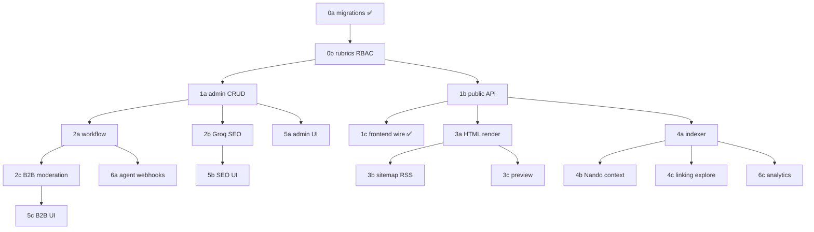

# Wenando Editorial CMS — Sprint Plan

> **Source spec:** [`EDITORIAL_CMS.md`](./EDITORIAL_CMS.md)  
> **Backend repo:** `backend/` (separate git → `backend-mr-top`)  
> **Frontend repo:** workspace root (React/Vite SPA)  
> **Last updated:** 2026-06-06

---

## How to use this document

Each sprint is split into **agent-sized sub-phases** (0a, 0b, …). After completing a sub-phase:

1. Mark it ✅ DONE with date and commit ref.
2. Fill **Next agent handoff** with exact file paths and acceptance criteria.
3. Do not start the next sub-phase until dependencies are green (migrations + tests).

**North star:** Replace mock editorial data with a newspaper-grade CMS — crawlable HTML, Groq SEO with human approval, internal search feeding Nando + `/esplora`, B2B moderation, enterprise admin ops.

---

## Sprint map (overview)

| Sprint | Theme | Sub-phases | Primary repo |
|--------|-------|------------|--------------|
| **0** | DB + models + RBAC | 0a ✅, 0b ✅ | backend |
| **1** | Admin CRUD + public read + frontend wire | 1a ✅, 1b ✅, 1c ✅ | backend + frontend |
| **2** | Workflow + Groq SEO + B2B moderation | 2a ✅, 2b ✅, 2c ✅ | backend |
| **3** | HTML render + sitemap/RSS/llms.txt + preview | 3a ✅, 3b ✅, 3c ✅ | backend (+ nginx) |
| **4** | Internal search indexer + Nando context | 4a ✅, 4b ✅, 4c ✅ | backend + frontend |
| **5** | Admin CMS UI + SEO approval + B2B portal | 5a ✅, 5b ✅, 5c | frontend + backend |
| **6** | Agent webhooks + analytics polish | 6a, 6b, 6c | backend + frontend |

---

## Cross-cutting requirements (every sprint)

| Capability | Where it lands | Notes |
|------------|----------------|-------|
| **Indexing engine admin panel** | Sprint 4a UI shell in 5a; rules in 0a tables | What to index/exclude, reindex jobs, crawl preview, sitemap toggles, per-content `noindex` |
| **Long-form multi-section content** | Block editor JSON in 0a; admin UI phases 5a→5b | heading, paragraph, faq, cta, callout, interview_qa, event_details |
| **Review queues** | 2a workflow + 2c B2B moderation + 5a UI | Structure onboarding review + editorial content moderation |
| **Enterprise admin ops dashboard** | 6c (+ partial 1a list metrics) | Searches count, leads w/ email, users, publish pipeline, SEO score distribution |
| **Auto-SEO + human approval** | 2b pipeline, 5b UI, publish gate | `seo_pack.approved` + min score before publish |
| **HTML prerender / hybrid pages** | Sprint 3a | Server HTML + optional React hydration |
| **Internal search indexer** | Sprint 4a–4c | Feeds Nando + `/esplora` editorial rail |

---

## Sprint 0 — Database foundation + RBAC

### Sprint 0a — Editorial schema migrations ✅ DONE

**Status:** ✅ DONE (2026-06-06)

**Goals**

- Core editorial tables for content, revisions, SEO audits, media, index queue/rules.
- Laravel enums for content type, status, author type, index queue.
- Models with relationships, policy skeleton, minimal factories.
- Feature test proving migrations + JSON block storage.

**Agent tasks (completed)**

- [x] Create enums in `backend/app/Enums/Editorial*.php`
- [x] Migrations `2026_06_05_000001` … `000006`
- [x] Models: `EditorialContent`, `EditorialContentRevision`, `EditorialContentSeoAudit`, `EditorialMedia`, `EditorialIndexQueue`, `EditorialIndexRule`
- [x] `EditorialContentPolicy` skeleton
- [x] Factories + `EditorialContentMigrationTest`

**Acceptance criteria**

- [x] `php artisan migrate:fresh` succeeds
- [x] Factory creates content with valid `body_blocks` JSON
- [x] Feature test passes

**Dependencies:** Existing `sectors`, `companies`, `users` tables.

**Repo:** `backend/` only

**Deploy notes:** Run migrations on staging before any API deploy. No env vars added.

**Files added**

```
backend/app/Enums/EditorialContentType.php
backend/app/Enums/EditorialContentStatus.php
backend/app/Enums/EditorialAuthorType.php
backend/app/Enums/EditorialIndexQueueAction.php
backend/app/Enums/EditorialIndexQueueStatus.php
backend/app/Models/EditorialContent.php
backend/app/Models/EditorialContentRevision.php
backend/app/Models/EditorialContentSeoAudit.php
backend/app/Models/EditorialMedia.php
backend/app/Models/EditorialIndexQueue.php
backend/app/Models/EditorialIndexRule.php
backend/app/Policies/EditorialContentPolicy.php
backend/database/migrations/2026_06_05_000001_create_editorial_media_table.php
backend/database/migrations/2026_06_05_000002_create_editorial_contents_table.php
backend/database/migrations/2026_06_05_000003_create_editorial_content_revisions_table.php
backend/database/migrations/2026_06_05_000004_create_editorial_content_seo_audits_table.php
backend/database/migrations/2026_06_05_000005_create_editorial_index_queue_table.php
backend/database/migrations/2026_06_05_000006_create_editorial_index_rules_table.php
backend/database/factories/EditorialContentFactory.php
backend/database/factories/EditorialMediaFactory.php
backend/database/factories/EditorialIndexRuleFactory.php
backend/tests/Feature/Editorial/EditorialContentMigrationTest.php
```

---

### Sprint 0b — Rubrics, RBAC seeds, policy tests ✅ DONE

**Status:** ✅ DONE (2026-06-06)

**Goals**

- `editorial_rubrics` table + seed 8 rubrics (anti-truffe, guide, costi, …).
- Remaining schema from spec §5.1: `editorial_authors`, pivot, `editorial_content_links`, workflow/audit, moderation, `editorial_seo_generations`, `editorial_search_documents`.
- `EditorialPermissionSeeder` — roles: `chief_editor`, `editor`, `reviewer`, `structure_author` + editorial permissions.
- FK `editorial_contents.rubric_id` → `editorial_rubrics`.
- Unit tests for `EditorialContentPolicy` role matrix.

**Agent tasks (completed)**

- [x] Migrations `2026_06_05_000007` … `000014` (rubrics, FK, authors+pivot, links, workflow, moderation, seo, search)
- [x] `EditorialRubricSeeder.php` — 8 rubrics with Italian labels
- [x] `EditorialPermissionSeeder.php` — permissions + roles + global `editorial_index_rules` row
- [x] Models with relationships on `EditorialContent`
- [x] `User::hasPermission()` + expanded `EditorialContentPolicy`
- [x] `tests/Unit/Policies/EditorialContentPolicyTest.php`
- [x] `tests/Feature/Editorial/EditorialRubricsSeederTest.php`

**Acceptance criteria**

- [x] `php artisan migrate:fresh --seed` creates rubrics + permissions
- [x] Policy tests cover admin / editor / reviewer / partner own-other-company
- [x] `rubric_id` FK enforced on `editorial_contents`
- [x] `php artisan test --filter=Editorial` — 14 passed

**Dependencies:** Sprint 0a ✅

**Repo:** `backend/` — commit `65a2ae9`

**Deploy notes:** Run `php artisan db:seed --class=EditorialRubricSeeder` and `EditorialPermissionSeeder` on staging.

**Files added**

```
backend/app/Enums/EditorialContentLinkType.php
backend/app/Enums/EditorialModerationStatus.php
backend/app/Enums/EditorialSeoGenerationStatus.php
backend/app/Models/EditorialRubric.php
backend/app/Models/EditorialAuthor.php
backend/app/Models/EditorialContentLink.php
backend/app/Models/EditorialWorkflowEvent.php
backend/app/Models/EditorialModerationQueue.php
backend/app/Models/EditorialSeoGeneration.php
backend/app/Models/EditorialSearchDocument.php
backend/database/migrations/2026_06_05_000007_create_editorial_rubrics_table.php
backend/database/migrations/2026_06_05_000008_add_rubric_foreign_key_to_editorial_contents.php
backend/database/migrations/2026_06_05_000009_create_editorial_authors_table.php
backend/database/migrations/2026_06_05_000010_create_editorial_content_links_table.php
backend/database/migrations/2026_06_05_000011_create_editorial_workflow_events_table.php
backend/database/migrations/2026_06_05_000012_create_editorial_moderation_queue_table.php
backend/database/migrations/2026_06_05_000013_create_editorial_seo_generations_table.php
backend/database/migrations/2026_06_05_000014_create_editorial_search_documents_table.php
backend/database/seeders/EditorialRubricSeeder.php
backend/database/seeders/EditorialPermissionSeeder.php
backend/tests/Unit/Policies/EditorialContentPolicyTest.php
backend/tests/Feature/Editorial/EditorialRubricsSeederTest.php
```

### Handoff — Sprint 0b COMPLETE

**Commit:** `65a2ae9` in `backend/`
**Tests run:** `php artisan test --filter=Editorial` — 14 passed, 92 assertions
**Known gaps:** Admin CRUD API not yet implemented; workflow transitions stubbed in schema only.

**Next agent START: Sprint 1a — Admin CRUD API**

```
READ:
  docs/EDITORIAL_CMS.md §6.3 (admin routes)
  docs/EDITORIAL_SPRINT_PLAN.md Sprint 1a section
  backend/app/Policies/EditorialContentPolicy.php
  backend/app/Models/EditorialContent.php
  backend/routes/api.php (existing admin route patterns)

CREATE:
  backend/app/Http/Controllers/Admin/EditorialContentController.php
  backend/app/Http/Requests/Admin/StoreEditorialContentRequest.php
  backend/app/Http/Requests/Admin/UpdateEditorialContentRequest.php
  backend/app/Http/Resources/EditorialContentResource.php
  backend/tests/Feature/Admin/EditorialContentCrudTest.php

IMPLEMENT:
  GET    /api/v1/admin/editorial/contents          — list + filters (status, type, rubric)
  POST   /api/v1/admin/editorial/contents          — create draft
  GET    /api/v1/admin/editorial/contents/{uuid}   — detail
  PATCH  /api/v1/admin/editorial/contents/{uuid}   — update fields/blocks
  DELETE /api/v1/admin/editorial/contents/{uuid}   — soft delete
  POST   /api/v1/admin/editorial/contents/{uuid}/revisions — save revision snapshot
  GET    /api/v1/admin/editorial/contents/{uuid}/revisions — list revisions

AUTH:
  Sanctum + role middleware + EditorialContentPolicy (editor/chief_editor/superadmin)

VERIFY:
  php artisan test --filter=EditorialContentCrud
```

---

## Sprint 1 — Core CMS API + frontend wire

### Sprint 1a — Admin CRUD API ✅ DONE

**Status:** ✅ DONE (2026-06-06)

**Goals:** `POST/PATCH/GET/DELETE /admin/editorial/contents`, revision save/list.

**Agent tasks**

- [x] `EditorialContentController` (admin namespace)
- [x] Form requests: `StoreEditorialContentRequest`, `UpdateEditorialContentRequest`
- [x] `EditorialContentResource` (ApiEnvelope)
- [x] Routes in `routes/api.php` under `auth:sanctum` + `EditorialContentPolicy::accessAdmin`
- [x] `EditorialContentService` with auto-revision on update
- [x] Feature tests: create draft, update blocks, list by status, 403 wrong role

**Acceptance criteria**

- [x] CRUD works for superadmin / editor roles
- [x] Blocks round-trip as JSON array
- [x] Soft delete sets `deleted_at`

**Dependencies:** Sprint 0b

**Repo:** `backend/`

**Deploy notes:** No public exposure until 1b; admin routes require Sanctum + RBAC.

**Files added**

```
backend/app/Http/Controllers/Api/V1/Admin/EditorialContentController.php
backend/app/Http/Requests/V1/Admin/StoreEditorialContentRequest.php
backend/app/Http/Requests/V1/Admin/UpdateEditorialContentRequest.php
backend/app/Http/Resources/V1/EditorialContentResource.php
backend/app/Services/Editorial/EditorialContentService.php
backend/tests/Feature/Admin/EditorialContentCrudTest.php
```

### Handoff — Sprint 1a COMPLETE

**Commit:** `fefdc65` in `backend/`
**Tests run:** `php artisan test --filter=EditorialContentCrud` + `php artisan test --filter=Editorial`
**Known gaps:** Publish/transition endpoints (Sprint 2a); public read API not yet implemented.

**Next agent START: Sprint 1b — Public read API + Card DTO**

```
READ:
  docs/EDITORIAL_CMS.md §6.2 (public routes)
  docs/EDITORIAL_SPRINT_PLAN.md Sprint 1b section
  src/components/search-results/EditorialInsightsSection.jsx (card prop contract)

CREATE:
  backend/app/Http/Controllers/Api/V1/Public/EditorialController.php
  backend/app/Http/Resources/V1/EditorialContentCardResource.php
  backend/tests/Feature/Public/EditorialReadTest.php

IMPLEMENT:
  GET /api/v1/editorial/contents          — published list + card DTO
  GET /api/v1/editorial/contents/{slug}   — published detail
  GET /api/v1/editorial/rubrics           — rubric tree

VERIFY:
  php artisan test --filter=EditorialRead
```

---

### Sprint 1b — Public read API + Card DTO ✅ DONE

**Status:** ✅ DONE (2026-06-06)

**Goals:** Replace mocks at API layer; card shape matches `EditorialInsightsSection`.

**Agent tasks**

- [x] `B2C/EditorialController` — `GET /b2c/editorial/contents`, `GET /b2c/editorial/contents/{slug}`, `GET /b2c/editorial/rubrics`
- [x] Card transformer: `id`, `type`, `title`, `description`, `category`, `readMinutes`, `url`, `image`, `featured`
- [x] Published-only filter; draft → 404
- [x] Feature tests vs frontend prop contract

**Acceptance criteria**

- [x] Published content visible; drafts hidden
- [x] Response matches mock card interface in `src/components/search-results/EditorialInsightsSection.jsx`

**Dependencies:** Sprint 1a

**Repo:** `backend/`

**Deploy notes:** Enable rate limiter `search-editorial` (already registered).

**Files added**

```
backend/app/Http/Controllers/Api/V1/B2C/EditorialController.php
backend/app/Http/Resources/V1/EditorialContentCardResource.php
backend/app/Http/Resources/V1/EditorialContentPublicResource.php
backend/app/Services/Editorial/EditorialContentQueryService.php
backend/tests/Feature/B2C/EditorialReadTest.php
```

### Handoff — Sprint 1b COMPLETE

**Commit:** `d0e11db` in `backend/`
**Tests run:** `php artisan test --filter=EditorialRead` — 6 passed; `php artisan test --filter=Editorial` — 29 passed
**Known gaps:** HTML prerender (Sprint 3a); query-aware explore rail (Sprint 4c).

**Next agent START: Sprint 1c — Frontend editorial service + ExplorePage**

```
READ:
  docs/EDITORIAL_SPRINT_PLAN.md Sprint 1c section
  src/components/search-results/EditorialInsightsSection.jsx (card prop contract — unchanged)
  src/constants/searchResultsData.js (MOCK_BLOG_RESULTS to replace)
  src/pages/ExplorePage.jsx

CREATE:
  src/services/editorialService.js
  src/hooks/useEditorialSearch.js
  src/fixtures/editorialMocks.js (move MOCK_BLOG_RESULTS here)

IMPLEMENT:
  fetchEditorialContents() → GET /api/v1/b2c/editorial/contents
  fetchEditorialContent(slug) → GET /api/v1/b2c/editorial/contents/{slug}
  Update ExplorePage.jsx — replace MOCK_BLOG_RESULTS when VITE_EDITORIAL_API=true
  Graceful fallback to fixtures on API error

VERIFY:
  /esplora shows live cards with flag on
  No breaking prop changes to EditorialInsightsSection
```

---

### Sprint 1c — Frontend editorial service + ExplorePage ✅ DONE

**Status:** ✅ DONE (2026-06-06)

**Goals:** Wire `/esplora` to live API with mock fallback.

**Agent tasks**

- [x] `src/services/editorialService.js`
- [x] `src/hooks/useEditorialContents.js`
- [x] Update `ExplorePage.jsx` — replace `MOCK_BLOG_RESULTS`
- [x] Feature flag `VITE_EDITORIAL_API=true`
- [x] Move mocks to `src/fixtures/editorialMocks.js`

**Acceptance criteria**

- [x] `/esplora` shows API cards when flag on
- [x] Graceful fallback on API error
- [x] No breaking prop changes to `EditorialInsightsSection`

**Dependencies:** Sprint 1b

**Repo:** `frontend/` (workspace root)

**Deploy notes:** Set `VITE_EDITORIAL_API=false` until staging verified.

**Files added**

```
src/services/editorialService.js
src/hooks/useEditorialContents.js
src/fixtures/editorialMocks.js
```

**Files changed**

```
src/pages/ExplorePage.jsx
src/constants/searchResultsData.js (re-export MOCK_BLOG_RESULTS)
.env.example
```

### Handoff — Sprint 1c COMPLETE

**Tests run:** `npm run lint` — pass
**Known gaps:** Query-aware explore rail (Sprint 4c); magazine HTML pages (Sprint 3a).

**Next agent START: Sprint 2a — Workflow publish/moderation**

```
READ:
  docs/EDITORIAL_SPRINT_PLAN.md Sprint 2a section
  docs/EDITORIAL_CMS.md §6.4 (workflow transitions)
  backend/app/Models/EditorialContent.php
  backend/app/Services/Editorial/EditorialContentService.php

CREATE:
  backend/app/Services/Editorial/EditorialWorkflowService.php
  backend/tests/Feature/Admin/EditorialWorkflowTest.php

IMPLEMENT:
  POST /api/v1/admin/editorial/contents/{uuid}/transition
  Draft → review → publish state machine
  Audit log writes to editorial_workflow_events
  Optimistic locking (If-Match / updated_at) → 409 on conflict
  Review queue list endpoint for admins

VERIFY:
  php artisan test --filter=EditorialWorkflow
  Full happy path draft → published with audit entries
```

---

## Sprint 2 — Workflow, SEO, B2B moderation

### Sprint 2a — Workflow state machine ✅ DONE

**Status:** ✅ DONE (2026-06-06)

**Goals:** Draft → review → publish transitions; audit log; optimistic locking.

**Agent tasks**

- [x] `EditorialWorkflowService`
- [x] `editorial_workflow_events` writes + `editorial_moderation_queue` upsert on `pending_review`
- [x] `POST .../transition` endpoint
- [x] `If-Match` / `updated_at` conflict → 409 `VERSION_CONFLICT`
- [x] `GET /admin/editorial/review-queue` list endpoint for admins

**Acceptance criteria**

- [x] Full happy path draft → published with audit entries
- [x] Concurrent PATCH returns 409 on stale version
- [x] `php artisan test --filter=EditorialWorkflow` — 10 passed
- [x] `php artisan test --filter=Editorial` — 39 passed

**Dependencies:** Sprint 1a ✅

**Repo:** `backend/`

**Auto-SEO note:** Transitions to `pending_review` may trigger SEO job stub (wired in 2b).

**Files added**

```
backend/app/Services/Editorial/EditorialWorkflowService.php
backend/app/Services/Editorial/EditorialOptimisticLock.php
backend/app/Http/Controllers/Api/V1/Admin/EditorialWorkflowController.php
backend/app/Http/Requests/V1/Admin/TransitionEditorialContentRequest.php
backend/tests/Feature/Admin/EditorialWorkflowTest.php
```

**Files changed**

```
backend/app/Policies/EditorialContentPolicy.php
backend/app/Http/Controllers/Api/V1/Admin/EditorialContentController.php
backend/routes/api.php
```

### Handoff — Sprint 2a COMPLETE

**Next agent START: Sprint 2b — Groq SEO pipeline**

```
READ:
  docs/EDITORIAL_CMS.md §8 (Auto-SEO pipeline)
  docs/EDITORIAL_SPRINT_PLAN.md Sprint 2b section
  backend/app/Services/Nando/NandoGroqService.php (Groq pattern)
  backend/app/Models/EditorialSeoGeneration.php
  backend/app/Models/EditorialContentSeoAudit.php

CREATE:
  backend/app/Services/Editorial/EditorialSeoGroqService.php
  backend/app/Services/Editorial/EditorialSeoScorer.php
  backend/app/Jobs/GenerateEditorialSeoJob.php
  backend/tests/Feature/Admin/EditorialSeoTest.php

IMPLEMENT:
  POST /api/v1/admin/editorial/contents/{uuid}/seo-regenerate
  PATCH /api/v1/admin/editorial/contents/{uuid}/seo-pack
  POST /api/v1/admin/editorial/contents/{uuid}/seo-pack/approve
  Publish gate: seo_pack.approved === true AND seo_score >= EDITORIAL_SEO_MIN_SCORE
  Hook pending_review transition to dispatch GenerateEditorialSeoJob (stub ok)
  Writes to editorial_content_seo_audits on approve

VERIFY:
  php artisan test --filter=EditorialSeo
  php artisan test --filter=Editorial
```

---

### Sprint 2b — Groq SEO pipeline ✅ DONE

**Status:** ✅ DONE (2026-06-06)

**Goals:** Auto-generate `seo_pack`; human approval gate before publish.

**Agent tasks**

- [x] `EditorialSeoGroqService`, `EditorialSeoScorer`, `GenerateEditorialSeoJob`
- [x] `editorial_seo_generations` history
- [x] Endpoints: `seo/regenerate`, `seo/approve`, `seo/reject`, `GET seo`
- [x] Publish gate: latest generation `approved` OR manual seo_title + seo_description
- [x] Writes to `editorial_content_seo_audits` on approve

**Acceptance criteria**

- [x] Regenerate stores valid seo_pack JSON
- [x] Approve creates audit row; unapproved content cannot publish
- [x] Groq failure / missing key → rule-based fallback

**Dependencies:** Sprint 2a, existing `NandoGroqService` pattern

**Repo:** `backend/`

**Deploy notes:** `GROQ_API_KEY` required for Groq; optional `GROQ_EDITORIAL_SEO_MODEL`, `EDITORIAL_SEO_MIN_SCORE=70`.

**Files added**

```
backend/app/Services/Editorial/EditorialSeoGroqService.php
backend/app/Services/Editorial/EditorialSeoScorer.php
backend/app/Services/Editorial/EditorialSeoService.php
backend/app/Jobs/GenerateEditorialSeoJob.php
backend/app/Http/Controllers/Api/V1/Admin/EditorialSeoController.php
backend/config/editorial.php
backend/tests/Feature/Admin/EditorialSeoTest.php
```

**Files changed**

```
backend/app/Services/Editorial/EditorialWorkflowService.php
backend/app/Policies/EditorialContentPolicy.php
backend/routes/api.php
backend/tests/Feature/Admin/EditorialWorkflowTest.php
backend/.env.example
```

### Handoff — Sprint 2b COMPLETE

**Commit:** `7560430` in `backend/`
**Tests run:** `php artisan test --filter=EditorialSeo` — 8 passed; `php artisan test --filter=Editorial` — 47 passed, 292 assertions
**Known gaps:** SEO approval UI panel is placeholder only (Sprint 5b); publish from review queue requires SEO gate from 2b.

**Next agent START: Sprint 5b — SEO approval UI**

**Next agent START: Sprint 2c — B2B author API + moderation queue**

```
READ:
  docs/EDITORIAL_CMS.md §6.5 (B2B author routes)
  docs/EDITORIAL_SPRINT_PLAN.md Sprint 2c section
  backend/app/Policies/EditorialContentPolicy.php (partner scope)
  backend/app/Services/Editorial/EditorialWorkflowService.php

CREATE:
  backend/app/Http/Controllers/Api/V1/B2B/EditorialController.php
  backend/tests/Feature/B2B/EditorialAuthorTest.php

IMPLEMENT:
  GET/POST/PATCH /api/v1/b2b/editorial/contents (company-scoped)
  Submit → pending_review; partner cannot publish directly
  Moderation queue resolve endpoints
  Structure disclaimer in API responses

VERIFY:
  php artisan test --filter=EditorialAuthor
  php artisan test --filter=Editorial
```

### Sprint 2c — B2B author API + moderation queue ✅ DONE

**Status:** ✅ DONE (2026-06-06)

**Goals:** Partner-scoped CRUD; moderation resolve; structure disclaimer.

**Agent tasks**

- [x] `/b2b/editorial/*` routes with company scope middleware
- [x] Submit → `pending_review` via `EditorialWorkflowService`
- [x] Inject structure badge + disclaimer in API responses
- [x] Partner cannot publish directly; cannot access admin routes or other company content

**Acceptance criteria**

- [x] Partner cannot publish directly
- [x] Partner submit transitions content to `pending_review` + moderation queue
- [x] Wrong `company_id` → 403
- [x] `php artisan test --filter=B2bEditorial` — 7 passed
- [x] `php artisan test --filter=Editorial` — 54 passed

**Dependencies:** Sprint 2a ✅

**Repo:** `backend/`

**Review queue:** Structure onboarding (existing `vetting_status`) stays separate; editorial moderation queue is for published content submissions.

**Files added**

```
backend/app/Http/Controllers/Api/V1/B2B/EditorialContentController.php
backend/app/Http/Requests/V1/B2B/StoreB2bEditorialContentRequest.php
backend/app/Http/Requests/V1/B2B/UpdateB2bEditorialContentRequest.php
backend/tests/Feature/B2B/B2bEditorialContentTest.php
```

**Files changed**

```
backend/app/Policies/EditorialContentPolicy.php
backend/app/Http/Resources/V1/EditorialContentResource.php
backend/config/editorial.php
backend/routes/api.php
backend/tests/Unit/Policies/EditorialContentPolicyTest.php
```

### Handoff — Sprint 2c COMPLETE

**Commit:** `17292da` in `backend/`
**Tests run:** `php artisan test --filter=B2bEditorial` — 7 passed; `php artisan test --filter=Editorial` — 54 passed, 321 assertions
**Known gaps:** HTML prerender (Sprint 3a); B2B portal UI (Sprint 5c).

**Next agent START: Sprint 3a — HTML render controller + Blade templates**

```
READ:
  docs/EDITORIAL_CMS.md §7 (HTML render)
  docs/EDITORIAL_SPRINT_PLAN.md Sprint 3a section
  backend/app/Models/EditorialContent.php
  backend/app/Http/Resources/V1/EditorialContentPublicResource.php

CREATE:
  backend/app/Http/Controllers/EditorialPageController.php
  backend/app/Services/Editorial/EditorialBlockRenderer.php
  backend/resources/views/editorial/*.blade.php
  backend/tests/Feature/Editorial/EditorialPageRenderTest.php

IMPLEMENT:
  GET /magazine/{type_plural}/{slug} — server HTML + JSON-LD @graph
  EditorialBlockRenderer + HTMLPurifier allowlist
  Cream #FDFBF7, coral CTAs, geo-summary box

VERIFY:
  php artisan test --filter=EditorialPage
  View-source shows full article HTML
```

---

## Sprint 3 — Public HTML, feeds, preview

### Sprint 3a — HTML render controller + Blade templates ✅ DONE

**Status:** ✅ DONE (2026-06-06)

**Goals:** Crawlable magazine pages; block → semantic HTML; JSON-LD @graph.

**Agent tasks**

- [x] `EditorialPageController` (web routes)
- [x] `EditorialBlockRenderer` + safe HTML escaping
- [x] Blade views: `show.blade.php`, minimal `hub.blade.php`
- [x] Cream `#FDFBF7`, coral CTAs, geo-summary box
- [x] Routes: `/magazine`, `/magazine/{rubric_slug}/{slug}`

**Acceptance criteria**

- [x] View-source shows full article HTML
- [x] JSON-LD validates (Article, FAQPage, Event)
- [x] LCP-friendly hero dimensions

**Dependencies:** Sprint 1b ✅

**Repo:** `backend/` + Hostinger nginx routing

**Deploy notes:** Proxy `/magazine/*`, `/sitemap*.xml`, `/llms.txt` to Laravel public. Set `EDITORIAL_SITE_URL=https://wenando.com`. Magazine HTML may be served from `api.wenando.com` or reverse-proxied to the same Laravel app on `wenando.com`.

**Files added**

```
backend/app/Http/Controllers/Web/EditorialPageController.php
backend/app/Services/Editorial/EditorialBlockRenderer.php
backend/app/Services/Editorial/EditorialJsonLdBuilder.php
backend/resources/views/editorial/show.blade.php
backend/resources/views/editorial/hub.blade.php
backend/tests/Feature/Web/EditorialPageTest.php
```

**Files changed**

```
backend/routes/web.php
backend/config/editorial.php
backend/app/Services/Editorial/EditorialContentQueryService.php
```

### Handoff — Sprint 3a COMPLETE

**Next agent START: Sprint 3c — Preview tokens**

```
READ:
  docs/EDITORIAL_CMS.md §6.5 (Preview routes)
  docs/EDITORIAL_SPRINT_PLAN.md Sprint 3c section
  backend/app/Http/Controllers/Web/EditorialPageController.php

CREATE:
  backend/app/Http/Controllers/Web/PreviewEditorialController.php
  backend/tests/Feature/Web/EditorialPreviewTest.php

IMPLEMENT:
  POST /admin/editorial/contents/{uuid}/preview-token
  GET /preview/editorial/{uuid}?token=
  Signed middleware, 24h TTL, X-Robots-Tag: noindex
  Preview excluded from sitemap (already enforced via draft/noindex)

VERIFY:
  php artisan test --filter=EditorialPreview
```

---

### Sprint 3b — Sitemap, RSS, robots, llms.txt ✅ DONE

**Status:** ✅ DONE (2026-06-06)

**Goals:** Dynamic feeds respecting index rules + per-content `noindex`.

**Agent tasks (completed)**

- [x] `GenerateEditorialSitemapsCommand`, `GenerateEditorialLlmsTxtCommand`
- [x] `GET /sitemap.xml`, `/sitemap-index.xml`, chunk files, RSS, robots.txt, llms.txt
- [x] Honor `editorial_index_rules` + content `noindex`
- [x] Schedule daily + sync regen on publish transition

**Acceptance criteria**

- [x] Sitemap lists published URLs (excluding noindex and rubric exclusions)
- [x] RSS valid for last 50 articles
- [x] `llms.txt` served at site root

**Files changed**

```
backend/app/Console/Commands/GenerateEditorialSitemapsCommand.php
backend/app/Console/Commands/GenerateEditorialLlmsTxtCommand.php
backend/app/Http/Controllers/Web/EditorialFeedController.php
backend/app/Services/Editorial/EditorialSitemapService.php
backend/app/Services/Editorial/EditorialLlmsTxtService.php
backend/app/Services/Editorial/EditorialWorkflowService.php
backend/routes/web.php
backend/routes/console.php
backend/tests/Feature/Web/EditorialFeedsTest.php
```

---

### Sprint 3c — Preview tokens ✅ DONE

**Status:** ✅ DONE (2026-06-06)

**Goals:** Signed draft preview; always noindex.

**Agent tasks (completed)**

- [x] `EditorialPreviewService` — HMAC tokens with configurable TTL/secret
- [x] `PreviewEditorialController` + `POST .../preview-token` admin endpoint
- [x] `GET /preview/editorial/{uuid}?token=` — validates token, renders `show.blade.php`
- [x] `X-Robots-Tag: noindex, nofollow` on preview responses
- [x] Preview allowed for draft, pending_review, scheduled — not archived

**Acceptance criteria**

- [x] Expired/invalid token → 403
- [x] Preview not in sitemap (draft/unpublished content only)

**Dependencies:** Sprint 3a ✅

**Repo:** `backend/`

**Deploy notes:** `EDITORIAL_PREVIEW_SECRET` optional (falls back to `APP_KEY`); `EDITORIAL_PREVIEW_TTL_HOURS=24`.

**Files added**

```
backend/app/Services/Editorial/EditorialPreviewService.php
backend/app/Http/Controllers/Web/PreviewEditorialController.php
backend/tests/Feature/Web/EditorialPreviewTest.php
```

**Files changed**

```
backend/app/Http/Controllers/Web/EditorialPageController.php
backend/app/Http/Controllers/Api/V1/Admin/EditorialContentController.php
backend/config/editorial.php
backend/routes/web.php
backend/routes/api.php
backend/.env.example
```

### Handoff — Sprint 3c COMPLETE

**Next agent START: Sprint 4a — Internal search indexer**

```
READ:
  docs/EDITORIAL_CMS.md §9 (Internal search)
  docs/EDITORIAL_SPRINT_PLAN.md Sprint 4a section
  backend/app/Models/EditorialSearchDocument.php
  backend/app/Models/EditorialIndexQueue.php
  backend/app/Models/EditorialIndexRule.php

CREATE:
  backend/app/Jobs/IndexEditorialDocumentJob.php
  backend/app/Services/Editorial/EditorialSearchIndexer.php
  backend/tests/Feature/Admin/EditorialIndexerTest.php

IMPLEMENT:
  IndexEditorialDocumentJob — upsert editorial_search_documents on publish
  Enqueue via editorial_index_queue on publish/update/unpublish
  GET /api/v1/search/editorial?q=&type=&rubric=
  Admin: GET/PATCH /admin/editorial/index-rules, POST /admin/editorial/reindex
  Ranking v1 formula from spec §9.3
  Per-content noindex excludes from internal search

VERIFY:
  php artisan test --filter=EditorialIndexer
  php artisan test --filter=Editorial
```

---

## Sprint 4 — Internal search indexer + Nando

### Sprint 4a — Indexer + search API + admin panel backend ✅ DONE

**Status:** ✅ DONE (2026-06-06)

**Goals:** Index on publish; admin controls for index/sitemap/search; reindex jobs.

**Agent tasks**

- [x] `IndexEditorialDocumentJob` — upsert `editorial_search_documents`
- [x] Enqueue via `editorial_index_queue` on publish/archive
- [x] `GET /api/v1/b2c/search/editorial?q=&type=&rubric=&limit=`
- [x] Admin: `GET/PATCH /admin/editorial/index-rules`, `POST /admin/editorial/reindex`, queue status
- [x] Ranking v1 formula from spec §9.3 (text relevance + recency + featured + type weight)
- [x] Per-content `noindex` excludes from internal search
- [x] `editorial:process-index-queue` command for cron/sync processing

**Acceptance criteria**

- [x] Publish indexes doc; archive removes
- [x] Reindex job processes queue rows
- [x] Admin can toggle sitemap/search inclusion per rubric
- [x] `php artisan test --filter=EditorialIndexer` — 7 passed
- [x] `php artisan test --filter=Editorial` — 82 passed

**Dependencies:** Sprint 1b, 0a index tables

**Repo:** `backend/`

**Files added**

```
backend/app/Services/Editorial/EditorialSearchIndexer.php
backend/app/Services/Editorial/EditorialInternalSearchService.php
backend/app/Services/Editorial/EditorialIndexQueueService.php
backend/app/Jobs/IndexEditorialDocumentJob.php
backend/app/Http/Controllers/Api/V1/Admin/EditorialIndexController.php
backend/app/Console/Commands/ProcessIndexQueueCommand.php
backend/database/migrations/2026_06_06_000001_add_metadata_to_editorial_search_documents_table.php
backend/tests/Feature/Admin/EditorialIndexerTest.php
```

**Files changed**

```
backend/app/Services/Editorial/EditorialWorkflowService.php
backend/app/Http/Controllers/Api/V1/B2C/SearchController.php
backend/app/Models/EditorialSearchDocument.php
backend/routes/api.php
backend/routes/console.php
backend/tests/Feature/B2C/EditorialSearchTest.php
```

### Handoff — Sprint 4a COMPLETE

**Commit:** `41fe18a` in `backend/`
**Tests run:** `php artisan test --filter=EditorialIndexer` — 7 passed; `php artisan test --filter=Editorial` — 82 passed, 450 assertions
**Known gaps:** Nando editorial context injection (Sprint 4b); query-aware explore rail (Sprint 4c).

**Next agent START: Sprint 4b — Nando editorial context**

```
READ:
  docs/EDITORIAL_CMS.md §9.5 (Nando context)
  docs/EDITORIAL_SPRINT_PLAN.md Sprint 4b section
  backend/app/Services/Nando/NandoGroqService.php
  backend/app/Services/Editorial/EditorialInternalSearchService.php

CREATE:
  backend/tests/Feature/B2C/NandoEditorialContextTest.php

IMPLEMENT:
  Extend NandoGroqService with topSnippets($query, limit: 5)
  GET /api/v1/b2c/nando/editorial-context?q=
  System prompt: cite only provided editorial URLs from search index

VERIFY:
  php artisan test --filter=NandoEditorial
  php artisan test --filter=Editorial
```

---

### Sprint 4b — Nando editorial context ✅ DONE

**Status:** ✅ DONE (2026-06-06)

**Goals:** Ground Nando responses in real editorial URLs.

**Agent tasks**

- [x] `NandoEditorialContextService::topSnippets($query, limit: 5)` via `EditorialInternalSearchService::searchRanked`
- [x] `GET /api/v1/b2c/nando/editorial-context?q=&limit=5` (throttle: `nando-refine`)
- [x] `NandoGroqService` injects `editorial_context` in refine payload; system prompt cites only provided URLs
- [x] `NandoController::refine` auto-fetches top 5 snippets before Groq call

**Acceptance criteria**

- [x] Nando refine sends real editorial snippets to Groq when indexed content matches query
- [x] Public editorial-context endpoint returns snippets for debug/frontend
- [x] No raw Groq key on frontend
- [x] `php artisan test --filter=NandoEditorial` — 4 passed
- [x] `php artisan test --filter=Editorial` — 86 passed

**Dependencies:** Sprint 4a ✅

**Repo:** `backend/`

**Files added**

```
backend/app/Services/Nando/NandoEditorialContextService.php
backend/tests/Feature/B2C/NandoEditorialContextTest.php
```

**Files changed**

```
backend/app/Services/Editorial/EditorialInternalSearchService.php
backend/app/Services/Nando/NandoGroqService.php
backend/app/Http/Controllers/Api/V1/B2C/NandoController.php
backend/routes/api.php
```

### Handoff — Sprint 4b COMPLETE

**Commit:** `b20eafb` in `backend/`
**Tests run:** `php artisan test --filter=NandoEditorial` — 4 passed; `php artisan test --filter=Editorial` — 86 passed, 479 assertions
**Known gaps:** Query-aware explore rail (Sprint 4c); internal linking suggestions job (Sprint 4c optional).

**Next agent START: Sprint 4c — Explore query-aware rail**

```
READ:
  docs/EDITORIAL_CMS.md §9.6 (Explore integration)
  docs/EDITORIAL_SPRINT_PLAN.md Sprint 4c section
  src/pages/ExplorePage.jsx
  src/services/editorialService.js
  backend/app/Services/Editorial/EditorialInternalSearchService.php

IMPLEMENT:
  Frontend: fetchEditorialForQuery(query) → GET /api/v1/b2c/search/editorial?q=
  Wire ExplorePage editorial rail to session query when VITE_EDITORIAL_API=true
  Optional: SuggestInternalLinksJob + admin endpoint (backend)

VERIFY:
  /esplora editorial section reacts to active search query
  php artisan test --filter=Editorial
```

---

### Sprint 4c — Internal linking suggestions + Explore query-aware rail ✅ DONE

**Status:** ✅ DONE (2026-06-06)

**Goals:** CMS suggests related links; `/esplora` uses query-aware editorial.

**Agent tasks**

- [x] `SuggestInternalLinksService` + `SuggestInternalLinksJob` + admin endpoint
- [x] `editorial_content_links` graph (`link_type=suggested`, `relevance_score`)
- [x] Frontend: `fetchEditorialForQuery` + `useQueryAwareEditorial` on ExplorePage
- [x] `EditorialInsightsSection` optional `contextLabel` (“In base alla tua ricerca”)

**Acceptance criteria**

- [x] CMS admin GET returns up to 5 suggested links with score
- [x] Explore editorial section reacts to session query when `VITE_EDITORIAL_API=true`

**Dependencies:** Sprint 4a, 1c

**Repo:** `backend/` + frontend root

**Files (backend)**

- `backend/app/Services/Editorial/SuggestInternalLinksService.php`
- `backend/app/Jobs/SuggestInternalLinksJob.php`
- `backend/app/Http/Controllers/Api/V1/Admin/EditorialContentController.php` (`suggestedLinks`)
- `backend/tests/Feature/Admin/EditorialSuggestedLinksTest.php`

**Files (frontend)**

- `src/services/editorialService.js` — `fetchEditorialForQuery`
- `src/hooks/useEditorialContents.js` — `useQueryAwareEditorial`
- `src/pages/ExplorePage.jsx`
- `src/components/search-results/EditorialInsightsSection.jsx`

### Handoff — Sprint 4c COMPLETE

**Tests run:** `php artisan test --filter=EditorialSuggested` — 4 passed; `php artisan test --filter=Editorial` — 90 passed; `npm run lint` — clean

**Next agent START: Sprint 5a — Admin editorial module**

```
READ:
  docs/EDITORIAL_CMS.md §8–§9 (admin UI, block editor)
  docs/EDITORIAL_SPRINT_PLAN.md Sprint 5a section
  backend/app/Http/Controllers/Api/V1/Admin/EditorialContentController.php
  src/pages/ExplorePage.jsx (reference for editorial card shape)

IMPLEMENT:
  src/pages/admin/editorial/ — list + block editor MVP
  Wire to admin API (1a); review queues + indexing panel shells (5a scope)
  GET /admin/editorial/contents/{uuid}/suggested-links in link inspector UI

VERIFY:
  Editor creates article with H2 + paragraph, saves draft
  List filters by type, rubric, status, SEO score
  Reindex triggers job; queue status visible
```

---

## Sprint 5 — Admin CMS UI + SEO approval + B2B portal

### Sprint 5a — Admin editorial module (list + block editor MVP) ✅ DONE

**Status:** ✅ DONE (2026-06-06)

**Goals:** React routes `/admin/editorial`; filters; long-form block editor shell.

**Agent tasks**

- [x] `src/pages/admin/editorial/` — list, editor layout
- [x] Block components: heading, paragraph, image, callout (phase 1)
- [x] Wire to 1a admin API
- [x] **Review queues UI:** tabs for editorial moderation + link to partner vetting
- [x] **Indexing admin panel UI:** rules list, reindex button, queue status (calls 4a)

**Acceptance criteria**

- [x] Editor creates article with H2 + paragraph, saves draft
- [x] List filters by type, rubric, status, SEO score
- [x] Reindex triggers job; queue status visible

**Dependencies:** Sprint 1a, 2a, 4a

**Repo:** `frontend/` (workspace root)

**Files added**

```
src/services/adminEditorialService.js
src/pages/admin/editorial/EditorialListPage.jsx
src/pages/admin/editorial/EditorialEditorPage.jsx
src/pages/admin/editorial/EditorialReviewPage.jsx
src/pages/admin/editorial/EditorialIndexingPage.jsx
src/components/admin/editorial/BlockEditor.jsx
src/components/admin/editorial/EditorialSubNav.jsx
src/components/admin/editorial/blockUtils.js
src/components/admin/editorial/blocks/HeadingBlock.jsx
src/components/admin/editorial/blocks/ParagraphBlock.jsx
src/components/admin/editorial/blocks/ImageBlock.jsx
src/components/admin/editorial/blocks/CalloutBlock.jsx
```

**Files changed**

```
src/App.jsx
src/components/admin/AdminLayout.jsx
docs/EDITORIAL_SPRINT_PLAN.md
```

### Handoff — Sprint 5a COMPLETE

**Tests run:** `npm run lint` — pass
**Known gaps:** SEO approval UI panel is placeholder only (Sprint 5b); publish from review queue requires SEO gate from 2b.

**Next agent START: Sprint 5b — SEO approval UI**

```
READ:
  docs/EDITORIAL_SPRINT_PLAN.md Sprint 5b section
  backend/app/Http/Controllers/Api/V1/Admin/EditorialSeoController.php
  src/pages/admin/editorial/EditorialEditorPage.jsx (SeoPanelPlaceholder)

CREATE:
  src/components/admin/editorial/SeoReviewPanel.jsx

IMPLEMENT:
  Wire getSeo, regenerateSeo, approveSeo, rejectSeo from adminEditorialService
  Side-by-side SEO review: title/description variants, geo excerpt, issues list
  Publish / approve buttons disabled until seo_pack.approved && score >= min
  Replace SeoPanelPlaceholder in EditorialEditorPage

VERIFY:
  Reviewer approves SEO; publish enables in editor + review queue
  npm run lint
```

---

### Sprint 5b — SEO approval UI ✅ DONE

**Status:** ✅ DONE (2026-06-06)

**Goals:** Side-by-side SEO review per spec §8.4.

**Agent tasks (completed)**

- [x] `SeoReviewPanel.jsx` — editable SEO fields, score badge, breakdown, FAQ hints
- [x] Wire `getSeo`, `regenerateSeo`, `approveSeo`, `rejectSeo` in `adminEditorialService`
- [x] Replace `SeoPanelPlaceholder` in `EditorialEditorPage`
- [x] Amber banner when SEO not approved; refresh content after approve
- [x] Consistent SEO score badge colors in `EditorialListPage`

**Acceptance criteria**

- [x] Reviewer approves SEO; content `seo_pack.approved` refreshes in editor
- [x] Approve disabled when score &lt; 70; reject modal with note
- [ ] Manual overrides persist in `seo_pack.manual_overrides` — frontend sends `manual_overrides` on approve; backend merge pending

**Dependencies:** Sprint 2b, 5a

**Repo:** `frontend/`

**Tests run:** `npm run lint` — pass

**Files changed**

```
src/components/admin/editorial/SeoReviewPanel.jsx
src/components/admin/editorial/seoUtils.js
src/services/adminEditorialService.js
src/pages/admin/editorial/EditorialEditorPage.jsx
src/pages/admin/editorial/EditorialListPage.jsx
docs/EDITORIAL_SPRINT_PLAN.md
```

### Handoff — Sprint 5b COMPLETE

**Tests run:** `npm run lint` — pass
**Known gaps:** Backend `approve` endpoint does not yet merge `manual_overrides` from request body; publish button not yet in editor (banner only).

**Next agent START: Sprint 5c — B2B author portal**

```
READ:
  docs/EDITORIAL_SPRINT_PLAN.md Sprint 5c section
  backend/app/Http/Controllers/Api/V1/B2B/EditorialContentController.php
  src/pages/admin/editorial/EditorialEditorPage.jsx (reference for block editor patterns)

CREATE:
  src/pages/pro/editorial/ — list + editor pages

IMPLEMENT:
  /pro/editoriale routes — simplified editor, restricted blocks
  Structure disclaimer preview
  Submit to moderation flow

VERIFY:
  Partner submits story; sees queue status
  Cannot use faq/structure_card blocks
  npm run lint
```

---

### Sprint 5c — B2B author portal

**Goals:** `/pro/editoriale` — simplified editor + moderation status.

**Agent tasks**

- `src/pages/pro/editorial/` — list, editor (restricted blocks)
- Structure disclaimer preview
- Submit to moderation flow

**Acceptance criteria**

- Partner submits story; sees queue status
- Cannot use faq/structure_card blocks

**Dependencies:** Sprint 2c, 5a

**Repo:** `frontend/`

---

## Sprint 6 — Agents, analytics, polish

### Sprint 6a — Agent webhook draft ingest

**Goals:** HMAC webhook creates agent drafts; full audit trail.

**Agent tasks**

- `AgentEditorialWebhookController`
- System user with `editorial.agent` permission
- `POST /webhooks/editorial/agent-draft`

**Acceptance criteria**

- Signed payload → draft with `author_type=agent`
- Audit `actor_type=agent`; cannot auto-publish

**Dependencies:** Sprint 2a

**Repo:** `backend/`

**Deploy notes:** `EDITORIAL_AGENT_WEBHOOK_SECRET`

---

### Sprint 6b — Magazine public hub (optional SPA polish)

**Goals:** `/magazine` hub linking to HTML articles.

**Agent tasks**

- `src/pages/MagazineHome.jsx` or hybrid shell
- Featured + rubric rails from 1b API

**Acceptance criteria**

- Hub matches wireframe §14.1 aesthetic

**Dependencies:** Sprint 3a, 1b

**Repo:** `frontend/`

---

### Sprint 6c — Enterprise admin ops dashboard + analytics

**Goals:** Platform KPIs for editorial + core ops.

**Agent tasks**

- `GET /admin/editorial/metrics` — publish pipeline, SEO score histogram, moderation backlog
- Extend admin dashboard: searches count, leads with email, user counts
- `search_queries_log` aggregation (90-day retention)
- Plausible integration [ASSUNZIONE]

**Acceptance criteria**

- Dashboard shows top articles 30d, SEO distribution, queue depths
- Publish/unpublish/seo events in audit → metrics

**Dependencies:** Sprint 2a, 4a, existing admin metrics

**Repo:** `backend/` + `frontend/`

---

## Dependency graph



**Suggested MVP slice:** 0a ✅ → 0b → 1a → 1b → 1c → 2b → 3a → 3b (publishable HTML articles with SEO).

---

## Agent handoff template

When finishing any sub-phase, append:

```markdown
### Handoff — Sprint Xy COMPLETE

**Commit:** `<hash>` in `backend/` or workspace root
**Tests run:** `php artisan test --filter=...`
**Known gaps:** ...
**Next agent START:**
1. Read files: ...
2. Run: ...
3. Implement: ...
4. Verify: ...
```

---

*Document version: 2.5 · Sprint 5b complete · Next: Sprint 5c B2B author portal*
