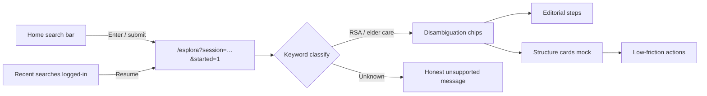

# Guided Search System

Architecture and product model for Wenando’s consumer **guided exploration** flow — parallel to the existing `/wizard` path, not a replacement.

## Philosophy

### Guide, not chatbot

The exploration experience is an **editorial canvas**: cards, chips, and structured steps — not a free-form chat UI. Users move through intentional choices; the product leads with empathy and clarity, not open-ended AI replies.

### AI (Groq) as safety and precision — not info dump

When Groq is integrated (phase 2+), it serves:

- **Query classification** — map free text to sector + intent
- **Safety checks** — flag risky or off-topic requests
- **Critical disambiguation** — only where keyword rules are ambiguous

Groq must **not** generate open-ended answers on unsupported topics. Unsupported queries show an honest message instead of hallucinated content.

### Anti-truffe / tutela utente

Positioning aligns with Wenando’s trust mission:

- No aggressive “Chiama ora” on structure cards
- Contact details revealed **only when the user chooses**
- Anonymous browsing until explicit opt-in
- Editorial content verified by humans; AI assists routing, not sales pressure

---

## User journey (phase 1)



### What stays unchanged

- Home layout, typography, aurora/bento sections
- Login flow (`/accedi`)
- `/wizard` and `/results` — full parallel path
- Nav “Inizia ora →” still links to wizard (hero CTA replaced by search only)

### Animations

- Home hero: CSS fades only (no new motion on load)
- `/esplora`: Framer Motion **only when** `started=1` (after search submit)
- `prefers-reduced-motion`: animations disabled

---

## Flow model

### Sessions

Each search creates a **session** persisted in `localStorage` under `wenando-search-sessions`. Structure is backend-ready for future sync to consumer account API.

### Steps

Steps are declarative config in `src/constants/guidedSearch.js` (`EXPLORATION_STEPS`). Types:

| Type | Purpose |
|------|---------|
| `disambiguation` | Tactile chips (RSA intent) |
| `editorial` | Verified copy + optional sub-chips / continue CTA |
| `structures` | Mock structure cards with low-friction actions |
| `unsupported` | Honest “not yet available” message |

### Resume

- URL: `/esplora?session={uuid}&started=1`
- Session stores `currentStepId` and `stepHistory[]`
- **Back** pops one entry from `stepHistory` (in-session navigation)
- Recent searches (logged-in consumers only) link to the same resume URL

### Implicit intent extraction

`selections` map records `{ stepId: chipId }` as the user progresses. Phase 2 will send this payload with Groq classification for lead scoring and admin analytics.

---

## Sector specialization

Phase 1 implements **elder care** (`elder_care`) with RSA-focused mock flow.

Specialties (admin-expandable later):

- case famiglia, strutture, anziani, ospedaliero
- infermieri, badanti, agenzie lavoro
- anti-truffe

Classification today: keyword list in `classifySearchQuery()`. Groq replaces/augments this in phase 2.

### RSA disambiguation chips (mock)

1. Stai cercando una RSA per te o un caro?
2. Vorresti aprirla? → unsupported (honest)
3. Vorresti sapere cos’è? → editorial
4. Vuoi conoscere alternative alle RSA? → editorial + sub-chips
5. Quanto costano le RSA? → editorial → optional structures

---

## Data model — session JSON schema

```json
{
  "id": "uuid-v4",
  "query": "RSA Milano costi badante",
  "label": "RSA Milano costi badante",
  "sectorId": "elder_care",
  "currentStepId": "rsa_disambiguation",
  "stepHistory": ["rsa_disambiguation"],
  "selections": {
    "rsa_disambiguation": "for_loved_one"
  },
  "supported": true,
  "createdAt": "2026-06-04T12:00:00.000Z",
  "updatedAt": "2026-06-04T12:05:00.000Z"
}
```

| Field | Description |
|-------|-------------|
| `id` | Stable resume identifier |
| `query` | Original search text |
| `label` | Short display label (≤48 chars) for recent list |
| `sectorId` | `elder_care` or `null` |
| `currentStepId` | Active step key in `EXPLORATION_STEPS` |
| `stepHistory` | Stack for back navigation |
| `selections` | Chip choices + optional `focusedStructure` |
| `supported` | Whether keyword classification matched a sector |
| `createdAt` / `updatedAt` | ISO timestamps |

Storage: `localStorage['wenando-search-sessions']` — array, max 20 sessions, newest first.

---

## Frontend integration points

| File | Role |
|------|------|
| `src/components/home/HomeSearchBar.jsx` | Hero search input → create session → navigate |
| `src/components/home/RecentSearches.jsx` | Logged-in recent list (max 3 + expand) |
| `src/pages/ExplorePage.jsx` | Route shell, session load, step orchestration |
| `src/components/explore/*` | Step UI (chips, cards, unsupported) |
| `src/utils/searchSessionStorage.js` | CRUD + back/advance |
| `src/constants/guidedSearch.js` | Sectors, steps, mock structures, classify |

### Routes

- **`/esplora?session={id}&started=1`** — primary entry after search or resume
- **`/esplora?q={text}&started=1`** — creates session then redirects to `session` param

---

## Groq integration (phase 2 — not implemented)

Planned hooks:

1. **POST classify** — `{ query }` → `{ sectorId, intent, confidence, safetyFlags }`
2. **Fallback** — if Groq unavailable, use keyword classifier
3. **Safety gate** — block or redirect harmful queries before any editorial content
4. **No generative answers** on unsupported topics — always show `UnsupportedTopicMessage`

Environment: reuse backend Groq config when exposed via API; frontend never holds API keys.

---

## Admin visibility (phase 2+ — hooks only)

Admins would eventually see:

- **Search trends** — top queries, unsupported topic frequency
- **Sector expansion** — enable new `EXPLORATION_STEPS` trees from admin CMS
- **Drop-off by step** — where users abandon disambiguation
- **Anti-truffe signals** — queries mentioning scams, aggressive providers

Phase 1 stores data client-side only; no admin UI yet.

---

## Structure card actions (phase 1 mock)

| Action | Behavior |
|--------|----------|
| Alternative simili | Alert placeholder — ranking TBD |
| Alternative diverse | Alert placeholder — cross-type exploration TBD |
| Raccontami di questa struttura | Shows summary; Groq deep-dive in phase 2 |
| Chiama | Alert — contact reveal flow in phase 2; user stays anonymous until opt-in |

---

## In scope (phase 1) vs out of scope

### In scope ✅

- Hero integrated search bar
- Recent searches (consumer logged-in, localStorage)
- `/esplora` guided flow with RSA mock
- Session resume + back navigation
- Unsupported topic honesty
- Architecture doc + JSON schema
- Reduced-motion respect
- Parallel `/wizard` preserved

### Out of scope (phase 2+) ⏳

- Groq classification API
- Backend session sync to user account
- Real structure data / lead submission from exploration
- Contact reveal + click-to-call
- Admin dashboard for search analytics
- Additional sectors beyond elder care mock
- E2E tests for exploration flow

---

## Follow-ups

1. **Backend** — `POST /user/search-sessions` sync; merge localStorage on login
2. **Groq** — classification endpoint; safety middleware
3. **Content** — CMS-driven editorial steps per sector
4. **Results bridge** — optional handoff from exploration to wizard/results when intent = “find structure”
5. **Analytics** — Plausible events: `search_start`, `step_advance`, `unsupported_topic`
6. **E2E** — Playwright: home search → chips → structures → resume
